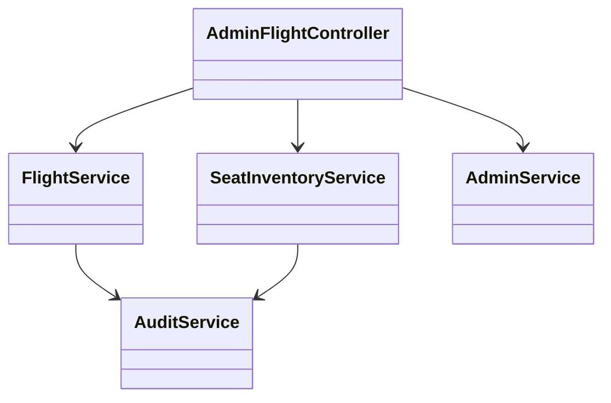
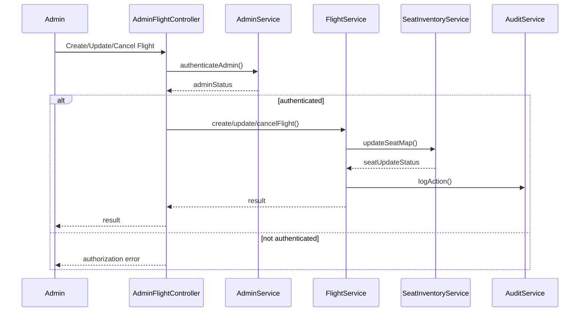
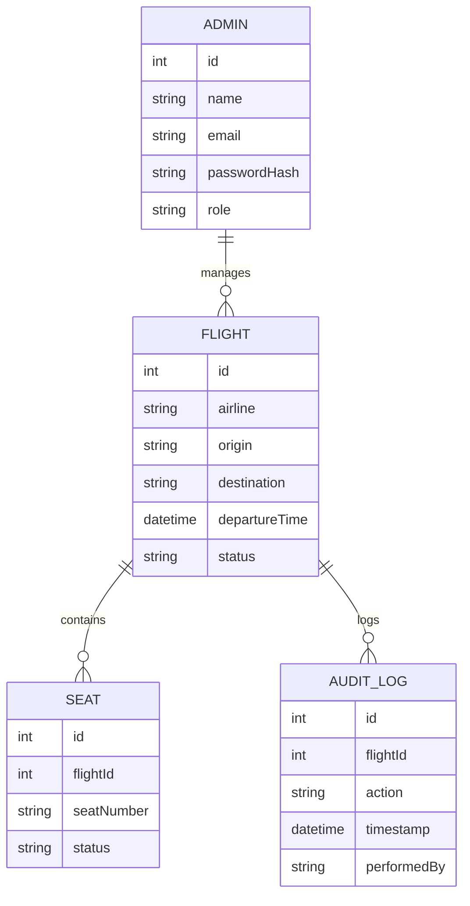

# For User Story Number [4]

1. Objective
This requirement enables airline administrators to manage flight schedules and seat inventory in real-time. Admins can create, update, or cancel flights, adjust seat allocations, and ensure accurate availability for bookings. The system prevents overbooking, validates changes, and maintains audit logs for all administrative actions.

2. API Model
  2.1 Common Components/Services
  - Admin Authentication & Role-based Access Control Service
  - Flight Management Service
  - Seat Inventory Service
  - Audit Logging Service

  2.2 API Details
| Operation    | REST Method | Type     | URL                                 | Request (Sample JSON)                                                                 | Response (Sample JSON)                                                                 |
|-------------|-------------|----------|-------------------------------------|--------------------------------------------------------------------------------------|----------------------------------------------------------------------------------------|
| Create      | POST        | Success  | /api/admin/flights                  | {"airline":"Delta","origin":"JFK","destination":"LAX","departureTime":"2025-10-01T10:00","seatMap":["1A","1B"]} | {"flightId":1,"status":"CREATED"}                                                |
| Update      | PUT         | Success  | /api/admin/flights/{flightId}       | {"departureTime":"2025-10-01T12:00","seatMap":["1A","1B","1C"]}           | {"flightId":1,"status":"UPDATED"}                                                |
| Cancel      | DELETE      | Success  | /api/admin/flights/{flightId}       | N/A                                                                                  | {"flightId":1,"status":"CANCELLED"}                                              |
| SeatUpdate  | PUT         | Success  | /api/admin/flights/{flightId}/seats | {"seatMap":["1A","1B","1C"]}                                                  | {"flightId":1,"seatMap":["1A","1B","1C"],"status":"SEAT_UPDATED"}         |
| Create      | POST        | Failure  | /api/admin/flights                  | {"airline":"Delta","origin":"JFK","destination":"LAX","departureTime":"2025-10-01T10:00","seatMap":[]} | {"error":"Invalid schedule or seat map"}                                           |

  2.3 Exceptions
| API Endpoint                          | Exception Type         | Description                                      |
|---------------------------------------|-----------------------|--------------------------------------------------|
| /api/admin/flights                    | AuthorizationException| User not admin                                   |
| /api/admin/flights                    | ValidationException   | Invalid schedule, route, or seat map             |
| /api/admin/flights/{id} (PUT/DELETE)  | FlightNotFoundException | Flight not found                               |
| /api/admin/flights/{id}/seats         | InventoryException    | Seat count exceeds aircraft capacity             |

3. Functional Design
  3.1 Class Diagram

  3.2 UML Sequence Diagram

  3.3 Components
| Component Name         | Description                                        | Existing/New |
|-----------------------|----------------------------------------------------|--------------|
| AdminFlightController | Handles admin flight management requests            | New          |
| FlightService         | Business logic for flight creation/modification     | New          |
| SeatInventoryService  | Manages seat inventory and prevents overbooking     | New          |
| AuditService          | Logs all admin actions for compliance               | New          |
| AdminService          | Manages admin authentication and roles              | New          |

  3.4 Service Layer Logic and Validations
| FieldName        | Validation                             | Error Message                       | ClassUsed             |
|------------------|----------------------------------------|-------------------------------------|-----------------------|
| admin            | Must be authenticated and have role    | User not authorized                 | AdminService          |
| departureTime    | Must be valid and not conflict         | Invalid or conflicting schedule     | FlightService         |
| route            | Must be valid                          | Invalid route                       | FlightService         |
| seatMap          | Cannot exceed aircraft capacity        | Seat count exceeds capacity         | SeatInventoryService  |

4. Integrations
| SystemToBeIntegrated | IntegratedFor         | IntegrationType |
|----------------------|----------------------|-----------------|
| Internal Booking API | Real-time availability| API             |
| Audit Logging        | Admin actions         | API             |

5. DB Details
  5.1 ER Model

  5.2 DB Validations
- Flight schedule must not conflict with existing flights.
- Seat inventory cannot exceed aircraft capacity.
- Only admins can perform flight management actions.

6. Non-Functional Requirements
  6.1 Performance
  - Changes must propagate to booking system within 30 seconds.
  - System must support 100+ concurrent admin users.

  6.2 Security
    6.2.1 Authentication
    - Admin authentication required (role-based access control).
    6.2.2 Authorization
    - Only admins can manage flights and inventory.

  6.3 Logging
    6.3.1 Application Logging
    - DEBUG: Admin API request/response payloads
    - INFO: Flight creation, updates, cancellations
    - ERROR: Validation or authorization failures
    - WARN: Attempted overbooking, schedule conflicts
    6.3.2 Audit Log
    - All admin actions on flights and seats

7. Dependencies
- Internal booking API for availability propagation
- Audit logging service for compliance

8. Assumptions
- Admin users are pre-registered and assigned roles
- Aircraft capacity is known and enforced in the system
- Audit logs are immutable and available for compliance reporting
