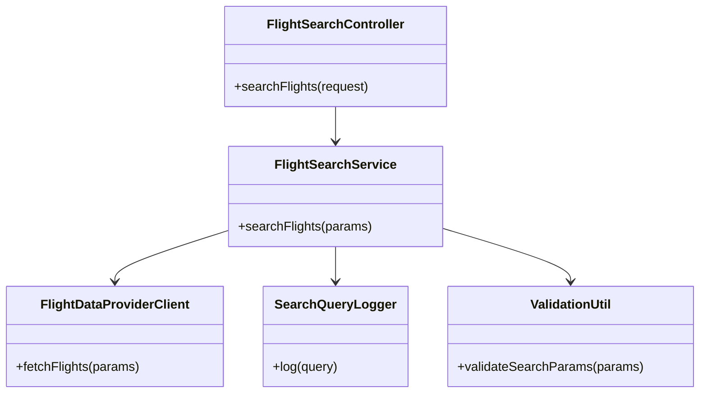
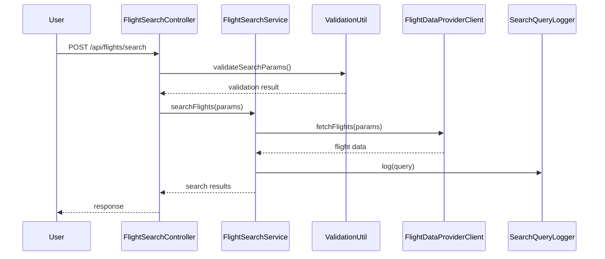
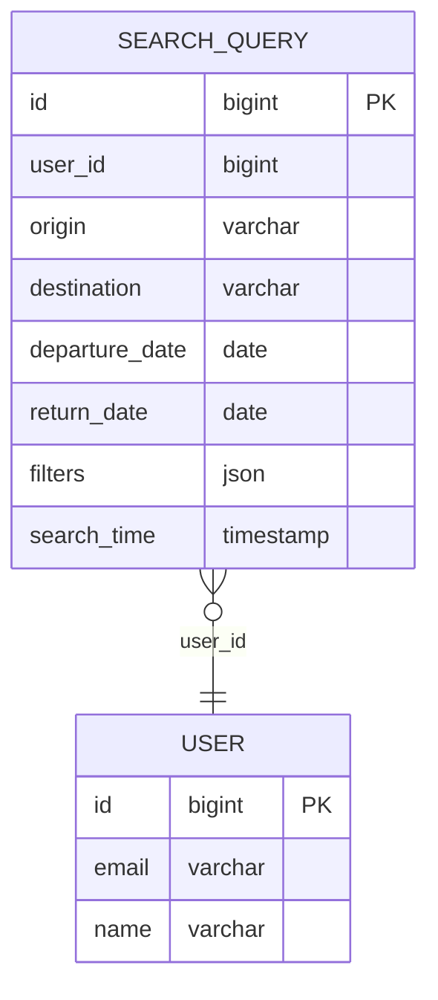

# For User Story Number 1
1. Objective
This requirement enables travelers to search for available flights by specifying origin, destination, travel dates, and various filters. The system should provide accurate, up-to-date, and filterable results to help users find the best flight options. The search must be efficient, secure, and support high concurrency.

2. API Model
  2.1 Common Components/Services
    - FlightSearchService (handles search logic)
    - FlightDataProviderClient (integration with airline APIs)
    - SearchQueryLogger (logs search queries for analytics)
    - ValidationUtil (input validation)

  2.2 API Details
| Operation | REST Method | Type    | URL                   | Request (JSON) | Response (JSON) |
|-----------|-------------|---------|-----------------------|----------------|-----------------|
| Search    | POST        | Success | /api/flights/search   | {"origin": "JFK", "destination": "LAX", "departureDate": "2025-10-20", "returnDate": "2025-10-27", "filters": {"airline": "Delta", "maxPrice": 500, "stops": 1}} | {"flights": [{"flightNumber": "DL123", "airline": "Delta", "departure": "2025-10-20T08:00:00", "arrival": "2025-10-20T11:00:00", "price": 450, "stops": 1, "availableSeats": 5}]} |
| Search    | POST        | Failure | /api/flights/search   | {"origin": "", "destination": "LAX", "departureDate": "2025-10-20"} | {"error": "Origin and destination must not be empty"} |

  2.3 Exceptions
| Exception                | Scenario                                 | HTTP Status |
|--------------------------|------------------------------------------|-------------|
| InvalidInputException    | Origin/destination empty, invalid dates  | 400         |
| NoFlightsFoundException  | No flights matching criteria             | 404         |
| ExternalAPIException     | Airline data provider failure            | 502         |
| RateLimitExceededException | Too many requests from user            | 429         |

3 Functional Design
  3.1 Class Diagram

  3.2 UML Sequence Diagram

  3.3 Components
| Component Name             | Description                                      | Existing/New |
|---------------------------|--------------------------------------------------|--------------|
| FlightSearchController     | REST controller for handling search requests      | New          |
| FlightSearchService        | Business logic for flight search                  | New          |
| FlightDataProviderClient   | Integrates with airline APIs                     | New          |
| SearchQueryLogger          | Logs search queries for analytics                 | New          |
| ValidationUtil             | Utility for validating search parameters          | New          |

  3.4 Service Layer Logic and Validations
| FieldName      | Validation                      | Error Message                         | ClassUsed        |
|---------------|---------------------------------|---------------------------------------|------------------|
| origin        | Not empty                       | Origin must not be empty              | ValidationUtil   |
| destination   | Not empty                       | Destination must not be empty         | ValidationUtil   |
| departureDate | Valid date, future date         | Departure date must be valid/future   | ValidationUtil   |
| returnDate    | Valid date, future date         | Return date must be valid/future      | ValidationUtil   |
| filters       | Valid filter values             | Invalid filter values                 | ValidationUtil   |

4 Integrations
| SystemToBeIntegrated | IntegratedFor         | IntegrationType |
|---------------------|-----------------------|-----------------|
| Airline API         | Fetch flight data     | API             |
| Analytics Service   | Log search queries    | API             |

5 DB Details
  5.1 ER Model

  5.2 DB Validations
  - Ensure search_time is always set to current timestamp.
  - Filters column must be valid JSON.

6 Non-Functional Requirements
  6.1 Performance
    - Search API must respond within 3 seconds.
    - Caching of frequent search queries at API layer.
  6.2 Security
    6.2.1 Authentication
      - API key or OAuth2 for internal/external API access.
    6.2.2 Authorization
      - Only authenticated users can access search API.
  6.3 Logging
    6.3.1 Application Logging
      - Log all search requests at INFO level.
      - Log validation errors at WARN level.
      - Log external API failures at ERROR level.
    6.3.2 Audit Log
      - Log user ID, search parameters, and timestamp for each search.

7 Dependencies
  - Airline data provider APIs must be available and up-to-date.
  - Analytics/logging service must be operational.

8 Assumptions
  - All airline APIs provide real-time seat availability.
  - User is authenticated before accessing search API.
  - Filters and sorting options are supported by airline APIs or implemented in backend.