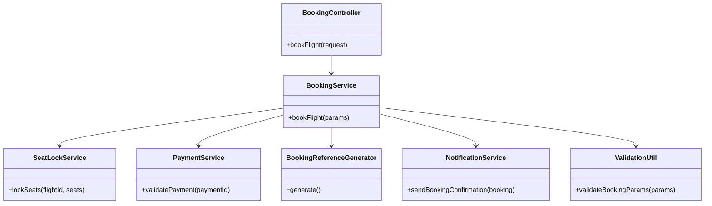
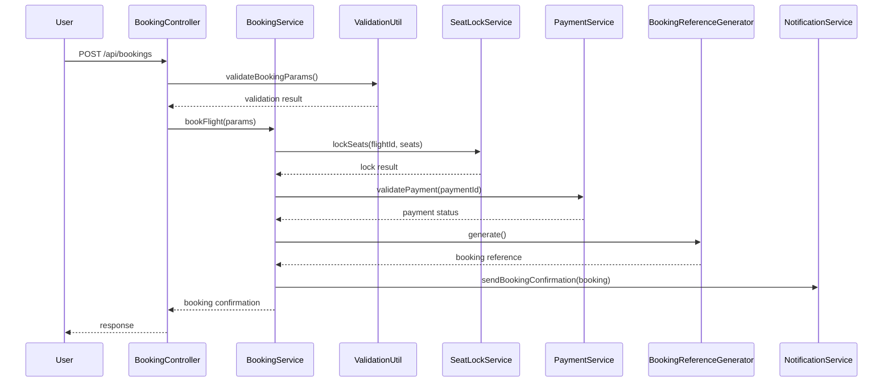
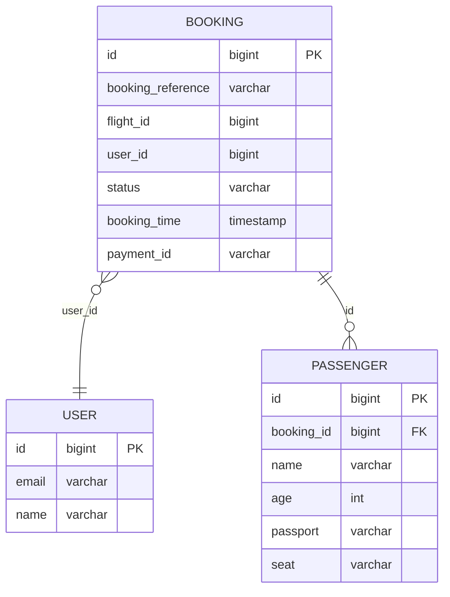

# For User Story Number 2
1. Objective
This requirement enables travelers to book a selected flight, enter passenger details, select seats, and confirm their reservation. The process must validate all inputs, prevent double-booking, and provide a unique booking reference with confirmation. The booking flow should be secure, auditable, and performant.

2. API Model
  2.1 Common Components/Services
    - BookingService (handles booking logic)
    - SeatLockService (locks seats during booking)
    - PaymentService (payment validation)
    - BookingReferenceGenerator (generates unique references)
    - NotificationService (sends confirmation)
    - ValidationUtil (input validation)

  2.2 API Details
| Operation | REST Method | Type    | URL                   | Request (JSON) | Response (JSON) |
|-----------|-------------|---------|-----------------------|----------------|-----------------|
| Book      | POST        | Success | /api/bookings         | {"flightId": "123", "passengers": [{"name": "John Doe", "age": 30, "passport": "A1234567"}], "seats": ["12A", "12B"], "paymentId": "pay_abc123"} | {"bookingReference": "BR123456", "status": "CONFIRMED"} |
| Book      | POST        | Failure | /api/bookings         | {"flightId": "123", "passengers": [], "seats": ["12A"], "paymentId": "pay_abc123"} | {"error": "Passenger details required"} |

  2.3 Exceptions
| Exception                | Scenario                                 | HTTP Status |
|--------------------------|------------------------------------------|-------------|
| InvalidInputException    | Missing/invalid passenger details         | 400         |
| SeatUnavailableException | Selected seat not available               | 409         |
| PaymentFailedException   | Payment not successful                    | 402         |
| ExternalAPIException     | Airline booking API error                 | 502         |

3 Functional Design
  3.1 Class Diagram

  3.2 UML Sequence Diagram

  3.3 Components
| Component Name             | Description                                      | Existing/New |
|---------------------------|--------------------------------------------------|--------------|
| BookingController         | REST controller for handling booking requests     | New          |
| BookingService            | Business logic for booking flights                | New          |
| SeatLockService           | Locks selected seats during booking               | New          |
| PaymentService            | Validates payment before confirming booking       | New          |
| BookingReferenceGenerator | Generates unique booking reference numbers        | New          |
| NotificationService       | Sends booking confirmation to user                | New          |
| ValidationUtil            | Utility for validating booking parameters         | New          |

  3.4 Service Layer Logic and Validations
| FieldName      | Validation                      | Error Message                         | ClassUsed        |
|---------------|---------------------------------|---------------------------------------|------------------|
| passengers    | Not empty, valid details        | Passenger details required            | ValidationUtil   |
| seats         | Not empty, available            | Selected seat not available           | SeatLockService  |
| paymentId     | Valid, payment successful       | Payment not successful                | PaymentService   |

4 Integrations
| SystemToBeIntegrated | IntegratedFor         | IntegrationType |
|---------------------|-----------------------|-----------------|
| Airline Booking API | Confirm seat booking  | API             |
| Payment Gateway     | Payment validation    | API             |
| Email/SMS Service   | Send confirmation     | API             |

5 DB Details
  5.1 ER Model

  5.2 DB Validations
  - booking_reference must be unique.
  - booking_time is set to current timestamp.
  - seat must be unique per flight.

6 Non-Functional Requirements
  6.1 Performance
    - Booking confirmation must be sent within 1 minute of payment.
    - System must handle 500 bookings per minute.
  6.2 Security
    6.2.1 Authentication
      - Only authenticated users can book flights.
    6.2.2 Authorization
      - User can only book for themselves or authorized passengers.
      - PCI DSS compliance for payment data.
  6.3 Logging
    6.3.1 Application Logging
      - Log all booking attempts at INFO level.
      - Log seat lock/payment failures at WARN/ERROR level.
    6.3.2 Audit Log
      - Log booking reference, user ID, and timestamp for each booking.

7 Dependencies
  - Airline booking API must be available and reliable.
  - Payment gateway must be operational.
  - Email/SMS service for confirmations.

8 Assumptions
  - All seat availability is real-time.
  - Payment is processed before booking confirmation.
  - User is authenticated before booking.