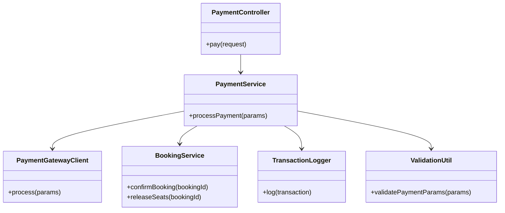
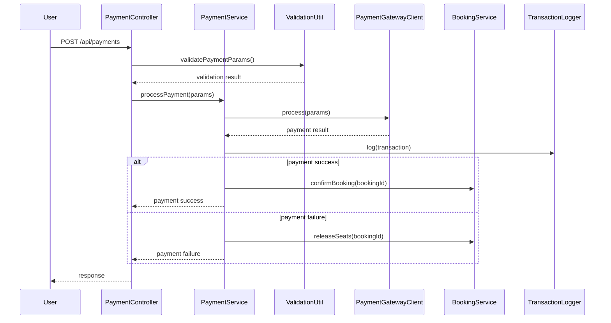
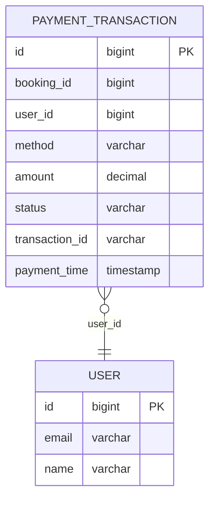

# For User Story Number 3
1. Objective
This requirement enables travelers to securely pay for their flight bookings using multiple payment methods. The payment process must be secure, reliable, and provide immediate feedback on the transaction status. It should also handle failures gracefully and ensure all transactions are logged for auditing and fraud detection.

2. API Model
  2.1 Common Components/Services
    - PaymentService (handles payment logic)
    - PaymentGatewayClient (integrates with payment providers)
    - BookingService (triggers booking confirmation on success)
    - SeatLockService (releases seats on failure)
    - TransactionLogger (logs payment transactions)
    - ValidationUtil (input validation)

  2.2 API Details
| Operation | REST Method | Type    | URL                   | Request (JSON) | Response (JSON) |
|-----------|-------------|---------|-----------------------|----------------|-----------------|
| Pay       | POST        | Success | /api/payments         | {"bookingId": "BK123", "method": "CARD", "details": {"cardNumber": "****", "expiry": "12/26", "cvv": "***"}} | {"status": "SUCCESS", "transactionId": "TX123456"} |
| Pay       | POST        | Failure | /api/payments         | {"bookingId": "BK123", "method": "CARD", "details": {"cardNumber": "", "expiry": "", "cvv": ""}} | {"status": "FAILED", "error": "Invalid payment details"} |

  2.3 Exceptions
| Exception                | Scenario                                 | HTTP Status |
|--------------------------|------------------------------------------|-------------|
| InvalidInputException    | Invalid/missing payment details           | 400         |
| UnsupportedMethodException | Unsupported payment method             | 400         |
| PaymentGatewayException  | Payment gateway integration failure       | 502         |
| PaymentFailedException   | Payment declined by provider              | 402         |

3 Functional Design
  3.1 Class Diagram

  3.2 UML Sequence Diagram

  3.3 Components
| Component Name             | Description                                      | Existing/New |
|---------------------------|--------------------------------------------------|--------------|
| PaymentController         | REST controller for handling payment requests     | New          |
| PaymentService            | Business logic for payment processing             | New          |
| PaymentGatewayClient      | Integrates with payment providers                 | New          |
| BookingService            | Confirms booking or releases seats                | Existing     |
| TransactionLogger         | Logs all payment transactions                     | New          |
| ValidationUtil            | Utility for validating payment parameters         | Existing     |

  3.4 Service Layer Logic and Validations
| FieldName      | Validation                      | Error Message                         | ClassUsed        |
|---------------|---------------------------------|---------------------------------------|------------------|
| bookingId     | Not empty, valid booking        | Invalid booking ID                    | ValidationUtil   |
| method        | Supported payment method        | Unsupported payment method            | ValidationUtil   |
| details       | Valid payment details           | Invalid payment details               | ValidationUtil   |

4 Integrations
| SystemToBeIntegrated | IntegratedFor         | IntegrationType |
|---------------------|-----------------------|-----------------|
| Payment Gateway     | Process payments      | API             |
| Booking Service     | Confirm/release seats | API             |
| Fraud Detection     | Monitor transactions  | API             |

5 DB Details
  5.1 ER Model

  5.2 DB Validations
  - transaction_id must be unique.
  - payment_time is set to current timestamp.
  - status must be one of SUCCESS, FAILED, PENDING.

6 Non-Functional Requirements
  6.1 Performance
    - Payment processing must complete within 10 seconds.
    - System must support 100 concurrent payment transactions.
  6.2 Security
    6.2.1 Authentication
      - Only authenticated users can initiate payments.
    6.2.2 Authorization
      - User can only pay for their own bookings.
      - PCI DSS compliance, HTTPS, encryption of sensitive data.
  6.3 Logging
    6.3.1 Application Logging
      - Log all payment attempts at INFO level.
      - Log gateway failures at ERROR level.
    6.3.2 Audit Log
      - Log transaction ID, user ID, booking ID, and timestamp for each payment.

7 Dependencies
  - Payment gateway must be available and PCI DSS compliant.
  - Booking service must be operational.
  - Fraud detection service for monitoring.

8 Assumptions
  - All payment methods are supported by the gateway.
  - User is authenticated before payment.
  - Booking is locked before payment is initiated.