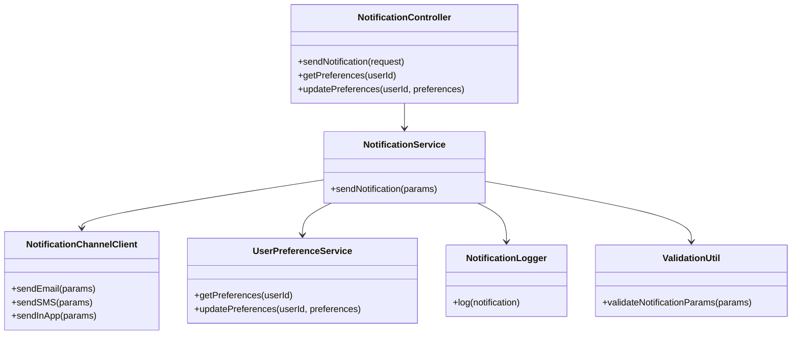
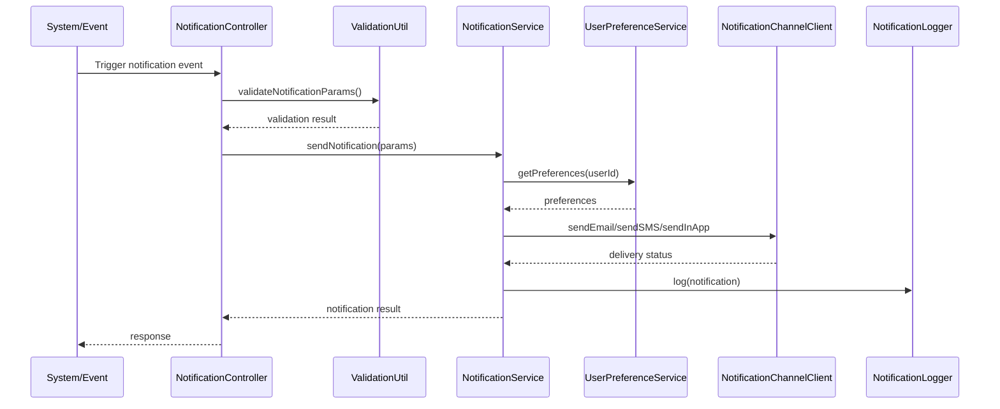
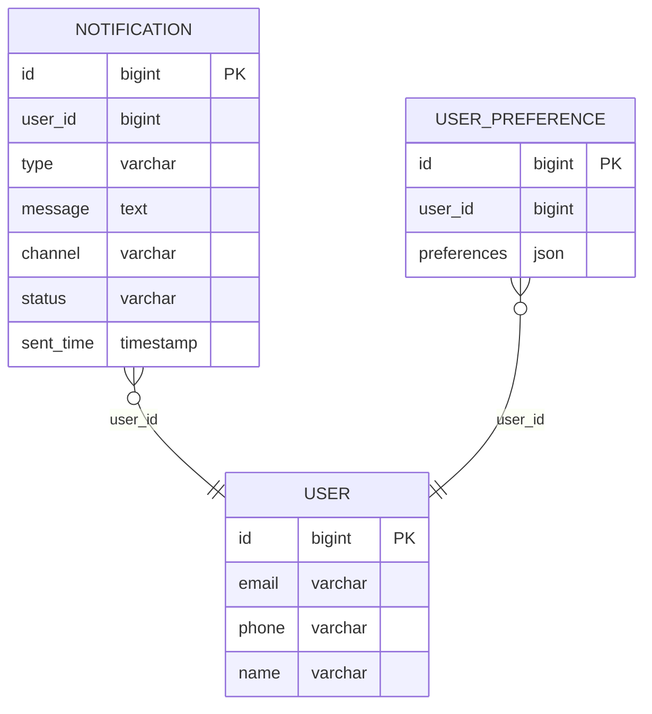

# For User Story Number 4
1. Objective
This requirement enables travelers to receive timely notifications about their flight status and booking via email, SMS, or in-app alerts. The system must respect user preferences, ensure notifications are sent within 2 minutes of the triggering event, and log all notifications for auditing. Notification delivery should be reliable, secure, and scalable.

2. API Model
  2.1 Common Components/Services
    - NotificationService (handles notification logic)
    - NotificationChannelClient (integrates with email/SMS gateways)
    - UserPreferenceService (manages opt-in/opt-out preferences)
    - NotificationLogger (logs notifications)
    - ValidationUtil (input validation)

  2.2 API Details
| Operation      | REST Method | Type    | URL                           | Request (JSON) | Response (JSON) |
|---------------|-------------|---------|-------------------------------|----------------|-----------------|
| Notify        | POST        | Success | /api/notifications/send       | {"userId": "U123", "type": "BOOKING_CONFIRMATION", "message": "Your booking is confirmed.", "channels": ["EMAIL", "SMS"]} | {"status": "SENT", "notificationId": "N123456"} |
| Notify        | POST        | Failure | /api/notifications/send       | {"userId": "U123", "type": "BOOKING_CONFIRMATION", "message": "", "channels": ["EMAIL"]} | {"status": "FAILED", "error": "Message cannot be empty"} |
| Preferences   | GET         | Success | /api/notifications/preferences/{userId} | N/A | {"userId": "U123", "preferences": {"BOOKING_CONFIRMATION": ["EMAIL", "SMS"], "FLIGHT_STATUS": ["IN_APP"]}} |
| Preferences   | PUT         | Success | /api/notifications/preferences/{userId} | {"preferences": {"BOOKING_CONFIRMATION": ["EMAIL"]}} | {"status": "UPDATED"} |

  2.3 Exceptions
| Exception                | Scenario                                 | HTTP Status |
|--------------------------|------------------------------------------|-------------|
| InvalidInputException    | Missing/invalid contact info or message   | 400         |
| NotificationFailedException | Gateway failure or delivery error      | 502         |
| PreferenceNotFoundException | User preferences not found             | 404         |

3 Functional Design
  3.1 Class Diagram

  3.2 UML Sequence Diagram

  3.3 Components
| Component Name             | Description                                      | Existing/New |
|---------------------------|--------------------------------------------------|--------------|
| NotificationController    | REST controller for notification APIs             | New          |
| NotificationService       | Business logic for sending notifications          | New          |
| NotificationChannelClient | Integrates with email/SMS/in-app gateways         | New          |
| UserPreferenceService     | Manages user opt-in/opt-out preferences           | New          |
| NotificationLogger        | Logs all notifications sent                       | New          |
| ValidationUtil            | Utility for validating notification parameters    | Existing     |

  3.4 Service Layer Logic and Validations
| FieldName      | Validation                      | Error Message                         | ClassUsed        |
|---------------|---------------------------------|---------------------------------------|------------------|
| userId        | Not empty, valid user            | Invalid user ID                       | ValidationUtil   |
| type          | Supported notification type      | Unsupported notification type         | ValidationUtil   |
| message       | Not empty                        | Message cannot be empty               | ValidationUtil   |
| channels      | Valid, supported channels        | Invalid notification channel          | ValidationUtil   |

4 Integrations
| SystemToBeIntegrated | IntegratedFor         | IntegrationType |
|---------------------|-----------------------|-----------------|
| Email Gateway       | Send email notifications | API          |
| SMS Gateway         | Send SMS notifications   | API          |
| In-App Notification | In-app alerts            | API          |

5 DB Details
  5.1 ER Model

  5.2 DB Validations
  - sent_time is set to current timestamp.
  - channel must be one of EMAIL, SMS, IN_APP.
  - preferences must be valid JSON.

6 Non-Functional Requirements
  6.1 Performance
    - Notifications must be delivered within 2 minutes of the event.
    - System must support 10,000 notifications per hour.
  6.2 Security
    6.2.1 Authentication
      - Only authenticated systems can trigger notifications.
    6.2.2 Authorization
      - User preferences must be respected.
      - GDPR compliance for contact data.
  6.3 Logging
    6.3.1 Application Logging
      - Log all notification attempts at INFO level.
      - Log gateway failures at ERROR level.
    6.3.2 Audit Log
      - Log notification ID, user ID, type, channel, and timestamp for each notification.

7 Dependencies
  - Email/SMS gateway must be available.
  - User preference service must be operational.

8 Assumptions
  - User contact information is up-to-date and valid.
  - Notification channels are reliable.
  - User is authenticated before updating preferences.