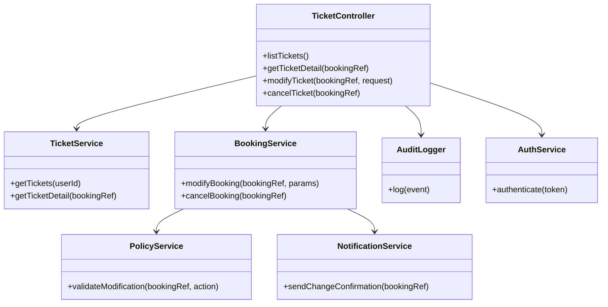
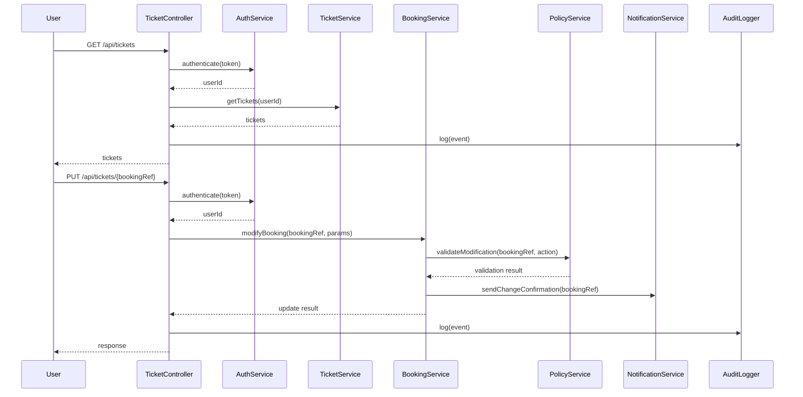
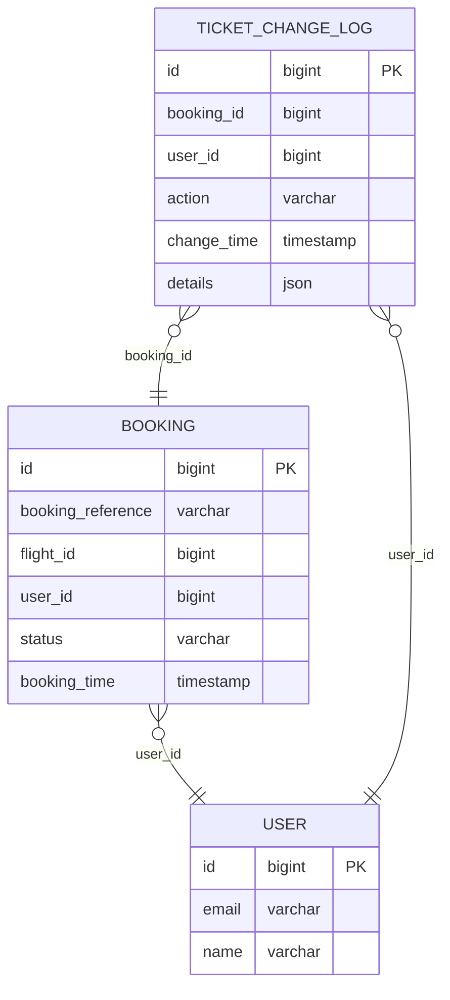

# For User Story Number 5
1. Objective
This requirement enables travelers to view and manage their booked tickets, including accessing travel details and making changes such as cancellations or modifications if allowed by airline policy. The system must ensure only authenticated users can access their tickets, enforce airline rules, and log all changes for auditing. Ticket information must be quickly retrievable and secure.

2. API Model
  2.1 Common Components/Services
    - TicketService (handles ticket retrieval and management)
    - BookingService (handles booking modifications/cancellations)
    - PolicyService (validates airline rules)
    - NotificationService (sends confirmation of changes)
    - AuditLogger (logs all access and changes)
    - AuthService (user authentication)

  2.2 API Details
| Operation      | REST Method | Type    | URL                           | Request (JSON) | Response (JSON) |
|---------------|-------------|---------|-------------------------------|----------------|-----------------|
| List Tickets  | GET         | Success | /api/tickets                  | N/A            | {"tickets": [{"bookingReference": "BR123456", "flightNumber": "DL123", "departure": "2025-10-20T08:00:00", "seat": "12A", "status": "CONFIRMED"}]} |
| Ticket Detail | GET         | Success | /api/tickets/{bookingRef}     | N/A            | {"bookingReference": "BR123456", "flightNumber": "DL123", "departure": "2025-10-20T08:00:00", "seat": "12A", "status": "CONFIRMED", "passenger": {"name": "John Doe"}} |
| Modify Ticket | PUT         | Success | /api/tickets/{bookingRef}     | {"action": "CHANGE_SEAT", "seat": "14C"} | {"status": "UPDATED", "bookingReference": "BR123456"} |
| Cancel Ticket | DELETE      | Success | /api/tickets/{bookingRef}     | N/A            | {"status": "CANCELLED", "bookingReference": "BR123456"} |
| Modify/Cancel | PUT/DELETE  | Failure | /api/tickets/{bookingRef}     | N/A            | {"error": "Modification not allowed by airline policy"} |

  2.3 Exceptions
| Exception                | Scenario                                 | HTTP Status |
|--------------------------|------------------------------------------|-------------|
| UnauthorizedException    | User not authenticated                   | 401         |
| NotFoundException        | Ticket not found                         | 404         |
| PolicyViolationException | Modification/cancellation not allowed    | 403         |
| ExternalAPIException     | Airline API error                        | 502         |

3 Functional Design
  3.1 Class Diagram

  3.2 UML Sequence Diagram

  3.3 Components
| Component Name             | Description                                      | Existing/New |
|---------------------------|--------------------------------------------------|--------------|
| TicketController          | REST controller for ticket management APIs        | New          |
| TicketService             | Handles ticket retrieval for users                | New          |
| BookingService            | Handles booking modifications/cancellations       | Existing     |
| PolicyService             | Validates airline policy for changes              | New          |
| NotificationService       | Sends change/cancellation confirmations          | Existing     |
| AuditLogger               | Logs all ticket access and changes                | New          |
| AuthService               | Authenticates user requests                       | Existing     |

  3.4 Service Layer Logic and Validations
| FieldName      | Validation                      | Error Message                         | ClassUsed        |
|---------------|---------------------------------|---------------------------------------|------------------|
| token         | Valid, authenticated            | Unauthorized                          | AuthService      |
| bookingRef    | Exists, belongs to user         | Ticket not found                      | TicketService    |
| action        | Allowed by airline policy       | Modification not allowed by policy    | PolicyService    |

4 Integrations
| SystemToBeIntegrated | IntegratedFor         | IntegrationType |
|---------------------|-----------------------|-----------------|
| Airline API         | Retrieve/update booking| API             |
| Notification Service| Send confirmations    | API             |
| Auth Service        | User authentication   | API             |

5 DB Details
  5.1 ER Model

  5.2 DB Validations
  - booking_reference must be unique.
  - change_time is set to current timestamp.
  - Only authenticated users can access their tickets.

6 Non-Functional Requirements
  6.1 Performance
    - Ticket information must load within 2 seconds.
    - System must support 5,000 concurrent users viewing tickets.
  6.2 Security
    6.2.1 Authentication
      - OAuth2 authentication for all ticket APIs.
    6.2.2 Authorization
      - User can only access their own tickets.
      - GDPR compliance for all stored data.
  6.3 Logging
    6.3.1 Application Logging
      - Log all ticket access at INFO level.
      - Log modification/cancellation attempts at WARN/ERROR level.
    6.3.2 Audit Log
      - Log user ID, booking reference, action, and timestamp for each change.

7 Dependencies
  - Airline API for booking status and policy enforcement.
  - Auth service for user authentication.
  - Notification service for confirmations.

8 Assumptions
  - Airline policy data is up-to-date and accessible.
  - User is authenticated before accessing tickets.
  - All ticket changes are subject to airline rules.