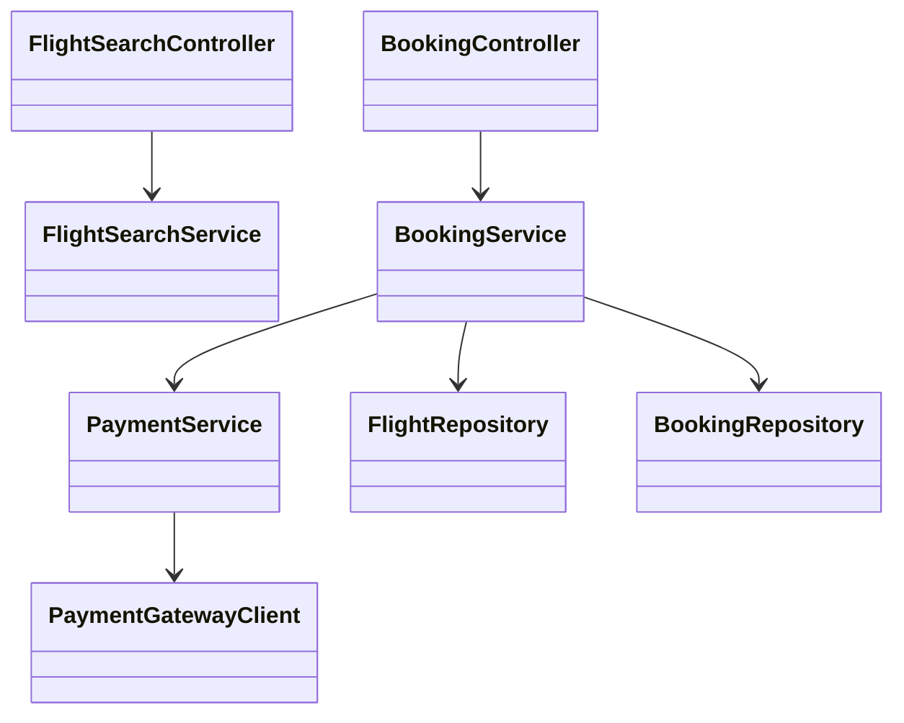
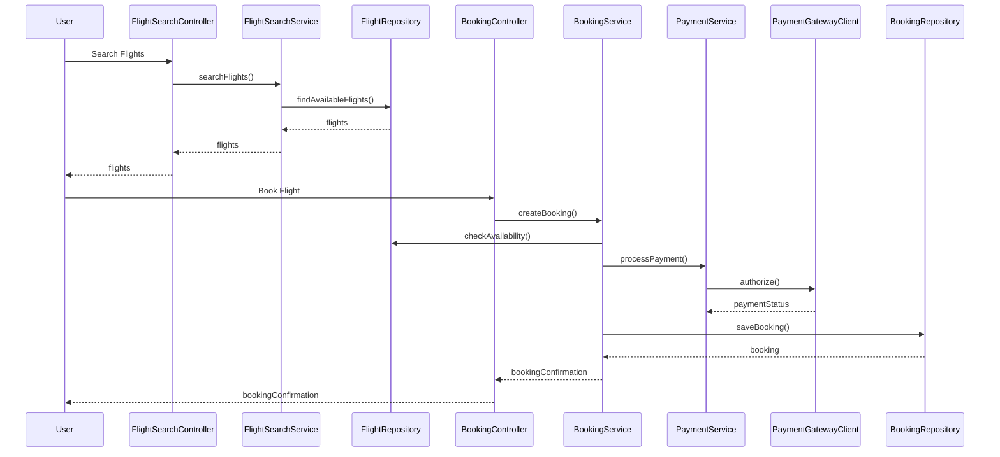
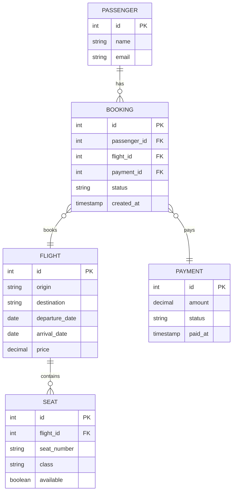

# For User Story Number [1]

1. Objective
The objective is to enable passengers to search for available flights, select preferred options, and book air transport tickets online. The system must support one-way, round-trip, and multi-city bookings, displaying flight details, prices, and seat availability. Booking confirmation is provided upon successful payment, ensuring a seamless and secure user experience.

2. API Model
  2.1 Common Components/Services
  - AuthenticationService (existing): Handles user authentication and session management.
  - PaymentService (existing): Integrates with payment gateway (Stripe).
  - FlightSearchService (new): Handles flight search and availability.
  - BookingService (new): Manages booking creation, fare calculation, and confirmation.

  2.2 API Details
| Operation  | REST Method | Type     | URL                              | Request (Sample JSON)                                                                                      | Response (Sample JSON)                                                                                     |
|------------|-------------|----------|-----------------------------------|------------------------------------------------------------------------------------------------------------|------------------------------------------------------------------------------------------------------------|
| Search     | GET         | Success  | /api/flights/search              | {"origin":"JFK","destination":"LAX","departureDate":"2025-12-01","returnDate":"2025-12-10","tripType":"round-trip"} | [{"flightId":123,"airline":"Delta","price":350.00,"seatsAvailable":5,"class":"Economy"}]         |
| Book       | POST        | Success  | /api/bookings                    | {"flightId":123,"passengerInfo":{...},"paymentInfo":{...}}                                            | {"bookingId":456,"status":"CONFIRMED","totalFare":370.00}                                            |
| Book       | POST        | Failure  | /api/bookings                    | {"flightId":123,"passengerInfo":{...},"paymentInfo":{...}}                                            | {"error":"Payment authorization failed"}                                                                |
| GetBooking | GET         | Success  | /api/bookings/{bookingId}        | -                                                                                                          | {"bookingId":456,"status":"CONFIRMED","flightDetails":{...}}                                         |

  2.3 Exceptions
  - FlightNotFoundException: Thrown when no flights match the search criteria.
  - InvalidInputException: Thrown when required fields are missing or invalid.
  - PaymentFailedException: Thrown when payment gateway authorization fails.
  - BookingNotFoundException: Thrown when a booking ID does not exist.

3. Functional Design
  3.1 Class Diagram

  3.2 UML Sequence Diagram

  3.3 Components
| Component Name         | Description                                                  | Existing/New |
|-----------------------|--------------------------------------------------------------|--------------|
| FlightSearchController| Handles flight search API endpoints                          | New          |
| BookingController     | Handles booking-related API endpoints                        | New          |
| FlightSearchService   | Business logic for searching flights                         | New          |
| BookingService        | Business logic for booking creation and validation           | New          |
| PaymentService        | Handles payment processing and integration                   | Existing     |
| FlightRepository      | Data access for flight information                           | New          |
| BookingRepository     | Data access for bookings                                     | New          |
| PaymentGatewayClient  | Communicates with external payment gateway                   | Existing     |

  3.4 Service Layer Logic and Validations
| FieldName        | Validation                                 | Error Message                        | ClassUsed         |
|------------------|--------------------------------------------|--------------------------------------|-------------------|
| origin           | Must not be empty                          | Origin field cannot be empty         | BookingService    |
| destination      | Must not be empty                          | Destination field cannot be empty    | BookingService    |
| travelDates      | Must be valid and not in the past          | Invalid or past travel date          | BookingService    |
| paymentDetails   | Must be valid and authorized               | Payment authorization failed         | PaymentService    |

4. Integrations
| SystemToBeIntegrated | IntegratedFor        | IntegrationType |
|----------------------|---------------------|-----------------|
| Payment Gateway      | Payment processing  | API             |
| Airline Data API     | Flight data         | API             |

5. DB Details
  5.1 ER Model

  5.2 DB Validations
  - Booking must reference valid passenger, flight, and payment IDs.
  - Payment status must be 'CONFIRMED' for booking confirmation.

6. Non-Functional Requirements
  6.1 Performance
  - Support at least 10,000 concurrent users.
  - Search queries must respond within 2 seconds.
  - Caching of flight search results at API layer for popular routes.

  6.2 Security
    6.2.1 Authentication
    - OAuth2/JWT-based authentication for all APIs.
    - HTTPS enforced for all endpoints.
    6.2.2 Authorization
    - Role-based access: only authenticated users can book flights.

  6.3 Logging
    6.3.1 Application Logging
    - DEBUG: API request/response payloads (excluding sensitive data)
    - INFO: Successful bookings, payments, flight searches
    - ERROR: Failed payments, booking errors
    - WARN: Suspicious activities, repeated failed logins
    6.3.2 Audit Log
    - Log all booking transactions with user, flight, and payment details for auditing.

7. Dependencies
  - Payment gateway (Stripe)
  - Airline data provider APIs
  - PostgreSQL database

8. Assumptions
  - All users are registered and authenticated.
  - Flight data from airline APIs is accurate and up-to-date.
  - Payment gateway is PCI DSS compliant.
