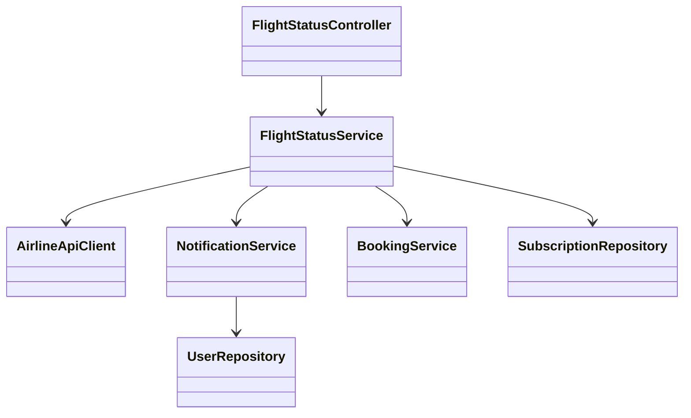
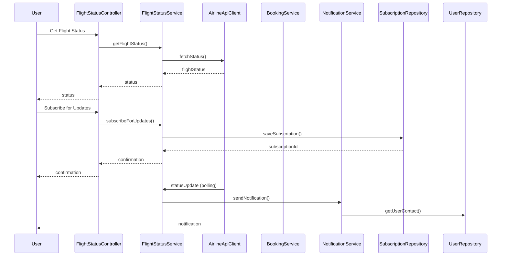
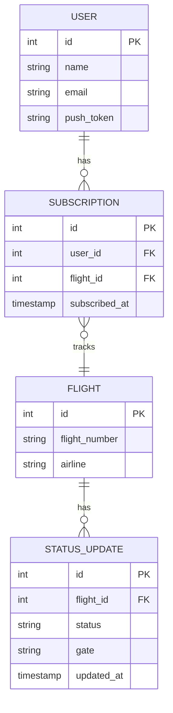

# For User Story Number [2]

1. Objective
The objective is to enable passengers to track the real-time status of their flights, including updates on departure, arrival, delays, gate assignments, and cancellations. The system must provide timely notifications to users for any changes affecting their flights. This ensures passengers are always informed and can plan accordingly.

2. API Model
  2.1 Common Components/Services
  - AuthenticationService (existing): Handles user authentication and session management.
  - NotificationService (new): Sends push notifications to users.
  - FlightStatusService (new): Polls airline APIs for real-time flight status.
  - BookingService (existing): Retrieves booking information for users.

  2.2 API Details
| Operation     | REST Method | Type     | URL                                 | Request (Sample JSON)                                   | Response (Sample JSON)                                                |
|--------------|-------------|----------|--------------------------------------|---------------------------------------------------------|-----------------------------------------------------------------------|
| GetStatus    | GET         | Success  | /api/flights/status                 | {"flightNumber":"DL1234"}                              | {"flightNumber":"DL1234","status":"DELAYED","gate":"A12","departureTime":"12:30"} |
| GetStatus    | GET         | Success  | /api/flights/status                 | {"bookingReference":"ABC123"}                          | {"flightNumber":"DL1234","status":"ON_TIME","gate":"A10","departureTime":"11:00"} |
| GetStatus    | GET         | Failure  | /api/flights/status                 | {"flightNumber":"INVALID"}                             | {"error":"Flight not found"}                                         |
| Subscribe    | POST        | Success  | /api/flights/subscribeStatusUpdates | {"flightNumber":"DL1234","userId":789}                | {"subscriptionId":555,"status":"SUBSCRIBED"}                        |

  2.3 Exceptions
  - FlightNotFoundException: Thrown when the flight number or booking reference is invalid.
  - NotificationFailedException: Thrown when notification delivery fails.
  - UnauthorizedAccessException: Thrown when user is not authenticated.

3. Functional Design
  3.1 Class Diagram

  3.2 UML Sequence Diagram

  3.3 Components
| Component Name         | Description                                                  | Existing/New |
|-----------------------|--------------------------------------------------------------|--------------|
| FlightStatusController| Handles flight status API endpoints                          | New          |
| FlightStatusService   | Business logic for real-time flight status and notifications | New          |
| AirlineApiClient      | Polls airline APIs for real-time flight data                 | New          |
| NotificationService   | Sends push notifications to users                            | New          |
| BookingService        | Retrieves user booking information                           | Existing     |
| UserRepository        | Data access for user contact info                            | Existing     |
| SubscriptionRepository| Manages user subscriptions for flight status updates         | New          |

  3.4 Service Layer Logic and Validations
| FieldName           | Validation                                 | Error Message                        | ClassUsed             |
|---------------------|--------------------------------------------|--------------------------------------|-----------------------|
| flightNumber        | Must be valid and exist                    | Flight not found                     | FlightStatusService   |
| bookingReference    | Must be valid and mapped to a booking      | Booking reference not found          | BookingService        |
| userId              | Must be authenticated and exist            | Unauthorized access                  | NotificationService   |
| notificationContact | Must be valid (email/push token)           | Invalid contact information          | NotificationService   |

4. Integrations
| SystemToBeIntegrated | IntegratedFor        | IntegrationType |
|----------------------|---------------------|-----------------|
| Airline Data API     | Real-time flight data| API             |
| Firebase             | Push notifications  | API             |

5. DB Details
  5.1 ER Model

  5.2 DB Validations
  - Subscription must reference valid user and flight IDs.
  - Status updates must be timestamped and linked to valid flights.

6. Non-Functional Requirements
  6.1 Performance
  - Updates must be reflected within 1 minute of change.
  - System must be available 24/7.
  - Efficient polling and caching of status updates for popular flights.

  6.2 Security
    6.2.1 Authentication
    - OAuth2/JWT-based authentication for all APIs.
    - HTTPS enforced for all endpoints.
    6.2.2 Authorization
    - Only authenticated users can subscribe for updates.

  6.3 Logging
    6.3.1 Application Logging
    - DEBUG: API request/response payloads (excluding sensitive data)
    - INFO: Subscription events, status updates
    - ERROR: Failed notifications, API errors
    - WARN: Repeated failed subscription attempts
    6.3.2 Audit Log
    - Log all status update notifications with user, flight, and event details.

7. Dependencies
  - Airline data provider APIs
  - Firebase push notification service
  - PostgreSQL database

8. Assumptions
  - Airline APIs provide timely and accurate data.
  - User devices are registered for push notifications.
  - Users are authenticated before accessing flight status.