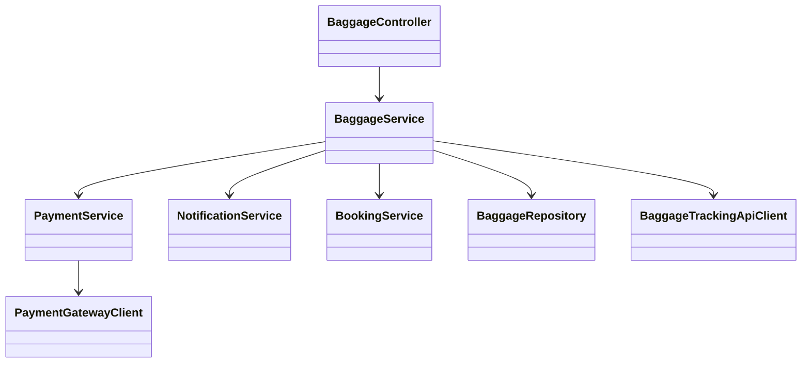
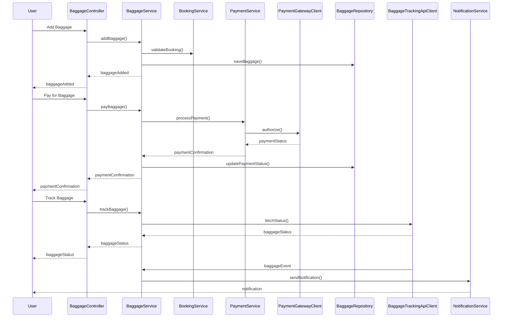
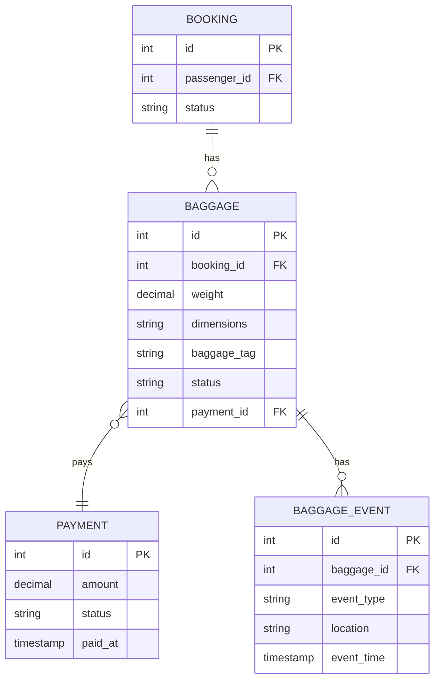

# For User Story Number [3]

1. Objective
The objective is to enable passengers to manage and track their checked baggage throughout their journey. Passengers can add and pay for baggage, generate baggage tags, and receive real-time status updates and notifications for baggage check-in, transfer, and arrival. This ensures transparency and assurance regarding baggage handling and location.

2. API Model
  2.1 Common Components/Services
  - AuthenticationService (existing): Handles user authentication and session management.
  - PaymentService (existing): Integrates with payment gateway (Stripe).
  - BaggageService (new): Manages baggage addition, tag generation, and tracking.
  - NotificationService (existing): Sends notifications to users.
  - BookingService (existing): Retrieves booking information for users.

  2.2 API Details
| Operation      | REST Method | Type     | URL                                 | Request (Sample JSON)                                                                 | Response (Sample JSON)                                                                 |
|---------------|-------------|----------|--------------------------------------|---------------------------------------------------------------------------------------|----------------------------------------------------------------------------------------|
| AddBaggage    | POST        | Success  | /api/baggage/add                     | {"bookingId":456,"baggageDetails":{"weight":23,"dimensions":"55x40x23"}}           | {"baggageId":789,"status":"ADDED","fee":30.00}                                   |
| AddBaggage    | POST        | Failure  | /api/baggage/add                     | {"bookingId":456,"baggageDetails":{"weight":50,"dimensions":"100x80x60"}}         | {"error":"Baggage exceeds airline policy"}                                          |
| PayBaggage    | POST        | Success  | /api/baggage/pay                     | {"baggageId":789,"paymentInfo":{...}}                                               | {"paymentId":321,"status":"CONFIRMED"}                                            |
| TrackBaggage  | GET         | Success  | /api/baggage/track/{baggageTag}      | -                                                                                     | {"baggageTag":"BG123456","status":"IN_TRANSIT","location":"LAX"}              |
| TrackBaggage  | GET         | Failure  | /api/baggage/track/{baggageTag}      | -                                                                                     | {"error":"Baggage not found"}                                                       |

  2.3 Exceptions
  - BaggagePolicyViolationException: Thrown when baggage exceeds airline policy.
  - PaymentFailedException: Thrown when payment for baggage fails.
  - BaggageNotFoundException: Thrown when baggage tag is invalid or not found.
  - UnauthorizedAccessException: Thrown when user is not authenticated.

3. Functional Design
  3.1 Class Diagram

  3.2 UML Sequence Diagram

  3.3 Components
| Component Name            | Description                                                  | Existing/New |
|--------------------------|--------------------------------------------------------------|--------------|
| BaggageController        | Handles baggage-related API endpoints                        | New          |
| BaggageService           | Business logic for baggage management and tracking           | New          |
| PaymentService           | Handles payment processing and integration                   | Existing     |
| NotificationService      | Sends notifications to users                                 | Existing     |
| BookingService           | Retrieves user booking information                           | Existing     |
| BaggageRepository        | Data access for baggage information                          | New          |
| PaymentGatewayClient     | Communicates with external payment gateway                   | Existing     |
| BaggageTrackingApiClient | Integrates with airline baggage tracking systems             | New          |

  3.4 Service Layer Logic and Validations
| FieldName        | Validation                                 | Error Message                        | ClassUsed         |
|------------------|--------------------------------------------|--------------------------------------|-------------------|
| baggageWeight    | Must comply with airline policy            | Baggage exceeds airline policy       | BaggageService    |
| baggageDimensions| Must comply with airline policy            | Baggage exceeds airline policy       | BaggageService    |
| paymentDetails   | Must be valid and authorized               | Payment authorization failed         | PaymentService    |
| baggageTag       | Must be valid and exist                    | Baggage not found                    | BaggageService    |

4. Integrations
| SystemToBeIntegrated | IntegratedFor        | IntegrationType |
|----------------------|---------------------|-----------------|
| Payment Gateway      | Payment processing  | API             |
| Airline Baggage API  | Baggage tracking    | API             |

5. DB Details
  5.1 ER Model

  5.2 DB Validations
  - Baggage must reference valid booking and payment IDs.
  - Baggage weight and dimensions must comply with airline policy.
  - Baggage events must be timestamped and linked to valid baggage IDs.

6. Non-Functional Requirements
  6.1 Performance
  - Baggage status updates must be reflected within 2 minutes.
  - System must handle at least 5,000 concurrent tracking requests.
  - Caching of frequent baggage tracking queries at API layer.

  6.2 Security
    6.2.1 Authentication
    - OAuth2/JWT-based authentication for all APIs.
    - HTTPS enforced for all endpoints.
    6.2.2 Authorization
    - Only authenticated users can manage and track baggage.

  6.3 Logging
    6.3.1 Application Logging
    - DEBUG: API request/response payloads (excluding sensitive data)
    - INFO: Baggage addition, payment, and tracking events
    - ERROR: Failed payments, baggage tracking errors
    - WARN: Suspicious baggage activity
    6.3.2 Audit Log
    - Log all baggage management and tracking transactions with user, booking, and event details.

7. Dependencies
  - Payment gateway (Stripe)
  - Airline baggage handling APIs
  - PostgreSQL database

8. Assumptions
  - Airline baggage APIs provide timely and accurate data.
  - Users are authenticated before managing or tracking baggage.
  - Payment gateway is PCI DSS compliant.
