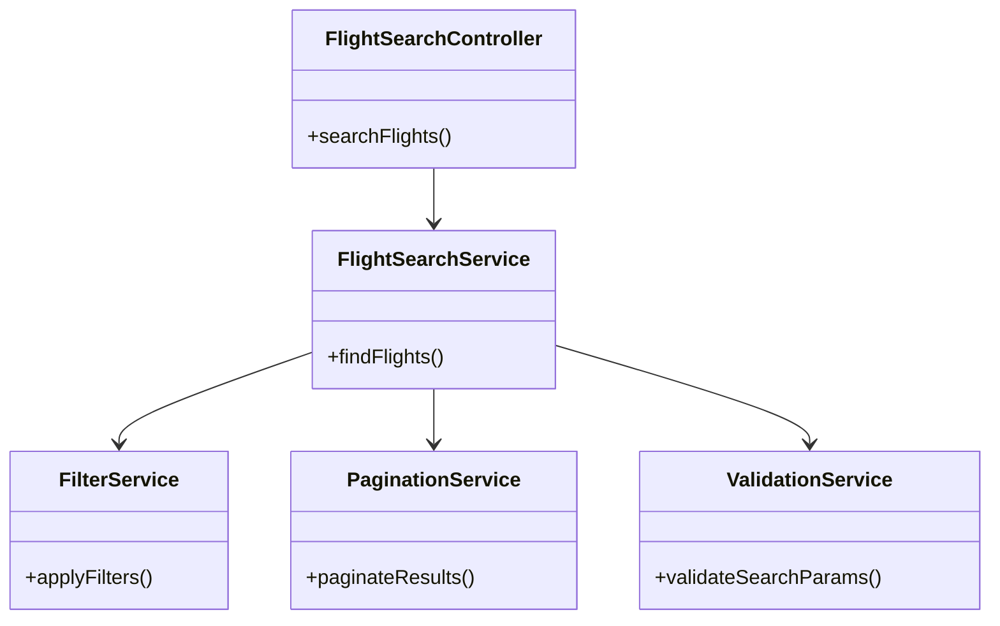
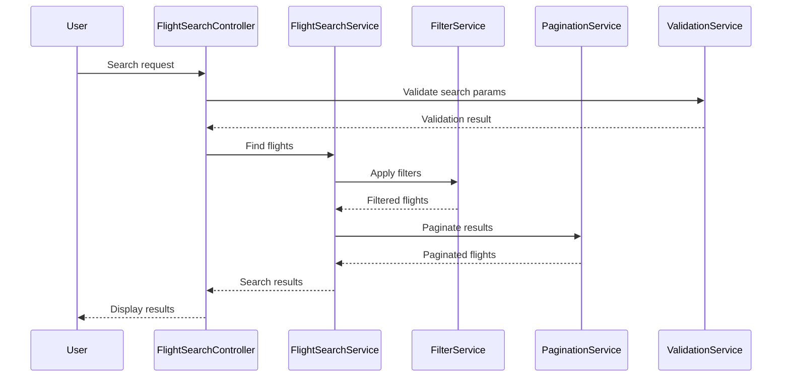
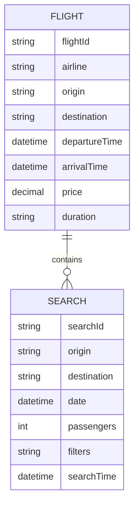

# For User Story Number 1

1. Objective
The objective is to enable travelers to search for available flights based on origin, destination, date, and number of passengers. The system should allow filtering and sorting of results by price, airline, and travel time. Results must be displayed in a user-friendly, paginated format with all relevant details.

2. API Model
  2.1 Common Components/Services
  - FlightSearchService (existing/new)
  - FilterService (existing/new)
  - PaginationService (existing/new)
  - ValidationService (existing)

  2.2 API Details
| Operation | REST Method | Type | URL | Request | Response |
|-----------|------------|------|-----|---------|----------|
| Search Flights | GET | Success | /api/flights/search | {"origin": "JFK", "destination": "LAX", "date": "2025-10-10", "passengers": 2, "filters": {"price": "asc", "airline": "Delta", "duration": "shortest"}, "page": 1, "size": 20} | {"flights": [{"flightId": "DL123", "airline": "Delta", "departureTime": "10:00", "arrivalTime": "13:00", "price": 320, "duration": "3h"}], "totalPages": 5, "currentPage": 1} |
| Search Flights | GET | Failure | /api/flights/search | {"origin": "XXX", "destination": "YYY", "date": "2020-01-01", "passengers": 0} | {"error": "No flights found"} |

  2.3 Exceptions
| Exception Name | Description |
|----------------|-------------|
| InvalidAirportCodeException | Origin or destination is not a valid airport code |
| InvalidDateException | Travel date is in the past |
| InvalidPassengerCountException | Number of passengers is less than 1 or exceeds maximum allowed |
| NoFlightsFoundException | No flights match the search criteria |

3 Functional Design
  3.1 Class Diagram

  3.2 UML Sequence Diagram

  3.3 Components
| Component Name | Description | Existing/New |
|----------------|-------------|--------------|
| FlightSearchController | Handles incoming flight search requests | New |
| FlightSearchService | Core logic for searching flights | New |
| FilterService | Applies filters to flight results | New |
| PaginationService | Handles pagination of results | New |
| ValidationService | Validates search parameters | Existing |

  3.4 Service Layer Logic and Validations
| FieldName | Validation | Error Message | ClassUsed |
|-----------|------------|--------------|-----------|
| origin | Valid airport code | Invalid airport code | ValidationService |
| destination | Valid airport code | Invalid airport code | ValidationService |
| date | Not in the past | Travel date cannot be in the past | ValidationService |
| passengers | >= 1 and <= max allowed | Invalid passenger count | ValidationService |

4 Integrations
| SystemToBeIntegrated | IntegratedFor | IntegrationType |
|---------------------|---------------|-----------------|
| Flight Data Provider (Amadeus/Sabre) | Fetch flight data | API |
| Analytics System | Track search trends | API |

5 DB Details
  5.1 ER Model

  5.2 DB Validations
- Ensure flightId is unique
- Ensure origin/destination are valid codes
- Ensure date is not in the past

6 Non-Functional Requirements
  6.1 Performance
  - Search results must load within 3 seconds
  - Caching at API layer for popular routes

  6.2 Security
    6.2.1 Authentication
    - All API endpoints require authentication (JWT/OAuth2)
    6.2.2 Authorization
    - Only authorized users can perform searches

  6.3 Logging
    6.3.1 Application Logging
    - DEBUG: Input search params
    - INFO: Successful searches
    - WARN: No flights found
    - ERROR: Validation failures, API errors
    6.3.2 Audit Log
    - Log search events with userId, search params, timestamp

7 Dependencies
- Flight data provider API
- Analytics system
- Authentication/Authorization service

8 Assumptions
- All airport codes are standardized and available
- Maximum passenger count is defined by business rules
- Flight data provider API is available and reliable
