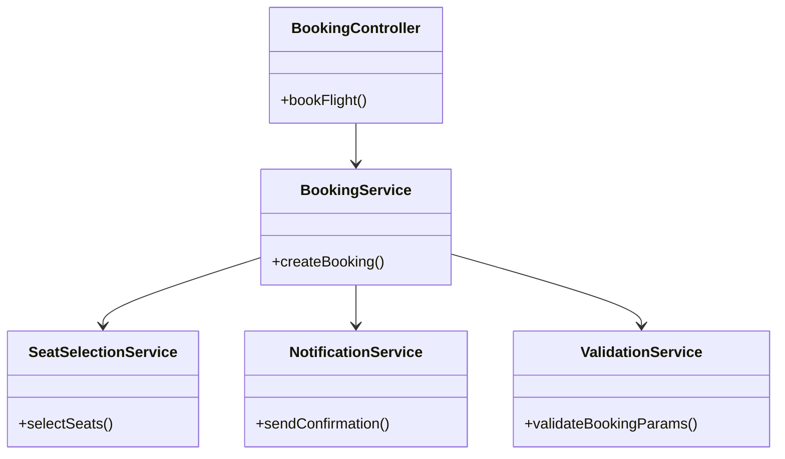
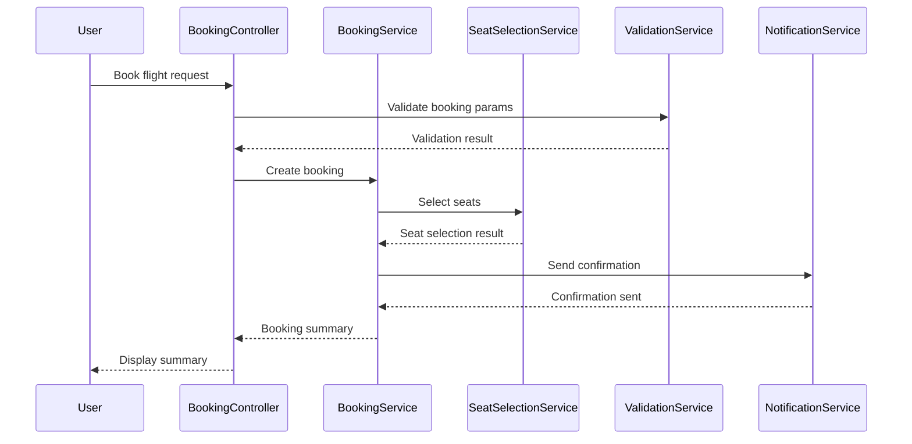
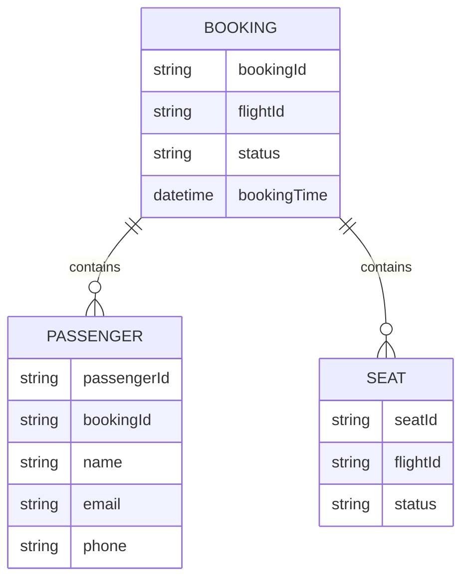

# For User Story Number 2

1. Objective
The objective is to enable travelers to book a selected flight by entering passenger details, selecting seats, and reviewing the booking summary. The system must validate all inputs, save the booking, and send confirmation via email/SMS. The process should be secure, efficient, and compliant with industry standards.

2. API Model
  2.1 Common Components/Services
  - BookingService (new)
  - NotificationService (existing)
  - ValidationService (existing)
  - SeatSelectionService (new)

  2.2 API Details
| Operation | REST Method | Type | URL | Request | Response |
|-----------|------------|------|-----|---------|----------|
| Book Flight | POST | Success | /api/bookings | {"flightId": "DL123", "passengers": [{"name": "John Doe", "email": "john@example.com", "phone": "1234567890"}], "seats": ["12A", "12B"]} | {"bookingId": "BK1001", "status": "confirmed", "summary": {"flightId": "DL123", "seats": ["12A", "12B"], "passengers": [{"name": "John Doe"}]}} |
| Book Flight | POST | Failure | /api/bookings | {"flightId": "DL123", "passengers": [], "seats": ["12A", "12B"]} | {"error": "Passenger information required"} |

  2.3 Exceptions
| Exception Name | Description |
|----------------|-------------|
| MissingPassengerInfoException | Required passenger details not provided |
| SeatUnavailableException | Selected seat(s) not available |
| InvalidEmailFormatException | Email format is invalid |
| InvalidPhoneFormatException | Phone number format is invalid |
| BookingFailedException | Booking could not be completed |

3 Functional Design
  3.1 Class Diagram

  3.2 UML Sequence Diagram

  3.3 Components
| Component Name | Description | Existing/New |
|----------------|-------------|--------------|
| BookingController | Handles booking requests | New |
| BookingService | Core logic for booking flights | New |
| SeatSelectionService | Manages seat selection and availability | New |
| NotificationService | Sends booking confirmation | Existing |
| ValidationService | Validates booking parameters | Existing |

  3.4 Service Layer Logic and Validations
| FieldName | Validation | Error Message | ClassUsed |
|-----------|------------|--------------|-----------|
| passengers | Required fields filled | Passenger information required | ValidationService |
| seats | Not exceed available seats | Seat(s) not available | SeatSelectionService |
| email | Valid format | Invalid email format | ValidationService |
| phone | Valid format | Invalid phone format | ValidationService |

4 Integrations
| SystemToBeIntegrated | IntegratedFor | IntegrationType |
|---------------------|---------------|-----------------|
| Airline Booking API | Save booking and seat selection | API |
| Notification Gateway (Email/SMS) | Send confirmation | API |

5 DB Details
  5.1 ER Model

  5.2 DB Validations
- Ensure bookingId is unique
- Ensure seat availability before assignment
- Validate email and phone formats

6 Non-Functional Requirements
  6.1 Performance
  - Booking process should complete within 5 seconds
  - Caching at API layer for frequent bookings

  6.2 Security
    6.2.1 Authentication
    - All API endpoints require authentication (JWT/OAuth2)
    6.2.2 Authorization
    - Only authorized users can book flights
    - PCI DSS compliance for payment info

  6.3 Logging
    6.3.1 Application Logging
    - DEBUG: Input booking params
    - INFO: Successful bookings
    - WARN: Failed bookings
    - ERROR: Validation failures, API errors
    6.3.2 Audit Log
    - Log booking events with userId, booking params, timestamp

7 Dependencies
- Airline booking API
- Notification gateway
- Authentication/Authorization service

8 Assumptions
- Seat map is updated in real time
- Email/SMS gateway is available and reliable
- Booking API supports required volume
