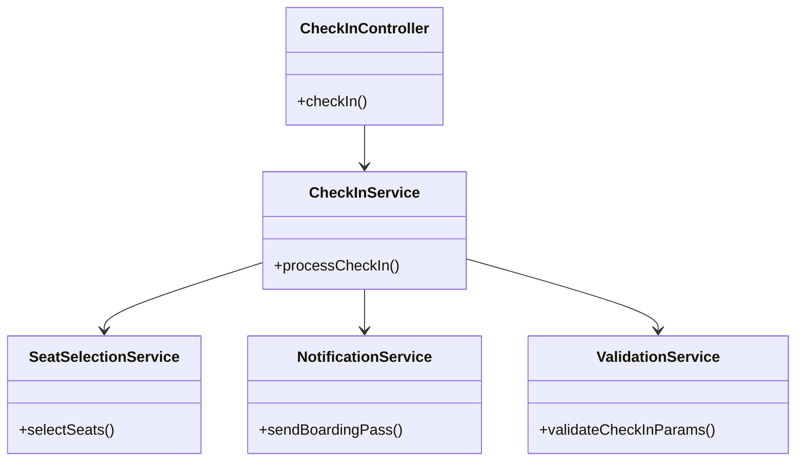
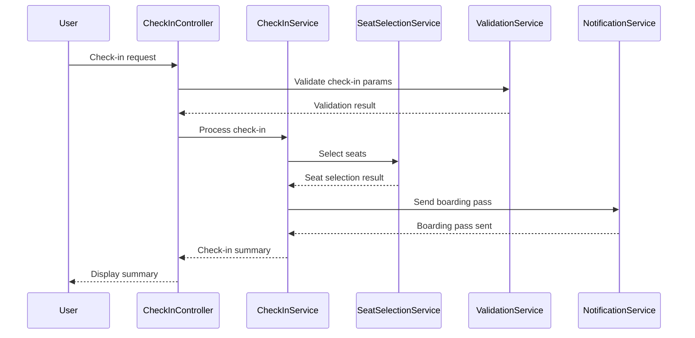
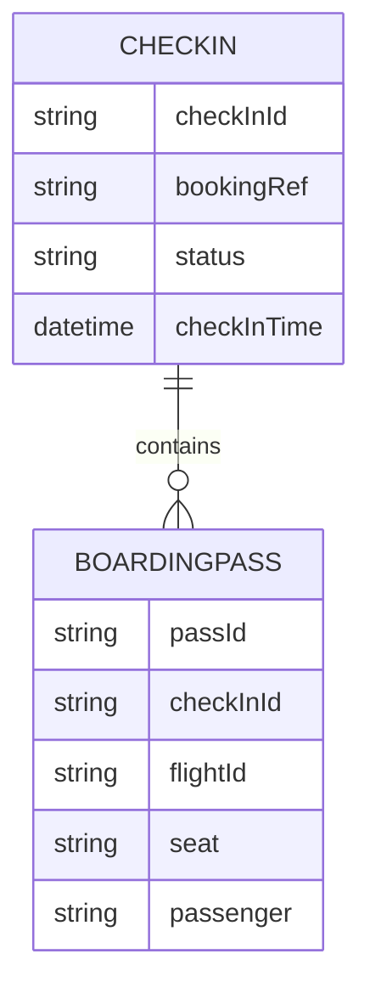

# For User Story Number 3

1. Objective
The objective is to enable travelers to check in online for their booked flights by entering booking reference and personal details, selecting available seats, and receiving a digital boarding pass and check-in confirmation. The process should be secure, efficient, and user-friendly.

2. API Model
  2.1 Common Components/Services
  - CheckInService (new)
  - SeatSelectionService (existing/new)
  - NotificationService (existing)
  - ValidationService (existing)

  2.2 API Details
| Operation | REST Method | Type | URL | Request | Response |
|-----------|------------|------|-----|---------|----------|
| Check-In | POST | Success | /api/checkin | {"bookingRef": "BK1001", "passengerDetails": {"name": "John Doe"}, "seat": "14C"} | {"checkInId": "CI2001", "status": "confirmed", "boardingPass": {"flightId": "DL123", "seat": "14C", "passenger": "John Doe"}} |
| Check-In | POST | Failure | /api/checkin | {"bookingRef": "INVALID", "passengerDetails": {"name": "John Doe"}, "seat": "14C"} | {"error": "Invalid booking reference"} |

  2.3 Exceptions
| Exception Name | Description |
|----------------|-------------|
| InvalidBookingReferenceException | Booking reference does not match a confirmed booking |
| CheckInWindowException | Check-in attempted outside allowed time window |
| SeatUnavailableException | Selected seat not available |
| CheckInFailedException | Check-in could not be completed |

3 Functional Design
  3.1 Class Diagram

  3.2 UML Sequence Diagram

  3.3 Components
| Component Name | Description | Existing/New |
|----------------|-------------|--------------|
| CheckInController | Handles check-in requests | New |
| CheckInService | Core logic for check-in process | New |
| SeatSelectionService | Manages seat selection and availability | Existing/New |
| NotificationService | Sends boarding pass and confirmation | Existing |
| ValidationService | Validates check-in parameters | Existing |

  3.4 Service Layer Logic and Validations
| FieldName | Validation | Error Message | ClassUsed |
|-----------|------------|--------------|-----------|
| bookingRef | Valid and matches confirmed booking | Invalid booking reference | ValidationService |
| checkInTime | Within allowed time window | Check-in not allowed at this time | ValidationService |
| seat | Not exceed available seats | Seat not available | SeatSelectionService |

4 Integrations
| SystemToBeIntegrated | IntegratedFor | IntegrationType |
|---------------------|---------------|-----------------|
| Airline Check-In API | Process check-in and seat assignment | API |
| Notification Gateway (Email/SMS) | Send boarding pass | API |

5 DB Details
  5.1 ER Model

  5.2 DB Validations
- Ensure checkInId is unique
- Validate bookingRef matches confirmed booking
- Validate seat availability before assignment

6 Non-Functional Requirements
  6.1 Performance
  - Check-in process should complete within 3 seconds
  - Caching at API layer for frequent check-ins

  6.2 Security
    6.2.1 Authentication
    - All API endpoints require authentication (JWT/OAuth2)
    6.2.2 Authorization
    - Only authorized users can check in

  6.3 Logging
    6.3.1 Application Logging
    - DEBUG: Input check-in params
    - INFO: Successful check-ins
    - WARN: Failed check-ins
    - ERROR: Validation failures, API errors
    6.3.2 Audit Log
    - Log check-in events with userId, check-in params, timestamp

7 Dependencies
- Airline check-in API
- Notification gateway
- Authentication/Authorization service

8 Assumptions
- Boarding pass format is standardized
- Email/SMS gateway is available and reliable
- Check-in API supports required volume
