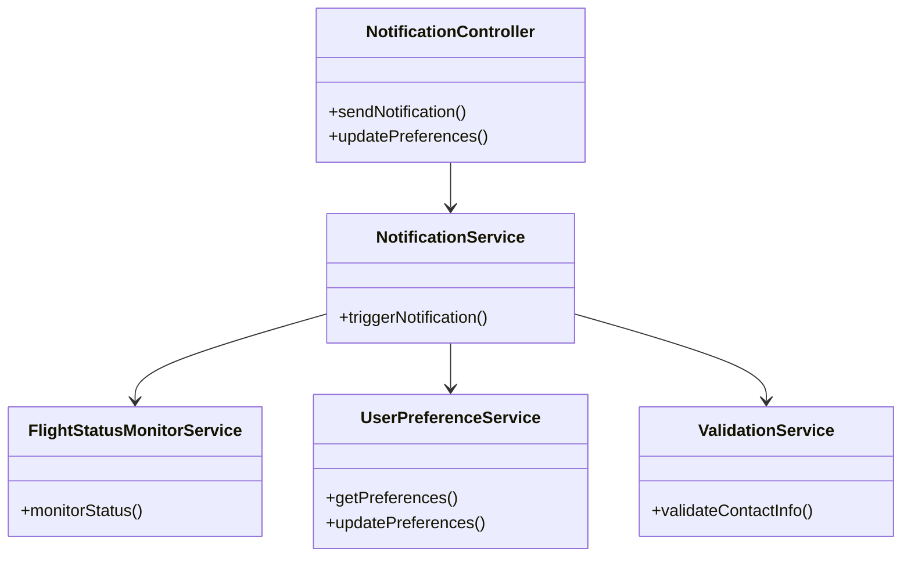
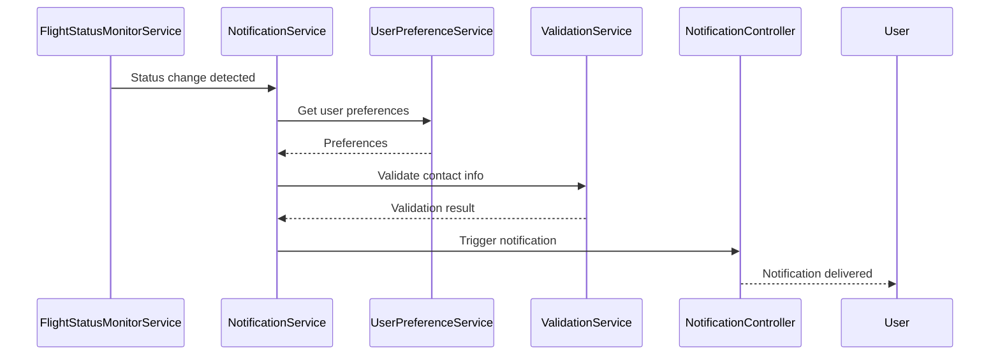
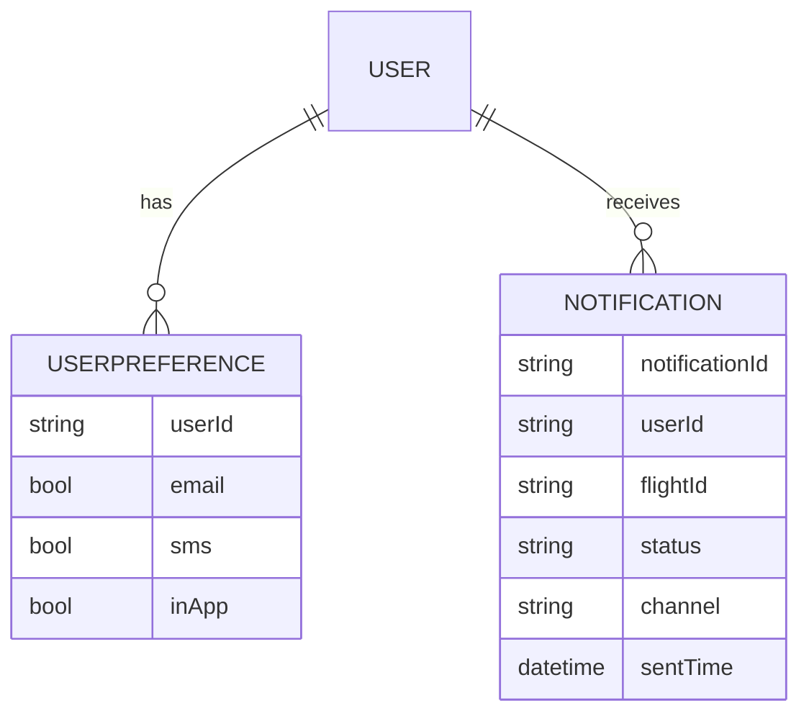

# For User Story Number 4

1. Objective
The objective is to inform travelers in real time about any changes or updates to their flight status, including delays, gate changes, and cancellations, via email, SMS, and in-app alerts. Users should be able to manage notification preferences in their profile. The notification system must be reliable, fast, and respect user preferences.

2. API Model
  2.1 Common Components/Services
  - NotificationService (new)
  - FlightStatusMonitorService (new)
  - UserPreferenceService (existing)
  - ValidationService (existing)

  2.2 API Details
| Operation | REST Method | Type | URL | Request | Response |
|-----------|------------|------|-----|---------|----------|
| Send Notification | POST | Success | /api/notifications/send | {"userId": "U1001", "flightId": "DL123", "status": "Delayed", "channels": ["email", "sms"]} | {"notificationId": "N3001", "status": "sent"} |
| Update Preferences | PUT | Success | /api/notifications/preferences | {"userId": "U1001", "preferences": {"email": true, "sms": false, "inApp": true}} | {"status": "preferences updated"} |
| Send Notification | POST | Failure | /api/notifications/send | {"userId": "U1001", "flightId": "DL123", "status": "Delayed", "channels": ["email"]} | {"error": "Invalid email format"} |

  2.3 Exceptions
| Exception Name | Description |
|----------------|-------------|
| InvalidPreferenceException | Notification preferences not saved/applied correctly |
| InvalidEmailFormatException | Email format is invalid |
| InvalidPhoneFormatException | Phone number format is invalid |
| NotificationFailedException | Notification could not be sent |

3 Functional Design
  3.1 Class Diagram

  3.2 UML Sequence Diagram

  3.3 Components
| Component Name | Description | Existing/New |
|----------------|-------------|--------------|
| NotificationController | Handles notification and preference requests | New |
| NotificationService | Core logic for sending notifications | New |
| FlightStatusMonitorService | Monitors flight status changes | New |
| UserPreferenceService | Manages user notification preferences | Existing |
| ValidationService | Validates contact info | Existing |

  3.4 Service Layer Logic and Validations
| FieldName | Validation | Error Message | ClassUsed |
|-----------|------------|--------------|-----------|
| preferences | Saved and applied correctly | Preferences not saved/applied | UserPreferenceService |
| email | Valid format | Invalid email format | ValidationService |
| phone | Valid format | Invalid phone format | ValidationService |
| flightId | Notification sent only for relevant flights | Notification not relevant | NotificationService |

4 Integrations
| SystemToBeIntegrated | IntegratedFor | IntegrationType |
|---------------------|---------------|-----------------|
| Airline Status API | Monitor flight status | API |
| Email/SMS Gateway | Send notifications | API/SMTP |
| In-App Notification System | Deliver in-app alerts | API |

5 DB Details
  5.1 ER Model

  5.2 DB Validations
- Ensure notificationId is unique
- Validate user contact info before sending
- Preferences must be persisted and retrievable

6 Non-Functional Requirements
  6.1 Performance
  - Notifications must be delivered within 1 minute of status change
  - Scalable to handle thousands of notifications per minute

  6.2 Security
    6.2.1 Authentication
    - All API endpoints require authentication (JWT/OAuth2)
    6.2.2 Authorization
    - Only authorized users can manage preferences
    - Opt-in/opt-out management for notifications

  6.3 Logging
    6.3.1 Application Logging
    - DEBUG: Notification triggers
    - INFO: Successful deliveries
    - WARN: Failed deliveries
    - ERROR: Validation failures, API errors
    6.3.2 Audit Log
    - Log notification events with userId, flightId, status, timestamp

7 Dependencies
- Airline status API
- Email/SMS gateway
- In-app notification system
- Authentication/Authorization service

8 Assumptions
- User contact info is up to date
- Notification gateways are reliable
- Flight status API supports required volume
