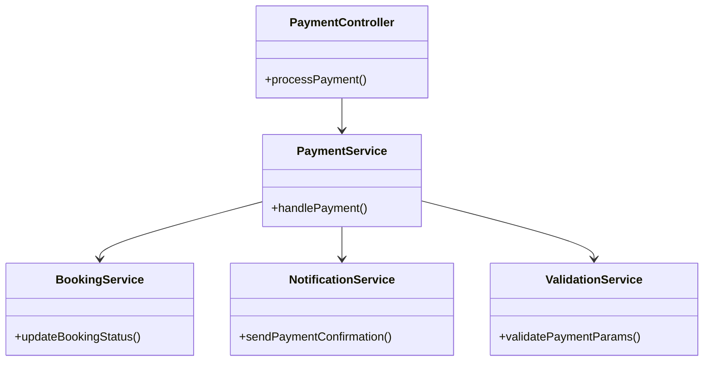
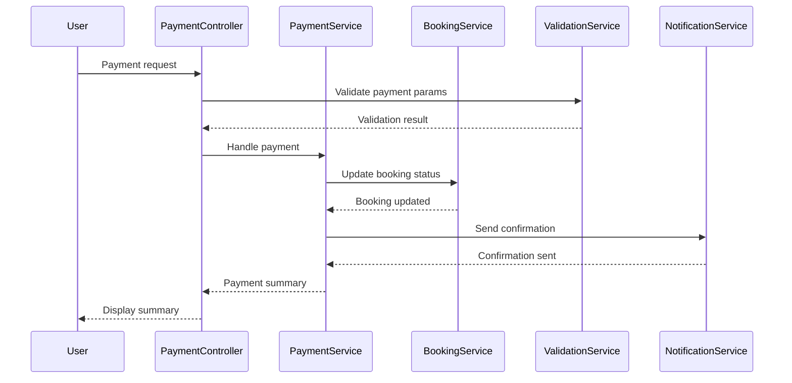
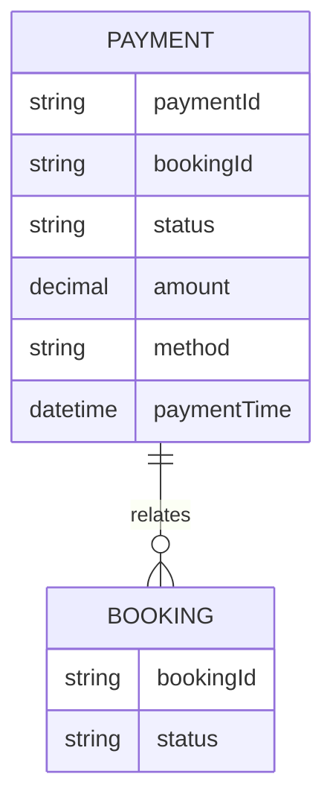

# For User Story Number 5

1. Objective
The objective is to enable travelers to securely pay for their flight bookings using multiple payment methods, ensuring secure and compliant transaction processing. The system must validate payment details, update booking status upon successful payment, and provide confirmation and booking details to the user. Payment failures must be handled gracefully.

2. API Model
  2.1 Common Components/Services
  - PaymentService (new)
  - BookingService (existing)
  - NotificationService (existing)
  - ValidationService (existing)

  2.2 API Details
| Operation | REST Method | Type | URL | Request | Response |
|-----------|------------|------|-----|---------|----------|
| Process Payment | POST | Success | /api/payments/process | {"bookingId": "BK1001", "paymentMethod": "card", "cardDetails": {"number": "4111111111111111", "expiry": "12/25", "cvv": "123"}} | {"paymentId": "PM4001", "status": "success", "confirmation": {"bookingId": "BK1001", "status": "paid"}} |
| Process Payment | POST | Failure | /api/payments/process | {"bookingId": "BK1001", "paymentMethod": "card", "cardDetails": {"number": "4111111111111111", "expiry": "12/20", "cvv": "123"}} | {"error": "Payment failed: Card expired"} |

  2.3 Exceptions
| Exception Name | Description |
|----------------|-------------|
| InvalidPaymentDetailsException | Payment details are incomplete or invalid |
| PaymentAuthorizationException | Payment could not be authorized |
| PaymentProcessingException | Payment gateway error |
| BookingUpdateException | Booking status could not be updated |

3 Functional Design
  3.1 Class Diagram

  3.2 UML Sequence Diagram

  3.3 Components
| Component Name | Description | Existing/New |
|----------------|-------------|--------------|
| PaymentController | Handles payment requests | New |
| PaymentService | Core logic for payment processing | New |
| BookingService | Updates booking status | Existing |
| NotificationService | Sends payment confirmation | Existing |
| ValidationService | Validates payment parameters | Existing |

  3.4 Service Layer Logic and Validations
| FieldName | Validation | Error Message | ClassUsed |
|-----------|------------|--------------|-----------|
| paymentDetails | Valid and complete | Invalid payment details | ValidationService |
| paymentAuthorization | Authorized and processed securely | Payment not authorized | PaymentService |
| bookingStatus | Updated only on successful payment | Booking not updated | BookingService |

4 Integrations
| SystemToBeIntegrated | IntegratedFor | IntegrationType |
|---------------------|---------------|-----------------|
| Payment Gateway (Stripe/PayPal) | Transaction processing | API |
| Booking System | Update booking status | API |
| Notification Gateway (Email/SMS) | Send payment confirmation | API |

5 DB Details
  5.1 ER Model

  5.2 DB Validations
- Ensure paymentId is unique
- Validate payment details before processing
- Booking status must be updated only on successful payment

6 Non-Functional Requirements
  6.1 Performance
  - Payment processing should complete within 5 seconds
  - Scalable to handle peak payment periods

  6.2 Security
    6.2.1 Authentication
    - All API endpoints require authentication (JWT/OAuth2)
    6.2.2 Authorization
    - Only authorized users can make payments
    - PCI DSS compliance, HTTPS, encryption of sensitive data

  6.3 Logging
    6.3.1 Application Logging
    - DEBUG: Payment request params
    - INFO: Successful payments
    - WARN: Failed payments
    - ERROR: Validation failures, gateway errors
    6.3.2 Audit Log
    - Log payment events with userId, payment params, timestamp

7 Dependencies
- Payment gateway (Stripe/PayPal)
- Booking system
- Notification gateway
- Authentication/Authorization service

8 Assumptions
- Payment gateway is PCI DSS compliant and reliable
- Booking system supports real-time updates
- Notification gateway is available
