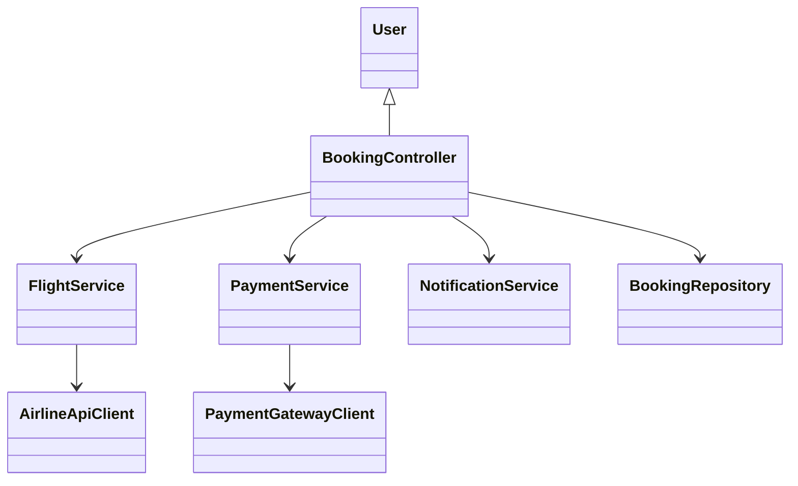
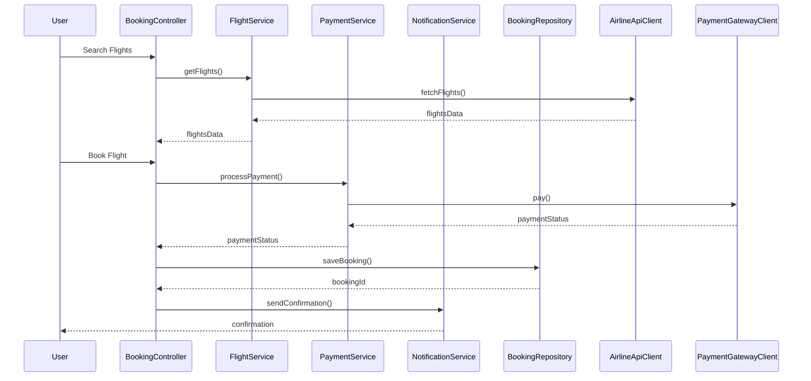
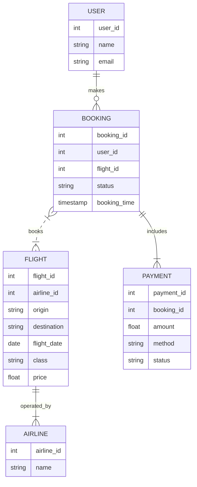

# For User Story Number [1]

1. Objective
The objective is to enable travelers to search, compare, and book air transport tickets online. The system provides real-time flight availability, supports multiple airlines, and ensures secure payment and booking confirmation. This enhances convenience and planning for users.

2. API Model
  2.1 Common Components/Services
  - Payment Gateway Service (Stripe/PayPal)
  - Airline Data Aggregator Service
  - Notification Service (Email/SMS)

  2.2 API Details
| Operation    | REST Method | Type        | URL                        | Request (Sample JSON)                                                                                  | Response (Sample JSON)                                                                                 |
|--------------|------------|-------------|----------------------------|--------------------------------------------------------------------------------------------------------|--------------------------------------------------------------------------------------------------------|
| Search       | GET        | Success     | /api/flights/search        | {"date":"2025-10-10","destination":"NYC","class":"Economy"}                                      | [{"flightId":1,"airline":"AA","price":200,"availability":true}, ...]                           |
| View Details | GET        | Success     | /api/flights/{flightId}    | N/A                                                                                                    | {"flightId":1,"details":{...},"price":200}                                                        |
| Book Ticket  | POST       | Success/Fail| /api/bookings              | {"flightId":1,"passengerDetails":{...},"paymentInfo":{...}}                                        | {"bookingId":123,"status":"CONFIRMED","confirmation":"sent"}                                   |
| Payment      | POST       | Success/Fail| /api/payments              | {"bookingId":123,"amount":200,"method":"Stripe"}                                                  | {"paymentId":456,"status":"SUCCESS"}                                                             |

  2.3 Exceptions
| API             | Exception Type           | Error Message                              |
|-----------------|-------------------------|--------------------------------------------|
| /api/flights/search | ValidationException      | Invalid date/destination/class input        |
| /api/bookings      | BookingException         | Flight not available or payment failed      |
| /api/payments      | PaymentException         | Payment gateway error                      |

3 Functional Design
  3.1 Class Diagram

  3.2 UML Sequence Diagram

  3.3 Components
| Component Name         | Description                                         | Existing/New |
|-----------------------|-----------------------------------------------------|--------------|
| BookingController     | Handles booking requests and orchestrates flow       | New          |
| FlightService         | Manages flight search and data aggregation           | New          |
| PaymentService        | Handles payment processing                           | New          |
| NotificationService   | Sends booking confirmations via email/SMS            | Existing     |
| AirlineApiClient      | Connects to airline APIs for flight data             | New          |
| PaymentGatewayClient  | Integrates with Stripe/PayPal                        | Existing     |
| BookingRepository     | Persists booking data in PostgreSQL                  | Existing     |

  3.4 Service Layer Logic & Validations
| FieldName         | Validation                                  | Error Message                        | ClassUsed           |
|-------------------|---------------------------------------------|--------------------------------------|---------------------|
| date              | Must be valid and in future                 | Invalid date                         | FlightService       |
| destination       | Must be a supported location                | Invalid destination                  | FlightService       |
| passengerDetails  | Required fields, valid format               | Invalid passenger details            | BookingController   |
| flightId          | Must be available                           | Flight not available                 | BookingController   |
| paymentInfo       | Valid payment method, sufficient funds      | Payment failed                       | PaymentService      |

4 Integrations
| SystemToBeIntegrated | IntegratedFor         | IntegrationType |
|----------------------|----------------------|-----------------|
| Airline APIs         | Flight availability   | API             |
| Stripe/PayPal        | Payment processing    | API             |
| Email/SMS Gateway    | Booking confirmation  | API             |

5 DB Details
  5.1 ER Model

  5.2 DB Validations
- Ensure booking is only created for available flights
- Payment status must be 'SUCCESS' before confirming booking

6 Non-Functional Requirements
  6.1 Performance
    - API response time <2s for search and booking
    - Caching for frequent flight search queries
  6.2 Security
    6.2.1 Authentication
      - SSL/TLS for all endpoints
      - PCI DSS compliance for payment data
    6.2.2 Authorization
      - Role-based access for booking management
  6.3 Logging
    6.3.1 Application Logging
      - DEBUG: API request/response payloads
      - INFO: Successful bookings and payments
      - ERROR: Payment failures, booking errors
      - WARN: API latency issues
    6.3.2 Audit Log
      - Log all booking transactions with timestamp, user, and status

7 Dependencies
- Airline APIs for real-time flight data
- Payment gateway (Stripe/PayPal)
- Email/SMS gateway for notifications

8 Assumptions
- All airlines provide real-time API access
- Payment gateways are PCI DSS compliant
- Email/SMS delivery is reliable