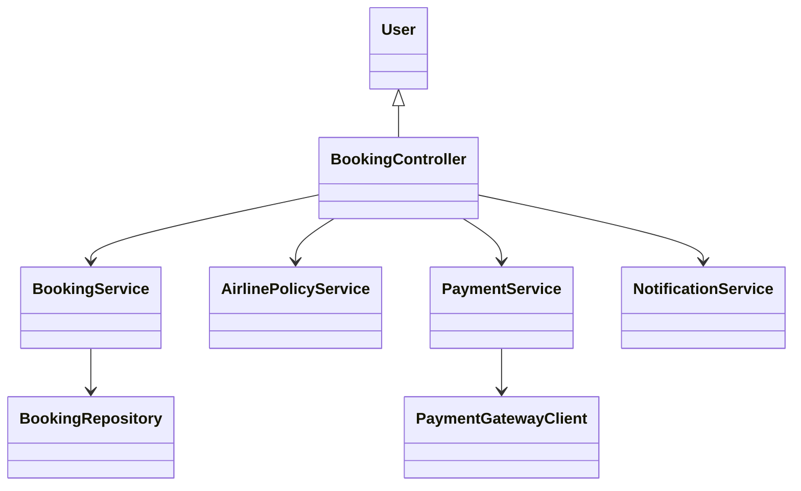
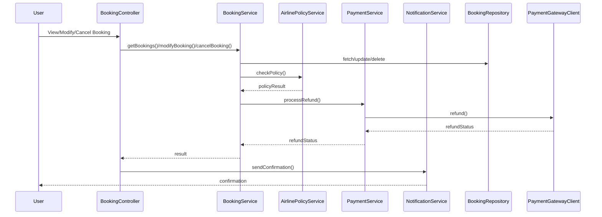
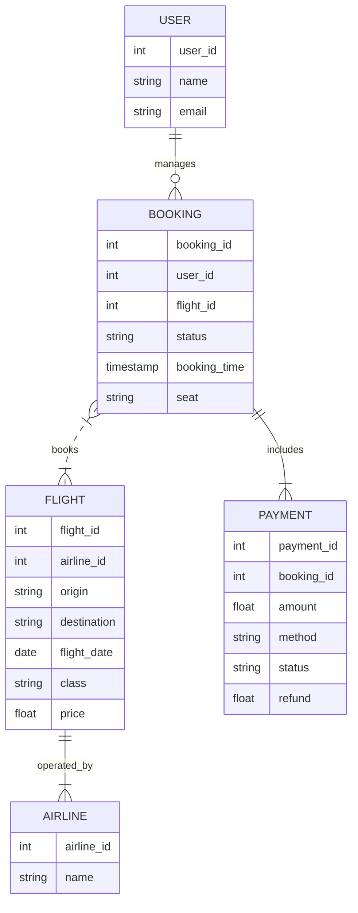

# For User Story Number [2]

1. Objective
Enable travelers to manage their air transport bookings by viewing, modifying, or canceling reservations easily. The system enforces airline policies and refund rules for all changes and cancellations. This improves user control and transparency over their travel plans.

2. API Model
  2.1 Common Components/Services
  - Booking Management Service
  - Airline Policy Service
  - Payment Gateway Service (for refunds)
  - Notification Service (Email/SMS)

  2.2 API Details
| Operation      | REST Method | Type        | URL                              | Request (Sample JSON)                                                                 | Response (Sample JSON)                                                                 |
|----------------|------------|-------------|----------------------------------|---------------------------------------------------------------------------------------|----------------------------------------------------------------------------------------|
| View Bookings  | GET        | Success     | /api/bookings                    | N/A                                                                                   | [{"bookingId":123,"flightId":1,"status":"CONFIRMED",...}, ...]                   |
| Modify Booking | PUT        | Success/Fail| /api/bookings/{bookingId}        | {"seat":"12A","passengerDetails":{...}}                                           | {"bookingId":123,"status":"MODIFIED","confirmation":"sent"}                    |
| Cancel Booking | DELETE     | Success/Fail| /api/bookings/{bookingId}        | N/A                                                                                   | {"bookingId":123,"status":"CANCELLED","refund":50,"confirmation":"sent"}      |
| Airline Rules  | GET        | Success     | /api/airlines/{airlineId}/rules  | N/A                                                                                   | {"changePolicy":{...},"cancellationPolicy":{...}}                                   |

  2.3 Exceptions
| API                  | Exception Type           | Error Message                              |
|----------------------|-------------------------|--------------------------------------------|
| /api/bookings        | AuthException           | Unauthorized access                        |
| /api/bookings/{id}   | PolicyException         | Modification/cancellation not allowed      |
| /api/bookings/{id}   | RefundException         | Refund calculation error                   |

3 Functional Design
  3.1 Class Diagram

  3.2 UML Sequence Diagram

  3.3 Components
| Component Name         | Description                                         | Existing/New |
|-----------------------|-----------------------------------------------------|--------------|
| BookingController     | Handles booking management requests                  | New          |
| BookingService        | Manages booking data and operations                  | New          |
| AirlinePolicyService  | Applies airline rules for changes/cancellations      | New          |
| PaymentService        | Handles refund processing                            | Existing     |
| NotificationService   | Sends confirmations via email/SMS                    | Existing     |
| BookingRepository     | Persists booking data in PostgreSQL                  | Existing     |
| PaymentGatewayClient  | Integrates with payment gateway for refunds          | Existing     |

  3.4 Service Layer Logic & Validations
| FieldName         | Validation                                  | Error Message                        | ClassUsed           |
|-------------------|---------------------------------------------|--------------------------------------|---------------------|
| userAuth          | Must be authenticated                       | Unauthorized access                  | BookingController   |
| bookingId         | Must exist and belong to user               | Booking not found                    | BookingService      |
| modification      | Allowed by airline policy                   | Modification not allowed             | AirlinePolicyService|
| cancellation      | Allowed by airline policy                   | Cancellation not allowed             | AirlinePolicyService|
| refund            | Accurate calculation, displayed before confirm| Refund calculation error            | PaymentService      |

4 Integrations
| SystemToBeIntegrated | IntegratedFor         | IntegrationType |
|----------------------|----------------------|-----------------|
| Airline APIs         | Policy rules          | API             |
| Payment Gateway      | Refund processing     | API             |
| Email/SMS Gateway    | Confirmation delivery | API             |

5 DB Details
  5.1 ER Model

  5.2 DB Validations
- Only authenticated users can access their bookings
- Refund amount must match airline policy

6 Non-Functional Requirements
  6.1 Performance
    - API response time <2s for booking management
    - Caching for frequent booking queries
  6.2 Security
    6.2.1 Authentication
      - OAuth2 authentication for all endpoints
      - SSL/TLS for secure transmission
    6.2.2 Authorization
      - Role-based access for booking management
  6.3 Logging
    6.3.1 Application Logging
      - DEBUG: API request/response payloads
      - INFO: Successful modifications/cancellations
      - ERROR: Refund failures, booking errors
      - WARN: API latency issues
    6.3.2 Audit Log
      - Log all booking changes/cancellations with timestamp, user, and status

7 Dependencies
- Airline APIs for policy rules
- Payment gateway for refunds
- Email/SMS gateway for notifications

8 Assumptions
- Airline rules are accessible via API
- Refunds are processed instantly by payment gateway
- Email/SMS delivery is reliable