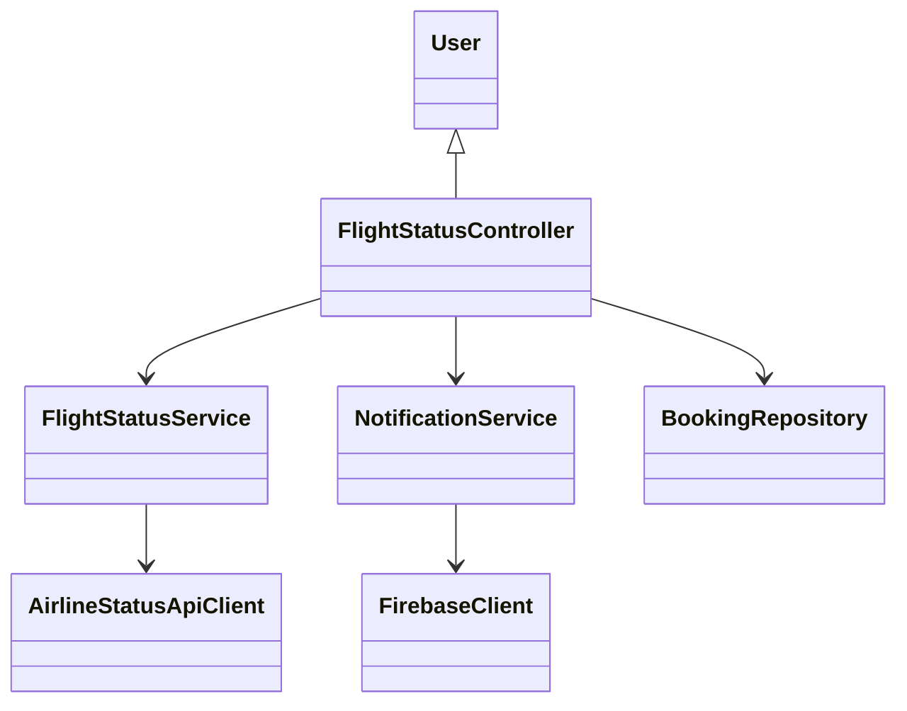
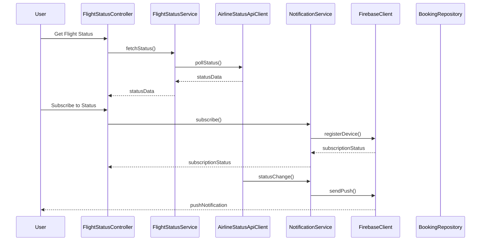
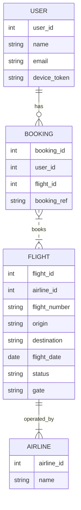

# For User Story Number [3]

1. Objective
Allow travelers to check the real-time status of their flights, including delays, gate changes, and cancellations. The system provides accurate, up-to-date information and push notifications for status changes. This keeps users informed and enables timely travel decisions.

2. API Model
  2.1 Common Components/Services
  - Flight Status Service
  - Notification Service (Push/Firebase)
  - Airline Status Aggregator Service

  2.2 API Details
| Operation         | REST Method | Type        | URL                                 | Request (Sample JSON)                                                        | Response (Sample JSON)                                                        |
|-------------------|------------|-------------|-------------------------------------|-------------------------------------------------------------------------------|-------------------------------------------------------------------------------|
| Get Flight Status | GET        | Success     | /api/flights/status                 | {"flightNumber":"AA123"}                                                   | {"flightNumber":"AA123","status":"DELAYED","gate":"B12","departure":"12:30"}|
| Get Status by Ref | GET        | Success     | /api/bookings/{bookingRef}/status   | N/A                                                                          | {"bookingRef":"XYZ789","flightStatus":"ON TIME","gate":"A1"}                |
| Subscribe Status  | POST       | Success/Fail| /api/notifications/subscribe        | {"userId":1,"flightNumber":"AA123","deviceToken":"xyz"}                  | {"subscriptionId":1001,"status":"SUBSCRIBED"}                              |

  2.3 Exceptions
| API                          | Exception Type           | Error Message                              |
|------------------------------|-------------------------|--------------------------------------------|
| /api/flights/status          | ValidationException      | Invalid flight number input                 |
| /api/bookings/{ref}/status   | NotFoundException        | Booking reference not found                 |
| /api/notifications/subscribe | NotificationException    | Invalid device token or subscription failed |

3 Functional Design
  3.1 Class Diagram

  3.2 UML Sequence Diagram

  3.3 Components
| Component Name         | Description                                         | Existing/New |
|-----------------------|-----------------------------------------------------|--------------|
| FlightStatusController| Handles flight status requests and notifications     | New          |
| FlightStatusService   | Manages status polling and aggregation               | New          |
| NotificationService   | Manages push notification subscriptions and delivery | Existing     |
| AirlineStatusApiClient| Connects to airline APIs for real-time status        | New          |
| FirebaseClient        | Integrates with Firebase for push notifications      | Existing     |
| BookingRepository     | Fetches booking references                           | Existing     |

  3.4 Service Layer Logic & Validations
| FieldName         | Validation                                  | Error Message                        | ClassUsed           |
|-------------------|---------------------------------------------|--------------------------------------|---------------------|
| flightNumber      | Must be valid and exist                      | Invalid flight number                | FlightStatusService |
| bookingRef        | Must exist and belong to user                | Booking reference not found          | BookingRepository   |
| deviceToken       | Must be valid for push notifications         | Invalid device token                 | NotificationService |
| statusData        | Must be fetched from reliable sources        | Status unavailable                   | AirlineStatusApiClient|

4 Integrations
| SystemToBeIntegrated | IntegratedFor         | IntegrationType |
|----------------------|----------------------|-----------------|
| Airline APIs         | Real-time flight status| API            |
| Firebase             | Push notifications    | API             |

5 DB Details
  5.1 ER Model

  5.2 DB Validations
- Flight status must be updated from airline API
- Device token must be valid and registered

6 Non-Functional Requirements
  6.1 Performance
    - Real-time status updates (<1min latency)
    - Monitoring for API failures
  6.2 Security
    6.2.1 Authentication
      - SSL/TLS for all endpoints
      - User authentication for notification subscriptions
    6.2.2 Authorization
      - Only users with valid bookings can subscribe for notifications
  6.3 Logging
    6.3.1 Application Logging
      - DEBUG: API request/response payloads
      - INFO: Status updates and notifications sent
      - ERROR: API failures, notification errors
      - WARN: Latency issues
    6.3.2 Audit Log
      - Log all status changes and notification deliveries

7 Dependencies
- Airline APIs for real-time status
- Firebase for push notifications

8 Assumptions
- Airline APIs provide reliable real-time status
- Firebase push notifications are delivered promptly
- Device tokens are managed securely