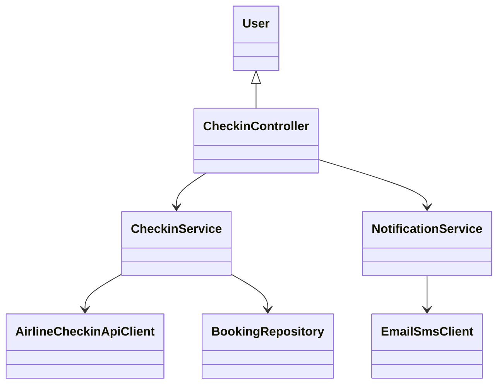
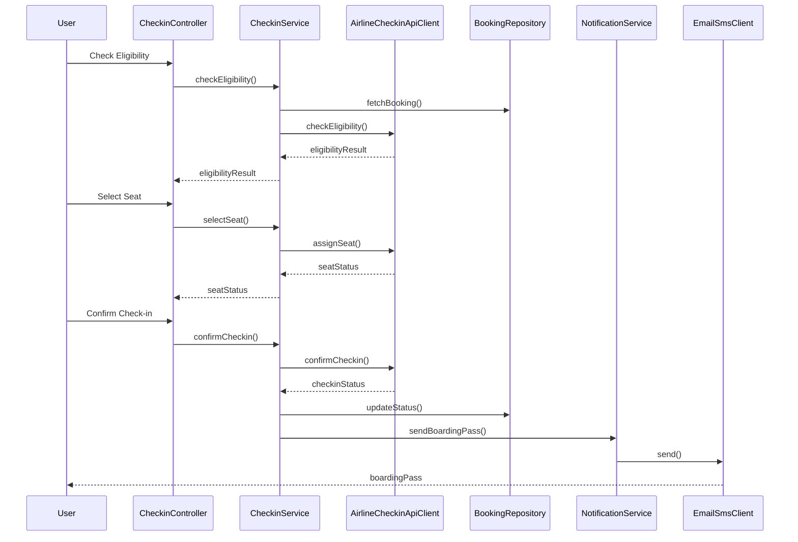
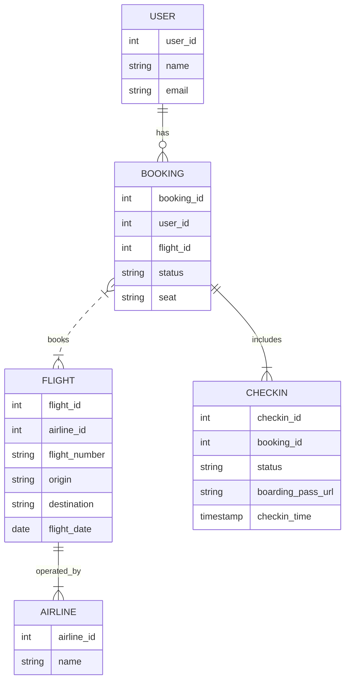

# For User Story Number [4]

1. Objective
Enable travelers to complete the flight check-in process online, select seats, and receive a digital boarding pass. The system enforces airline-specific check-in rules and integrates with airline APIs for seat assignment and boarding pass generation. This streamlines the airport experience and saves time for users.

2. API Model
  2.1 Common Components/Services
  - Check-in Service
  - Airline Check-in API Client
  - Notification Service (Email/SMS)

  2.2 API Details
| Operation         | REST Method | Type        | URL                                 | Request (Sample JSON)                                                        | Response (Sample JSON)                                                        |
|-------------------|------------|-------------|-------------------------------------|-------------------------------------------------------------------------------|-------------------------------------------------------------------------------|
| Check Eligibility | GET        | Success     | /api/checkin/eligibility            | {"userId":1,"flightId":1}                                                  | {"eligible":true,"window":"24h-2h before departure"}                        |
| Select Seat       | PUT        | Success/Fail| /api/checkin/{bookingId}/seat       | {"seat":"14C"}                                                              | {"bookingId":123,"seat":"14C","status":"SELECTED"}                        |
| Confirm Check-in  | POST       | Success/Fail| /api/checkin/{bookingId}/confirm    | {"userId":1,"bookingId":123}                                                | {"bookingId":123,"status":"CHECKED_IN","boardingPass":"sent"}             |
| Boarding Pass     | GET        | Success     | /api/checkin/{bookingId}/boardingpass| N/A                                                                          | {"bookingId":123,"boardingPassUrl":"https://.../bp123.pdf"}                  |

  2.3 Exceptions
| API                          | Exception Type           | Error Message                              |
|------------------------------|-------------------------|--------------------------------------------|
| /api/checkin/eligibility     | EligibilityException     | Not eligible for online check-in           |
| /api/checkin/{id}/seat       | SeatSelectionException   | Seat not available                         |
| /api/checkin/{id}/confirm    | CheckinException        | Check-in failed due to airline rules       |
| /api/checkin/{id}/boardingpass| BoardingPassException   | Boarding pass generation failed            |

3 Functional Design
  3.1 Class Diagram

  3.2 UML Sequence Diagram

  3.3 Components
| Component Name         | Description                                         | Existing/New |
|-----------------------|-----------------------------------------------------|--------------|
| CheckinController     | Handles check-in requests and orchestration          | New          |
| CheckinService        | Manages check-in logic and validations               | New          |
| AirlineCheckinApiClient| Connects to airline APIs for check-in/seat assignment| New         |
| NotificationService   | Sends boarding pass via email/SMS                    | Existing     |
| EmailSmsClient        | Integrates with email/SMS gateway                    | Existing     |
| BookingRepository     | Persists booking/check-in status                     | Existing     |

  3.4 Service Layer Logic & Validations
| FieldName         | Validation                                  | Error Message                        | ClassUsed           |
|-------------------|---------------------------------------------|--------------------------------------|---------------------|
| userId            | Must be authenticated                       | Unauthorized access                  | CheckinController   |
| flightId          | Must be eligible for online check-in        | Not eligible for online check-in     | CheckinService      |
| seat              | Must be available                           | Seat not available                   | AirlineCheckinApiClient|
| checkinStatus     | Must comply with airline rules               | Check-in failed                      | AirlineCheckinApiClient|
| boardingPass      | Generated only after successful check-in     | Boarding pass generation failed      | NotificationService |

4 Integrations
| SystemToBeIntegrated | IntegratedFor         | IntegrationType |
|----------------------|----------------------|-----------------|
| Airline APIs         | Check-in, seat assignment, boarding pass  | API             |
| Email/SMS Gateway    | Boarding pass delivery                    | API             |

5 DB Details
  5.1 ER Model

  5.2 DB Validations
- Check-in status must be updated only if eligible
- Seat assignment must match airline API response

6 Non-Functional Requirements
  6.1 Performance
    - Check-in process <2min
    - Scalable to 10,000 concurrent users
  6.2 Security
    6.2.1 Authentication
      - SSL/TLS for all endpoints
      - User authentication for check-in actions
    6.2.2 Authorization
      - Only users with valid bookings can check in
  6.3 Logging
    6.3.1 Application Logging
      - DEBUG: API request/response payloads
      - INFO: Successful check-ins and boarding pass generation
      - ERROR: Check-in failures, seat assignment errors
      - WARN: Latency issues
    6.3.2 Audit Log
      - Log all check-in actions and boarding pass deliveries

7 Dependencies
- Airline APIs for check-in, seat assignment, and boarding pass
- Email/SMS gateway for boarding pass delivery

8 Assumptions
- Airline APIs provide reliable check-in and seat assignment
- Email/SMS delivery is reliable