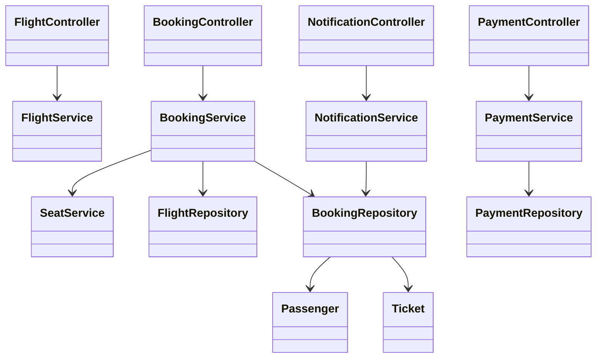
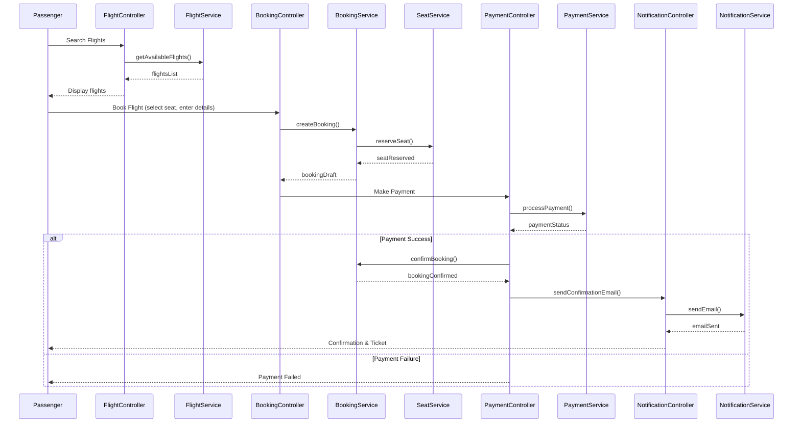
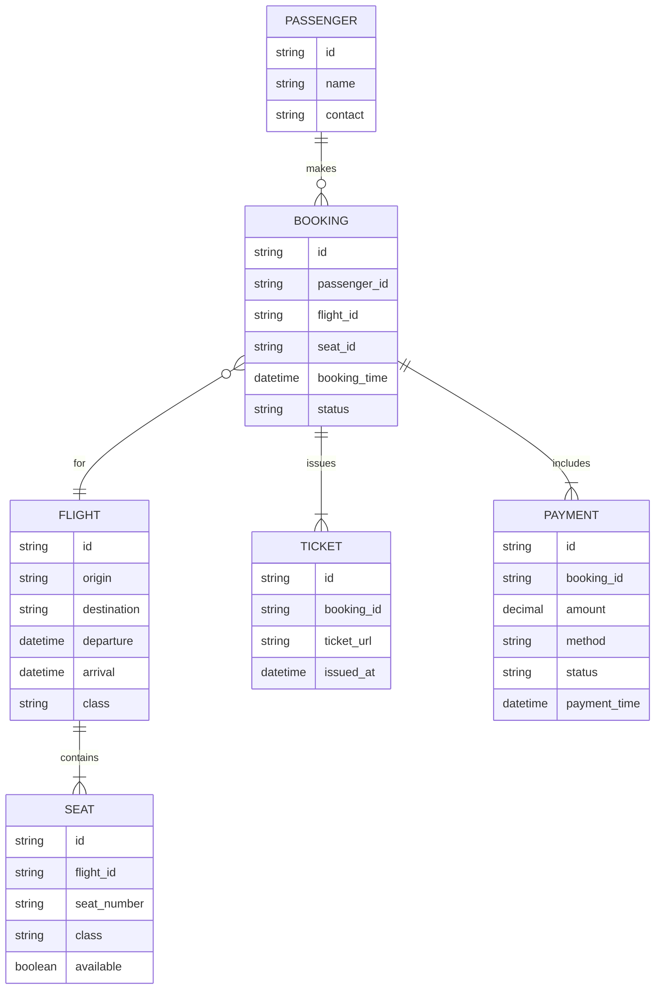

# For User Story Number [1]

1. Objective
This requirement enables passengers to book air transport tickets online by searching for flights, selecting seats, and making secure payments. The process is designed to be intuitive and secure, ensuring confirmation and digital ticket delivery upon successful booking. The goal is to provide a seamless and convenient ticketing experience for passengers.

2. API Model
  2.1 Common Components/Services
  - Flight Search Service
  - Payment Gateway Integration Service
  - Email Notification Service
  - Seat Management Service

  2.2 API Details
| Operation      | REST Method | Type     | URL                              | Request (Sample JSON)                                                                                 | Response (Sample JSON)                                                                                 |
|---------------|-------------|----------|----------------------------------|-------------------------------------------------------------------------------------------------------|--------------------------------------------------------------------------------------------------------|
| Search Flights| GET         | Success  | /api/flights/search              | {"origin": "JFK", "destination": "LAX", "date": "2024-12-01", "class": "Economy"}           | [{"flightId": "F123", "availableSeats": 20, "departure": "10:00", "arrival": "13:00"}]         |
| View Seats    | GET         | Success  | /api/flights/{flightId}/seats    | N/A                                                                                                   | [{"seatNumber": "12A", "class": "Economy", "available": true}]                                   |
| Book Ticket   | POST        | Success  | /api/bookings                    | {"flightId": "F123", "passenger": {"name": "John Doe", "contact": "john@email.com"}, "seat": "12A", "payment": {"method": "CreditCard", "details": {}}} | {"bookingId": "B456", "status": "CONFIRMED", "ticketUrl": "https://..."}                       |
| Payment       | POST        | Success/Failure | /api/payments                  | {"bookingId": "B456", "amount": 350.00, "method": "CreditCard", "details": {}}                 | {"paymentId": "P789", "status": "SUCCESS"}                                                        |
| Send Email    | POST        | Success  | /api/notifications/email         | {"to": "john@email.com", "subject": "Booking Confirmation", "body": "..."}                      | {"status": "SENT"}                                                                                   |

  2.3 Exceptions
| API                | Exception Type          | Error Message                                 |
|--------------------|------------------------|-----------------------------------------------|
| /api/flights/search| 404 Not Found          | No flights found for the given criteria       |
| /api/bookings      | 400 Bad Request        | Missing mandatory fields                      |
| /api/bookings      | 409 Conflict           | Selected seat is no longer available          |
| /api/payments      | 402 Payment Required   | Payment authorization failed                  |
| /api/notifications/email | 500 Internal Error| Failed to send confirmation email             |

3. Functional Design
  3.1 Class Diagram

  3.2 UML Sequence Diagram

  3.3 Components
| Component Name         | Description                                               | Existing/New |
|-----------------------|-----------------------------------------------------------|--------------|
| FlightController      | Handles flight search requests                            | New          |
| BookingController     | Manages booking and seat selection                        | New          |
| PaymentController     | Handles payment processing                                | New          |
| NotificationController| Sends booking confirmation emails                         | New          |
| FlightService         | Business logic for flight search                          | New          |
| BookingService        | Business logic for booking and seat allocation            | New          |
| PaymentService        | Integrates with payment gateway                           | New          |
| NotificationService   | Integrates with email service                             | New          |
| SeatService           | Manages seat availability and reservation                 | New          |
| FlightRepository      | Data access for flights                                   | New          |
| BookingRepository     | Data access for bookings                                  | New          |
| PaymentRepository     | Data access for payments                                  | New          |
| Passenger             | Passenger entity                                          | New          |
| Ticket                | Ticket entity                                             | New          |

  3.4 Service Layer Logic & Validations
| FieldName     | Validation                                    | Error Message                        | ClassUsed         |
|---------------|-----------------------------------------------|--------------------------------------|-------------------|
| name          | Not null, not empty                           | Name is required                     | BookingService    |
| contact       | Valid email/phone format, not null            | Contact information is required      | BookingService    |
| payment       | Not null, valid payment method                | Payment details are required         | PaymentService    |
| seat          | Must be available at booking time             | Selected seat is not available       | SeatService       |
| flightId      | Must exist and have available seats           | Invalid flight or no seats available | FlightService     |

4. Integrations
| SystemToBeIntegrated | IntegratedFor        | IntegrationType |
|----------------------|---------------------|-----------------|
| Payment Gateway      | Payment processing  | API             |
| Email Service        | Booking confirmation| API             |
| Flight Inventory     | Flight search       | API             |

5. DB Details
  5.1 ER Model

  5.2 DB Validations
- Unique constraint on (flight_id, seat_number) in SEAT table
- Foreign key constraints between BOOKING and PASSENGER, FLIGHT, SEAT
- Payment status must be CONFIRMED before ticket issuance

6. Non-Functional Requirements
  6.1 Performance
  - API response time for search and booking <2 seconds
  - Caching of frequent flight search queries at API layer
  - Asynchronous email sending

  6.2 Security
    6.2.1 Authentication
    - OAuth2/JWT for API authentication
    - Integration with IAM for user management
    6.2.2 Authorization
    - Role-based access for booking endpoints
    - Only authenticated users can book tickets

  6.3 Logging
    6.3.1 Application Logging
    - DEBUG: API request/response payloads (excluding sensitive data)
    - INFO: Successful bookings, payments, and email sends
    - ERROR: Failed payments, booking errors, email failures
    - WARN: Unusual booking patterns
    6.3.2 Audit Log
    - Log all booking and payment transactions with timestamps and user IDs

7. Dependencies
- Payment gateway provider
- Email notification service
- Flight inventory provider
- IAM/Authentication provider

8. Assumptions
- All external APIs are available and reliable
- Email delivery is near real-time
- PCI DSS compliance is handled by payment gateway
- Seat availability is updated in real-time
