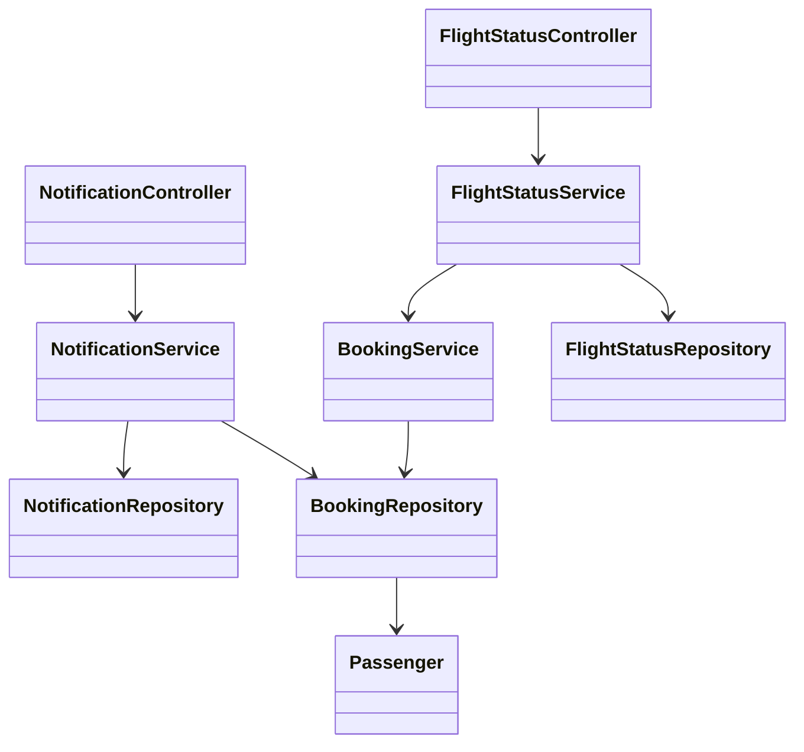
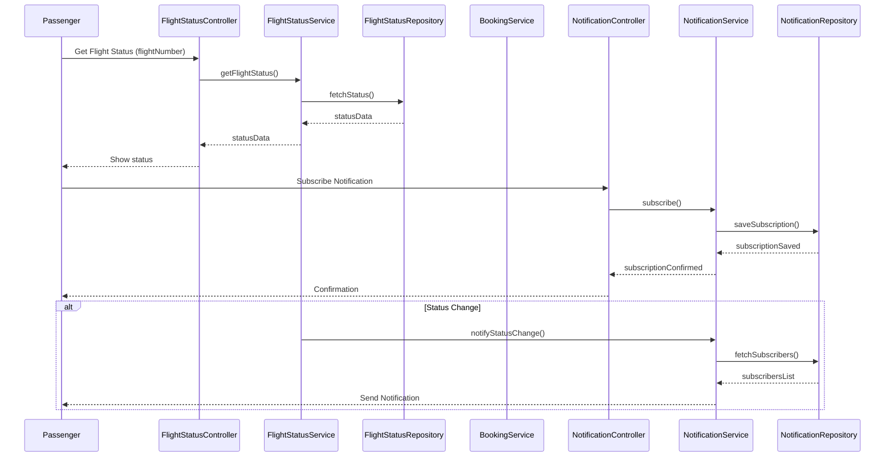
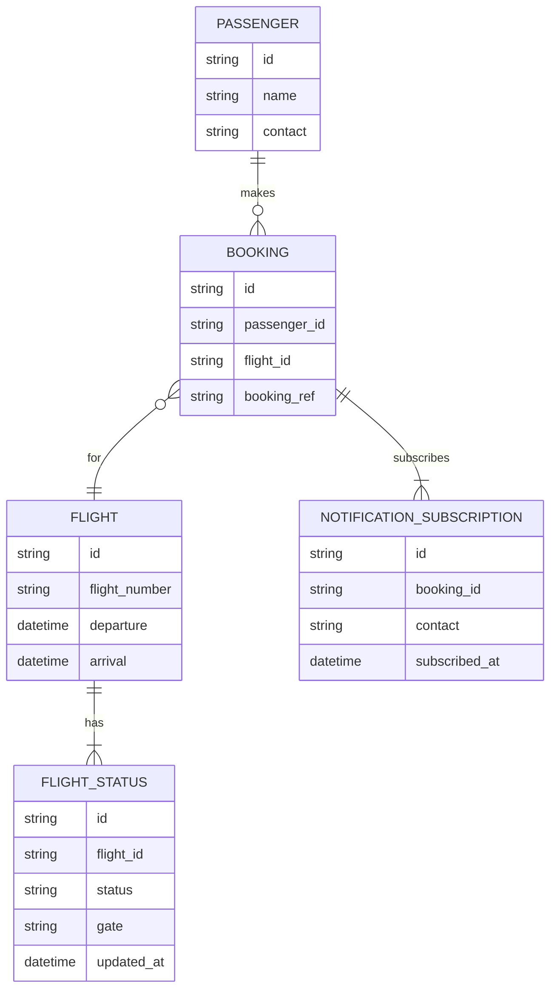

# For User Story Number [2]

1. Objective
This requirement allows passengers to track the real-time status of their flights, including delays, gate changes, and cancellations. The system provides timely notifications for any significant changes to the flight schedule. The goal is to keep passengers informed and reduce uncertainty during travel.

2. API Model
  2.1 Common Components/Services
  - Flight Status Service
  - Notification Service
  - Passenger Booking Service

  2.2 API Details
| Operation         | REST Method | Type     | URL                                 | Request (Sample JSON)                                 | Response (Sample JSON)                                                                 |
|-------------------|-------------|----------|-------------------------------------|-------------------------------------------------------|----------------------------------------------------------------------------------------|
| Get Flight Status | GET         | Success  | /api/flights/status                 | {"flightNumber": "F123"}                            | {"flightNumber": "F123", "status": "DELAYED", "gate": "A12", "departure": "10:30"}             |
| Get Status by Ref | GET         | Success  | /api/flights/status/by-booking      | {"bookingRef": "BR456"}                             | {"flightNumber": "F123", "status": "ON TIME", "gate": "A12", "departure": "10:00"}             |
| Subscribe Notify  | POST        | Success  | /api/notifications/subscribe        | {"contact": "john@email.com", "flightNumber": "F123"} | {"subscriptionId": "S789", "status": "SUBSCRIBED"}                                      |
| Send Notification | POST        | Success  | /api/notifications/send             | {"to": "john@email.com", "message": "Flight delayed"}     | {"status": "SENT"}                                                                         |

  2.3 Exceptions
| API                          | Exception Type          | Error Message                                  |
|------------------------------|------------------------|------------------------------------------------|
| /api/flights/status          | 404 Not Found          | Flight not found                               |
| /api/flights/status/by-booking| 400 Bad Request       | Invalid booking reference                      |
| /api/notifications/subscribe | 400 Bad Request        | Invalid contact details                        |
| /api/notifications/send      | 500 Internal Error     | Notification delivery failed                   |

3. Functional Design
  3.1 Class Diagram

  3.2 UML Sequence Diagram

  3.3 Components
| Component Name           | Description                                         | Existing/New |
|-------------------------|-----------------------------------------------------|--------------|
| FlightStatusController  | Handles flight status requests                      | New          |
| NotificationController  | Manages notification subscriptions and sending      | New          |
| FlightStatusService     | Business logic for flight status retrieval          | New          |
| NotificationService     | Business logic for notifications                    | New          |
| BookingService          | Retrieves booking and passenger details             | New          |
| FlightStatusRepository  | Data access for flight status                       | New          |
| NotificationRepository  | Data access for notification subscriptions          | New          |
| BookingRepository       | Data access for bookings                            | New          |
| Passenger               | Passenger entity                                    | New          |

  3.4 Service Layer Logic & Validations
| FieldName      | Validation                                  | Error Message                        | ClassUsed             |
|---------------|---------------------------------------------|--------------------------------------|-----------------------|
| flightNumber   | Must exist, valid format                    | Invalid flight number                | FlightStatusService   |
| bookingRef     | Must exist, valid format                    | Invalid booking reference            | BookingService        |
| contact        | Valid email/SMS/push, not null              | Invalid contact details              | NotificationService   |
| status         | Must be updated every 2 minutes             | Status update interval violation     | FlightStatusService   |

4. Integrations
| SystemToBeIntegrated | IntegratedFor         | IntegrationType |
|----------------------|----------------------|-----------------|
| Airline Status API   | Real-time flight data | API             |
| Notification Service | Passenger updates     | API             |

5. DB Details
  5.1 ER Model

  5.2 DB Validations
- Unique constraint on (flight_id, updated_at) in FLIGHT_STATUS
- Foreign key constraints between BOOKING and PASSENGER, FLIGHT
- Only valid contact details in NOTIFICATION_SUBSCRIPTION

6. Non-Functional Requirements
  6.1 Performance
  - Real-time updates with <1 minute latency
  - Scalable notification delivery

  6.2 Security
    6.2.1 Authentication
    - OAuth2/JWT for API authentication
    6.2.2 Authorization
    - Only authenticated users can access booking-linked status

  6.3 Logging
    6.3.1 Application Logging
    - DEBUG: API requests for status and notifications
    - INFO: Status changes, notification sends
    - ERROR: Failed notifications, data fetch errors
    6.3.2 Audit Log
    - Log all status changes and notification deliveries

7. Dependencies
- Airline status data provider
- Notification delivery provider

8. Assumptions
- Airline APIs provide real-time and accurate data
- Notification delivery is reliable and fast
- Contact details are up-to-date in booking records
