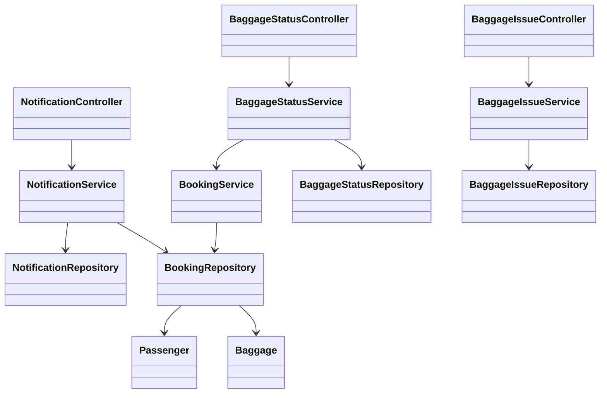
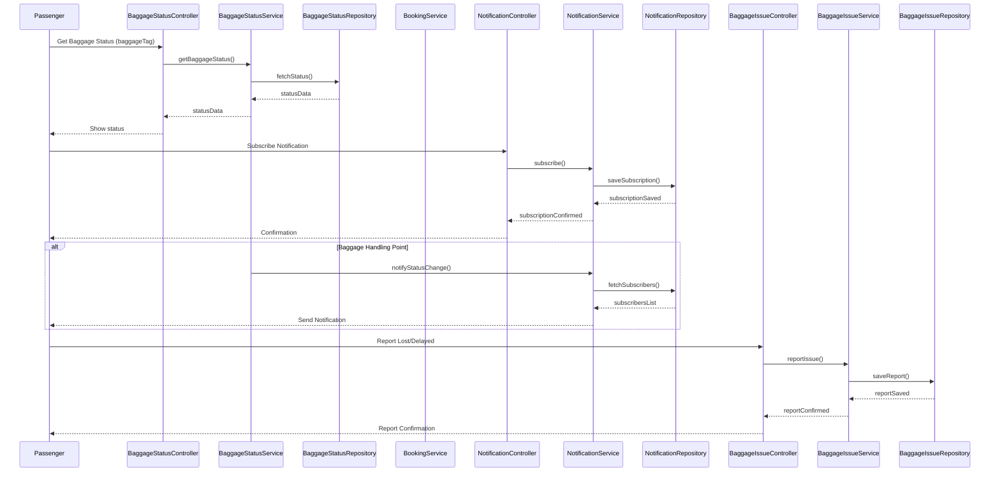
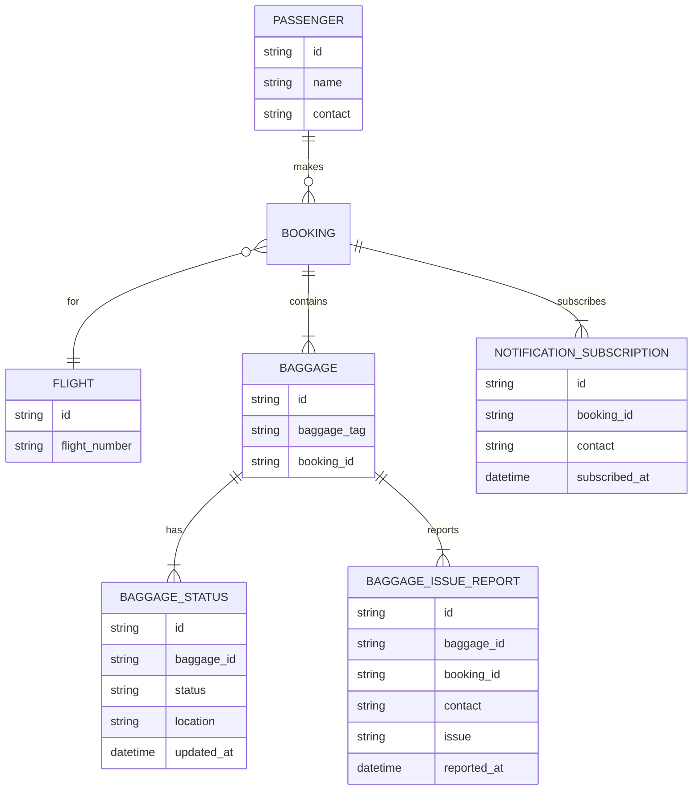

# For User Story Number [3]

1. Objective
This requirement enables passengers to track their checked baggage in real-time throughout their journey. Passengers receive notifications at key baggage handling points and can report lost or delayed baggage directly from the application. The goal is to provide assurance and transparency regarding baggage status and location.

2. API Model
  2.1 Common Components/Services
  - Baggage Tracking Service
  - Notification Service
  - Passenger Booking Service
  - Baggage Issue Reporting Service

  2.2 API Details
| Operation               | REST Method | Type     | URL                                     | Request (Sample JSON)                                             | Response (Sample JSON)                                                                 |
|-------------------------|-------------|----------|-----------------------------------------|-------------------------------------------------------------------|----------------------------------------------------------------------------------------|
| Get Baggage Status      | GET         | Success  | /api/baggage/status                     | {"baggageTag": "BG123456"}                                      | {"baggageTag": "BG123456", "status": "LOADED", "location": "JFK", "timestamp": "..."}            |
| Subscribe Notify        | POST        | Success  | /api/notifications/subscribe-baggage    | {"contact": "john@email.com", "baggageTag": "BG123456"}        | {"subscriptionId": "S789", "status": "SUBSCRIBED"}                                      |
| Report Lost/Delayed     | POST        | Success  | /api/baggage/report-issue               | {"baggageTag": "BG123456", "bookingRef": "BR456", "contact": "john@email.com", "issue": "DELAYED"} | {"reportId": "R001", "status": "RECEIVED"}                                               |
| Send Notification       | POST        | Success  | /api/notifications/send                 | {"to": "john@email.com", "message": "Baggage loaded at JFK"}   | {"status": "SENT"}                                                                         |

  2.3 Exceptions
| API                          | Exception Type          | Error Message                                  |
|------------------------------|------------------------|------------------------------------------------|
| /api/baggage/status          | 404 Not Found          | Baggage tag not found                          |
| /api/notifications/subscribe-baggage | 400 Bad Request | Invalid contact details                        |
| /api/baggage/report-issue    | 400 Bad Request        | Invalid booking or contact information         |
| /api/notifications/send      | 500 Internal Error     | Notification delivery failed                   |

3. Functional Design
  3.1 Class Diagram

  3.2 UML Sequence Diagram

  3.3 Components
| Component Name             | Description                                               | Existing/New |
|---------------------------|-----------------------------------------------------------|--------------|
| BaggageStatusController   | Handles baggage status requests                           | New          |
| NotificationController    | Manages notification subscriptions and sending            | New          |
| BaggageIssueController    | Handles lost/delayed baggage reports                      | New          |
| BaggageStatusService      | Business logic for baggage status retrieval and updates   | New          |
| NotificationService       | Business logic for notifications                          | New          |
| BookingService            | Retrieves booking and passenger details                   | New          |
| BaggageIssueService       | Handles lost/delayed baggage reporting workflow           | New          |
| BaggageStatusRepository   | Data access for baggage status                            | New          |
| NotificationRepository    | Data access for notification subscriptions                | New          |
| BookingRepository         | Data access for bookings                                  | New          |
| BaggageIssueRepository    | Data access for baggage issue reports                     | New          |
| Passenger                 | Passenger entity                                          | New          |
| Baggage                   | Baggage entity                                            | New          |

  3.4 Service Layer Logic & Validations
| FieldName      | Validation                                  | Error Message                        | ClassUsed             |
|---------------|---------------------------------------------|--------------------------------------|-----------------------|
| baggageTag     | Must exist, valid format                    | Invalid baggage tag                  | BaggageStatusService  |
| bookingRef     | Must exist, valid format                    | Invalid booking reference            | BookingService        |
| contact        | Valid email/SMS, not null                   | Invalid contact details              | NotificationService   |
| status         | Must be updated in real-time                | Status update interval violation     | BaggageStatusService  |
| issue          | Must be DELAYED or LOST                     | Invalid issue type                   | BaggageIssueService   |

4. Integrations
| SystemToBeIntegrated | IntegratedFor         | IntegrationType |
|----------------------|----------------------|-----------------|
| Baggage Tracking API | Real-time baggage data| API             |
| Notification Service | Passenger updates     | API             |

5. DB Details
  5.1 ER Model

  5.2 DB Validations
- Unique constraint on (baggage_id, updated_at) in BAGGAGE_STATUS
- Foreign key constraints between BAGGAGE and BOOKING
- Only valid contact details in NOTIFICATION_SUBSCRIPTION
- Only DELAYED/LOST allowed in BAGGAGE_ISSUE_REPORT.issue

6. Non-Functional Requirements
  6.1 Performance
  - Real-time updates with <1 minute latency
  - Scalable notification delivery

  6.2 Security
    6.2.1 Authentication
    - OAuth2/JWT for API authentication
    6.2.2 Authorization
    - Only authenticated users can access baggage status

  6.3 Logging
    6.3.1 Application Logging
    - DEBUG: API requests for status and notifications
    - INFO: Status changes, notification sends, issue reports
    - ERROR: Failed notifications, data fetch errors
    6.3.2 Audit Log
    - Log all status changes, notifications, and issue reports

7. Dependencies
- Baggage tracking data provider
- Notification delivery provider

8. Assumptions
- Baggage tracking APIs provide real-time and accurate data
- Notification delivery is reliable and fast
- Contact details are up-to-date in booking records
