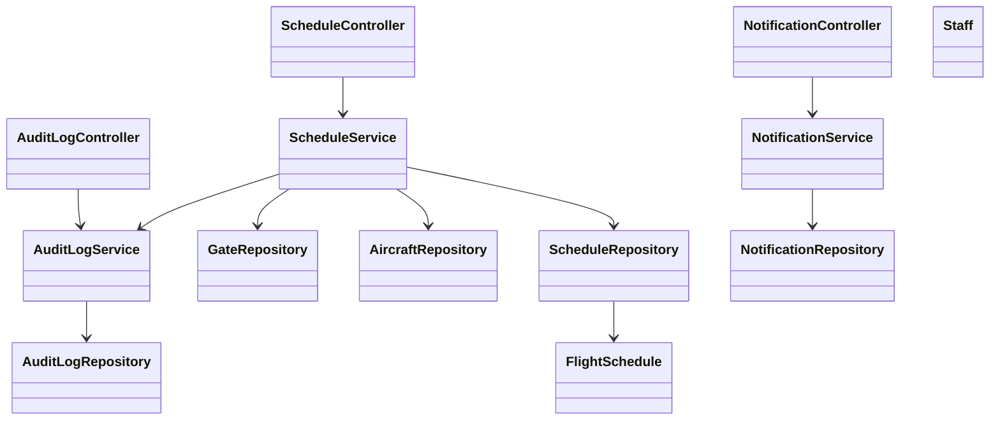
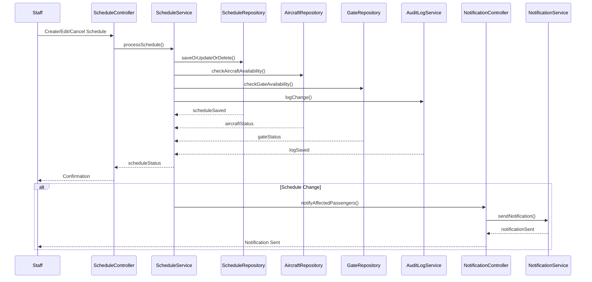
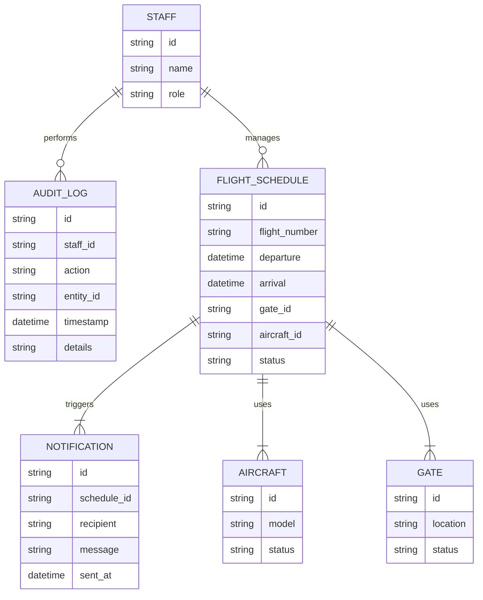

# For User Story Number [4]

1. Objective
This requirement enables authorized airline staff to create, edit, and cancel flight schedules, including times, gates, and aircraft assignments. All changes are reflected in real-time for passengers and dependent systems. The goal is to ensure accurate, up-to-date flight information and maintain compliance through audit logging.

2. API Model
  2.1 Common Components/Services
  - Flight Schedule Management Service
  - Notification Service
  - Audit Logging Service

  2.2 API Details
| Operation         | REST Method | Type     | URL                                   | Request (Sample JSON)                                                                                      | Response (Sample JSON)                                                                 |
|-------------------|-------------|----------|---------------------------------------|------------------------------------------------------------------------------------------------------------|----------------------------------------------------------------------------------------|
| Create Schedule   | POST        | Success  | /api/schedules                        | {"flightNumber": "F123", "departure": "2024-12-01T10:00", "arrival": "2024-12-01T13:00", "gate": "A12", "aircraftId": "AC456"} | {"scheduleId": "S001", "status": "CREATED"}                                               |
| Edit Schedule     | PUT         | Success  | /api/schedules/{scheduleId}           | {"departure": "2024-12-01T11:00", "gate": "A14"}                                               | {"scheduleId": "S001", "status": "UPDATED"}                                               |
| Cancel Schedule   | DELETE      | Success  | /api/schedules/{scheduleId}           | N/A                                                                                                       | {"scheduleId": "S001", "status": "CANCELLED"}                                             |
| Send Notification | POST        | Success  | /api/notifications/send               | {"to": "passenger@email.com", "message": "Flight F123 delayed"}                                     | {"status": "SENT"}                                                                         |

  2.3 Exceptions
| API                    | Exception Type          | Error Message                                  |
|------------------------|------------------------|------------------------------------------------|
| /api/schedules         | 400 Bad Request        | Missing required fields                        |
| /api/schedules         | 401 Unauthorized       | Unauthorized staff access                      |
| /api/schedules         | 409 Conflict           | Aircraft/gate double-booking                   |
| /api/notifications/send| 500 Internal Error     | Notification delivery failed                   |

3. Functional Design
  3.1 Class Diagram

  3.2 UML Sequence Diagram

  3.3 Components
| Component Name           | Description                                               | Existing/New |
|-------------------------|-----------------------------------------------------------|--------------|
| ScheduleController      | Handles schedule management requests                      | New          |
| NotificationController  | Manages notification sending                              | New          |
| AuditLogController      | Handles audit log retrieval                               | New          |
| ScheduleService         | Business logic for schedule creation, update, cancel      | New          |
| NotificationService     | Business logic for notifications                          | New          |
| AuditLogService         | Handles audit logging                                     | New          |
| ScheduleRepository      | Data access for schedules                                 | New          |
| NotificationRepository  | Data access for notifications                             | New          |
| AuditLogRepository      | Data access for audit logs                                | New          |
| AircraftRepository      | Data access for aircraft                                  | New          |
| GateRepository          | Data access for gates                                     | New          |
| Staff                   | Staff entity                                              | New          |
| FlightSchedule          | Flight schedule entity                                    | New          |

  3.4 Service Layer Logic & Validations
| FieldName      | Validation                                  | Error Message                        | ClassUsed             |
|---------------|---------------------------------------------|--------------------------------------|-----------------------|
| staffId        | Must be authorized staff                    | Unauthorized staff access            | ScheduleService       |
| flightNumber   | Not null, valid format                      | Invalid flight number                | ScheduleService       |
| departure      | Not null, valid datetime                    | Invalid departure time               | ScheduleService       |
| arrival        | Not null, valid datetime                    | Invalid arrival time                 | ScheduleService       |
| gate           | Not null, must not be double-booked         | Gate double-booking                  | GateRepository        |
| aircraftId     | Not null, must not be double-booked         | Aircraft double-booking              | AircraftRepository    |

4. Integrations
| SystemToBeIntegrated | IntegratedFor         | IntegrationType |
|----------------------|----------------------|-----------------|
| Notification Service | Passenger updates    | API             |
| Internal Scheduling  | Dependent systems    | API             |

5. DB Details
  5.1 ER Model

  5.2 DB Validations
- Unique constraint on (aircraft_id, departure) in FLIGHT_SCHEDULE
- Unique constraint on (gate_id, departure) in FLIGHT_SCHEDULE
- Foreign key constraints between FLIGHT_SCHEDULE and AIRCRAFT, GATE, STAFF
- Audit logs are immutable (append-only)

6. Non-Functional Requirements
  6.1 Performance
  - Changes reflected in all systems within 1 minute
  - Scalable for multiple airlines and thousands of flights

  6.2 Security
    6.2.1 Authentication
    - OAuth2/JWT for API authentication
    - IAM integration for staff roles
    6.2.2 Authorization
    - Role-based access for schedule management endpoints

  6.3 Logging
    6.3.1 Application Logging
    - DEBUG: API requests for schedule management
    - INFO: Schedule changes, notifications
    - ERROR: Failed updates, notification errors
    6.3.2 Audit Log
    - All schedule changes logged with staff ID, timestamp, and details
    - Audit logs retained for 7 years

7. Dependencies
- Notification delivery provider
- Internal scheduling integration
- IAM/Authentication provider

8. Assumptions
- Staff roles and permissions are managed externally
- Notification delivery is reliable and fast
- Audit log storage is secure and immutable
