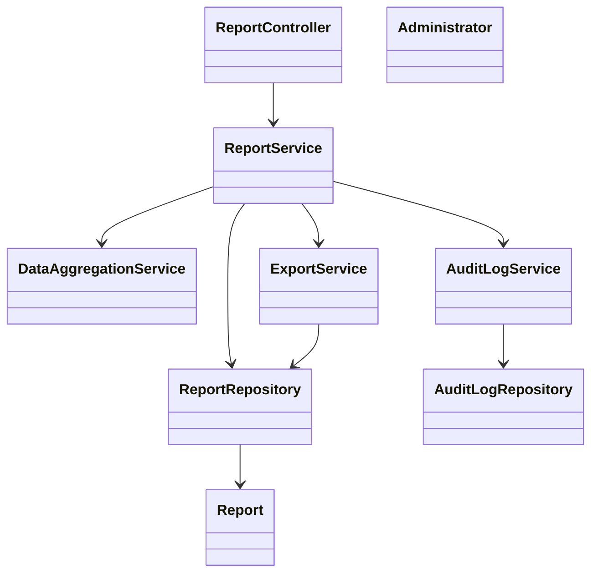
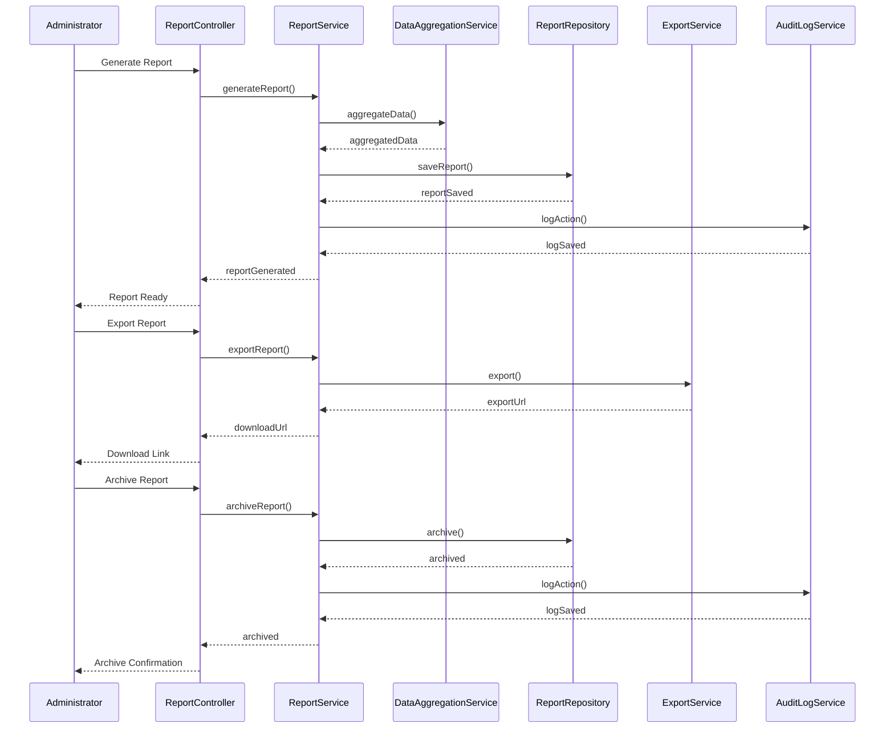
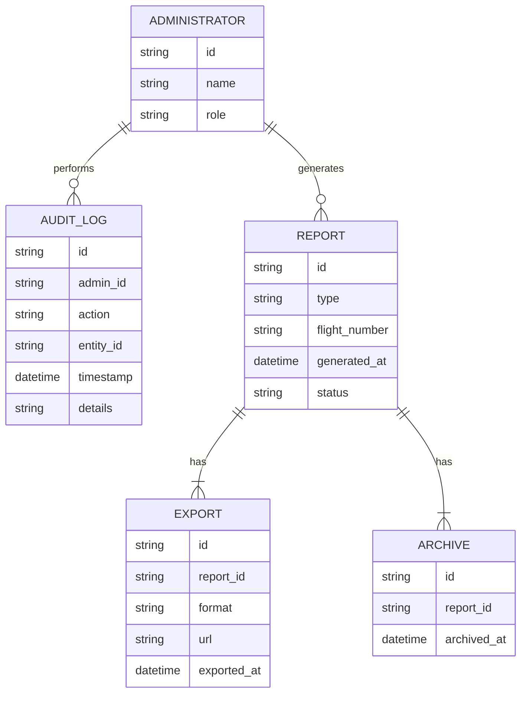

# For User Story Number [5]

1. Objective
This requirement enables airline administrators to generate, view, and export regulatory compliance reports such as passenger manifests, crew rosters, and incident logs. The reports must be accurate, timely, and formatted according to authority specifications. The system ensures compliance, auditability, and secure archival of all generated reports.

2. API Model
  2.1 Common Components/Services
  - Report Generation Service
  - Data Aggregation Service
  - Export Service
  - Audit Logging Service

  2.2 API Details
| Operation         | REST Method | Type     | URL                                   | Request (Sample JSON)                                                                                      | Response (Sample JSON)                                                                 |
|-------------------|-------------|----------|---------------------------------------|------------------------------------------------------------------------------------------------------------|----------------------------------------------------------------------------------------|
| Generate Report   | POST        | Success  | /api/reports/generate                 | {"reportType": "PASSENGER_MANIFEST", "flightNumber": "F123", "date": "2024-12-01"}                 | {"reportId": "R001", "status": "GENERATED"}                                               |
| View Report       | GET         | Success  | /api/reports/{reportId}               | N/A                                                                                                       | {"reportId": "R001", "reportData": { ... }}                                                |
| Export Report     | POST        | Success  | /api/reports/{reportId}/export        | {"format": "PDF"}                                                                                      | {"downloadUrl": "https://.../R001.pdf"}                                                     |
| Archive Report    | POST        | Success  | /api/reports/{reportId}/archive       | N/A                                                                                                       | {"reportId": "R001", "status": "ARCHIVED"}                                                |

  2.3 Exceptions
| API                    | Exception Type          | Error Message                                  |
|------------------------|------------------------|------------------------------------------------|
| /api/reports/generate  | 401 Unauthorized       | Unauthorized administrator access              |
| /api/reports/generate  | 400 Bad Request        | Missing required fields                        |
| /api/reports/generate  | 422 Unprocessable Entity| Data incomplete or invalid                    |
| /api/reports/export    | 400 Bad Request        | Unsupported export format                      |
| /api/reports/export    | 500 Internal Error     | Export failed                                  |

3. Functional Design
  3.1 Class Diagram

  3.2 UML Sequence Diagram

  3.3 Components
| Component Name           | Description                                               | Existing/New |
|-------------------------|-----------------------------------------------------------|--------------|
| ReportController        | Handles report generation, viewing, exporting, archiving  | New          |
| ReportService           | Business logic for report lifecycle                       | New          |
| DataAggregationService  | Aggregates data from multiple systems                     | New          |
| ExportService           | Formats and exports reports in required formats           | New          |
| AuditLogService         | Handles audit logging                                     | New          |
| ReportRepository        | Data access for reports                                   | New          |
| AuditLogRepository      | Data access for audit logs                                | New          |
| Administrator           | Administrator entity                                      | New          |
| Report                  | Report entity                                             | New          |

  3.4 Service Layer Logic & Validations
| FieldName      | Validation                                  | Error Message                        | ClassUsed             |
|---------------|---------------------------------------------|--------------------------------------|-----------------------|
| adminId       | Must be authorized administrator            | Unauthorized administrator access    | ReportService         |
| reportType    | Not null, valid type                        | Invalid report type                  | ReportService         |
| flightNumber  | Not null for flight-based reports           | Missing flight number                | ReportService         |
| date          | Not null, valid date                        | Invalid date                         | ReportService         |
| format        | Must be PDF, CSV, or XML                    | Unsupported export format            | ExportService         |

4. Integrations
| SystemToBeIntegrated | IntegratedFor         | IntegrationType |
|----------------------|----------------------|-----------------|
| Data Aggregation API | Source data retrieval| API             |
| Export Service API   | Report export        | API             |

5. DB Details
  5.1 ER Model

  5.2 DB Validations
- Unique constraint on (type, flight_number, generated_at) in REPORT
- Foreign key constraints between REPORT and ADMINISTRATOR, EXPORT, ARCHIVE
- Only PDF, CSV, XML allowed in EXPORT.format
- Audit logs are immutable (append-only)

6. Non-Functional Requirements
  6.1 Performance
  - Report generation completes within 2 minutes
  - Scalable for large datasets and multiple concurrent requests

  6.2 Security
    6.2.1 Authentication
    - OAuth2/JWT for API authentication
    - IAM integration for administrator roles
    6.2.2 Authorization
    - Role-based access for reporting endpoints
    - Data encryption for sensitive report data

  6.3 Logging
    6.3.1 Application Logging
    - DEBUG: API requests for report generation and export
    - INFO: Successful report generations, exports, archives
    - ERROR: Failed report generations, export errors
    6.3.2 Audit Log
    - All report actions logged with admin ID, timestamp, and details
    - Audit logs retained for 10 years

7. Dependencies
- Data aggregation provider
- Export service provider
- IAM/Authentication provider

8. Assumptions
- Source data is accurate and up-to-date
- Export and archival storage is reliable
- Regulatory requirements are up-to-date in the system
