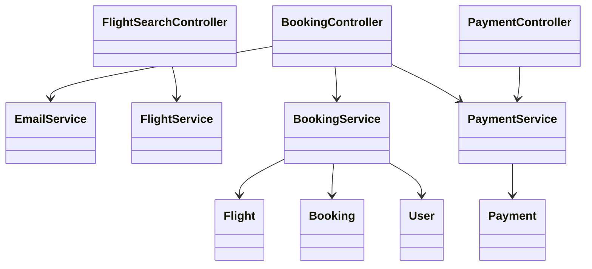
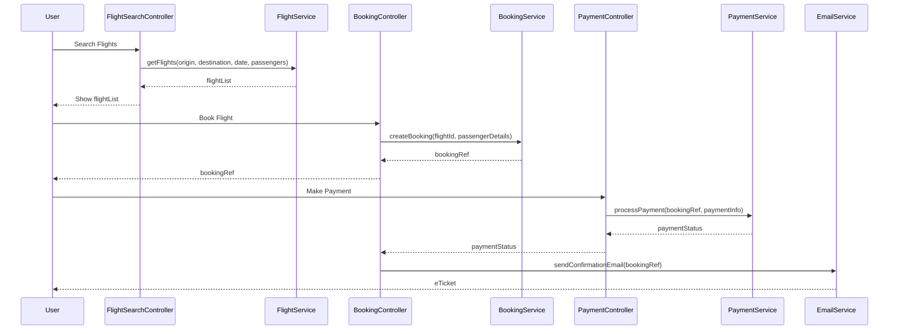
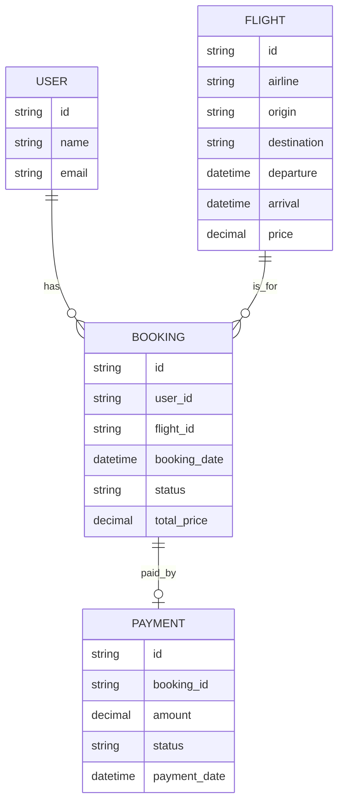

# For User Story Number [1]

1. Objective
This requirement enables travelers to search, select, and book air transport tickets online. The system will allow users to search for flights by origin, destination, date, and number of passengers, securely process payments, and send booking confirmations and e-tickets via email. The objective is to provide a seamless, secure, and efficient booking experience for travelers.

2. API Model
  2.1 Common Components/Services
  - Authentication Service
  - Flight Search Service
  - Booking Service
  - Payment Service
  - Email Notification Service

  2.2 API Details
| Operation | REST Method | Type    | URL                        | Request (JSON) | Response (JSON) |
|-----------|-------------|---------|----------------------------|----------------|-----------------|
| Search    | GET         | Success | /api/flights/search        | {"origin": "JFK", "destination": "LAX", "date": "2025-12-01", "passengers": 2} | [{"flightId": "F123", "airline": "Delta", "departure": "10:00", "arrival": "13:00", "price": 350.00}] |
| Book      | POST        | Success | /api/bookings              | {"flightId": "F123", "passengerDetails": [{...}], "paymentInfo": {...}} | {"bookingRef": "BR12345", "status": "CONFIRMED"} |
| Pay       | POST        | Success | /api/payments/process      | {"bookingRef": "BR12345", "paymentInfo": {...}} | {"paymentStatus": "SUCCESS", "transactionId": "TX123"} |
| Confirm   | GET         | Success | /api/bookings/confirmation | {"bookingRef": "BR12345"} | {"status": "CONFIRMED", "eTicket": "..."} |

  2.3 Exceptions
| API                | Exception Type           | Description |
|--------------------|-------------------------|-------------|
| /api/flights/search| InvalidInputException   | Origin/destination invalid |
| /api/bookings      | FlightNotAvailableException | Flight no longer available |
| /api/payments/process | PaymentFailedException | Payment declined or error |
| /api/bookings/confirmation | BookingNotFoundException | Booking reference invalid |

3 Functional Design
  3.1 Class Diagram

  3.2 UML Sequence Diagram

  3.3 Components
| Component Name         | Description                                      | Existing/New |
|-----------------------|--------------------------------------------------|--------------|
| FlightSearchController | Handles flight search requests                   | New          |
| BookingController      | Handles booking creation and confirmation        | New          |
| PaymentController      | Handles payment processing                       | New          |
| EmailService           | Sends confirmation and e-ticket emails           | New          |
| FlightService          | Business logic for flight search                 | New          |
| BookingService         | Business logic for booking management            | New          |
| PaymentService         | Business logic for payment processing            | New          |
| User                   | Represents the user entity                       | Existing     |
| Flight                 | Represents flight details                        | Existing     |
| Booking                | Represents booking details                       | New          |
| Payment                | Represents payment transactions                  | New          |

  3.4 Service Layer Logic and Validations
| FieldName     | Validation                                 | Error Message                  | ClassUsed         |
|--------------|--------------------------------------------|-------------------------------|-------------------|
| origin       | Not empty, valid airport code              | Invalid origin code            | FlightService     |
| destination  | Not empty, valid airport code              | Invalid destination code       | FlightService     |
| date         | Must be in the future                      | Travel date must be in future  | FlightService     |
| paymentInfo  | Valid card details, PCI DSS compliance     | Invalid payment details        | PaymentService    |

4 Integrations
| SystemToBeIntegrated | IntegratedFor       | IntegrationType |
|---------------------|---------------------|-----------------|
| Airline APIs        | Flight search/data  | API             |
| Payment Gateway     | Payment processing  | API             |
| Email Service       | Booking confirmation| API             |

5 DB Details
  5.1 ER Model

  5.2 DB Validations
- Foreign key constraints between booking, user, and flight.
- Unique booking reference.
- Payment status must be one of [PENDING, SUCCESS, FAILED].

6 Non-Functional Requirements
  6.1 Performance
  - System must handle at least 1000 concurrent users.
  - Booking confirmation delivered within 30 seconds.
  - Use caching for frequent flight search queries.

  6.2 Security
    6.2.1 Authentication
    - All APIs require user authentication (JWT/OAuth2).
    6.2.2 Authorization
    - Only authenticated users can book flights.
    - Role-based access for admin/operations.

  6.3 Logging
    6.3.1 Application Logging
    - DEBUG: API request/response payloads (masked for sensitive data)
    - INFO: Successful bookings, payments, email notifications
    - ERROR: Failed payments, booking errors
    - WARN: Suspicious activities, repeated failures
    6.3.2 Audit Log
    - Log all booking and payment actions with user ID, timestamp, and action details.

7 Dependencies
- Airline APIs for flight data
- Payment gateway for processing payments
- Email service for notifications

8 Assumptions
- All users have valid email addresses.
- Airline APIs provide real-time and accurate data.
- Payment gateway is PCI DSS compliant.
