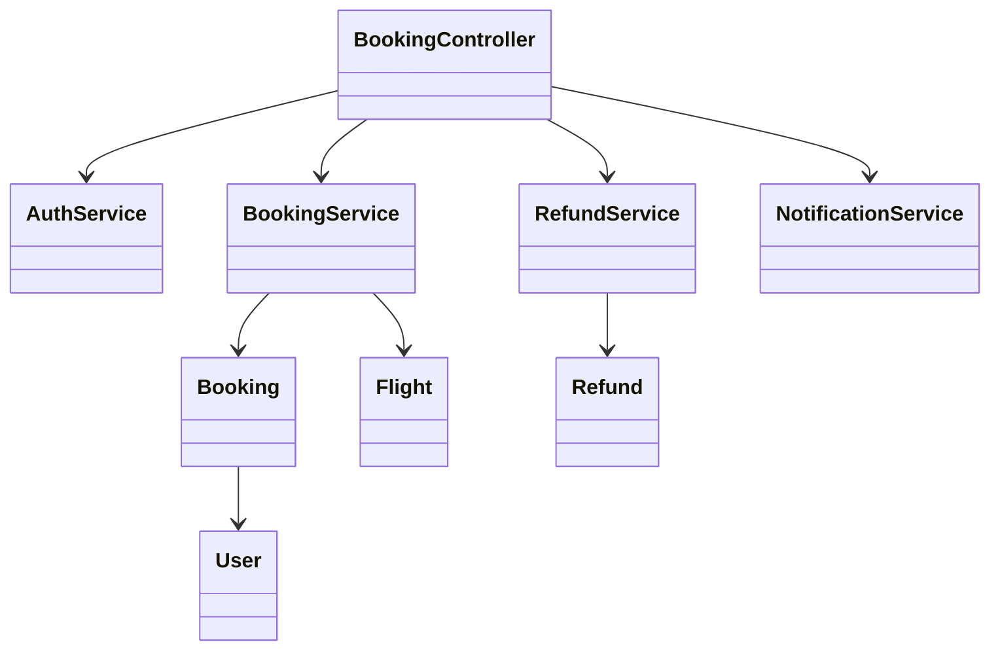
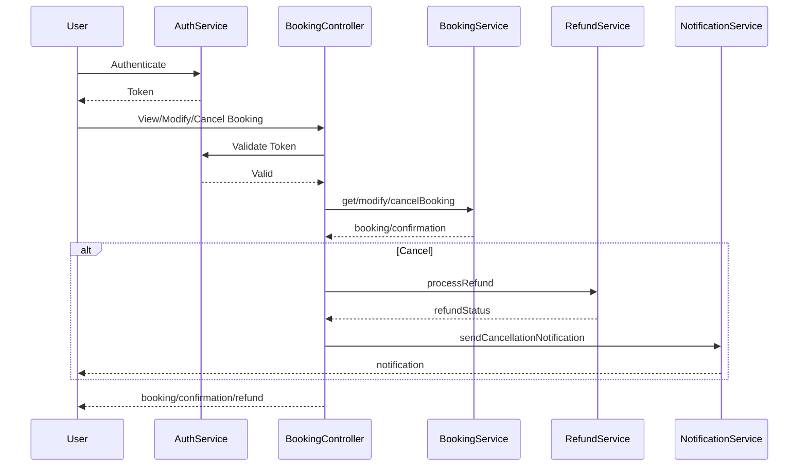
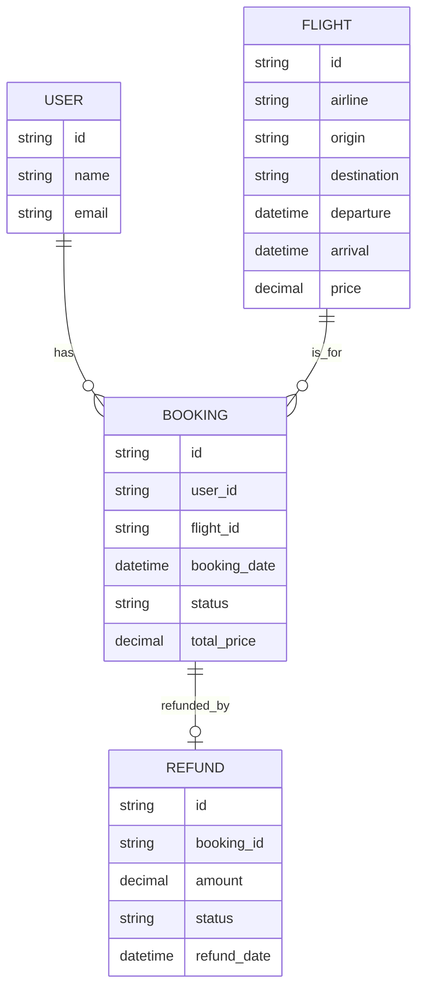

# For User Story Number [2]

1. Objective
This requirement enables travelers to manage their air transport bookings online. Users can view, modify, or cancel their reservations as needed, with all changes reflected in real time and refunds processed securely according to airline policies. The objective is to provide a secure, user-friendly platform for booking management.

2. API Model
  2.1 Common Components/Services
  - Authentication Service (OAuth2)
  - Booking Management Service
  - Refund Service
  - Notification Service

  2.2 API Details
| Operation | REST Method | Type    | URL                                 | Request (JSON) | Response (JSON) |
|-----------|-------------|---------|-------------------------------------|----------------|-----------------|
| View      | GET         | Success | /api/bookings                       | {"userId": "U123"} | [{"bookingId": "B123", "flight": {...}, "status": "CONFIRMED"}] |
| Modify    | PUT         | Success | /api/bookings/{bookingId}/modify    | {"date": "2025-12-10", "seat": "12A"} | {"status": "MODIFIED", "newPrice": 400.00} |
| Cancel    | DELETE      | Success | /api/bookings/{bookingId}/cancel    | {}             | {"status": "CANCELLED", "refund": 350.00} |
| Refund    | POST        | Success | /api/refunds/process                | {"bookingId": "B123"} | {"refundStatus": "PROCESSED", "amount": 350.00} |

  2.3 Exceptions
| API                 | Exception Type             | Description |
|---------------------|---------------------------|-------------|
| /api/bookings       | UnauthorizedException     | User not authenticated |
| /api/bookings/*     | BookingNotFoundException  | Booking does not exist |
| /api/bookings/*     | ModificationNotAllowedException | Modification not allowed by fare rules |
| /api/refunds/process| RefundPolicyException     | Refund not allowed or calculation error |

3 Functional Design
  3.1 Class Diagram

  3.2 UML Sequence Diagram

  3.3 Components
| Component Name         | Description                                      | Existing/New |
|-----------------------|--------------------------------------------------|--------------|
| BookingController      | Handles booking management requests              | New          |
| AuthService           | Handles user authentication                      | Existing     |
| BookingService         | Business logic for booking management            | New          |
| RefundService          | Handles refund processing                        | New          |
| NotificationService    | Sends notifications (email/SMS)                  | New          |
| User                   | Represents the user entity                       | Existing     |
| Booking                | Represents booking details                       | Existing     |
| Flight                 | Represents flight details                        | Existing     |
| Refund                 | Represents refund transactions                   | New          |

  3.4 Service Layer Logic and Validations
| FieldName     | Validation                                 | Error Message                  | ClassUsed         |
|--------------|--------------------------------------------|-------------------------------|-------------------|
| userId       | Authenticated user only                    | Unauthorized access            | AuthService       |
| bookingId    | Must exist and belong to user              | Booking not found              | BookingService    |
| date         | Modification allowed by fare rules         | Modification not allowed       | BookingService    |
| seat         | Valid seat assignment                      | Invalid seat                   | BookingService    |
| refund       | Accurate calculation as per policy         | Refund calculation error       | RefundService     |

4 Integrations
| SystemToBeIntegrated | IntegratedFor             | IntegrationType |
|---------------------|---------------------------|-----------------|
| Airline Reservation | Booking updates/cancel    | API             |
| Payment Gateway     | Refund processing         | API             |
| Notification Service| Cancellation/updates      | API             |

5 DB Details
  5.1 ER Model

  5.2 DB Validations
- Foreign key constraints between booking, user, and flight.
- Refunds must be unique per booking.
- Booking status must be updated after modification/cancellation.

6 Non-Functional Requirements
  6.1 Performance
  - All booking changes must be reflected in real time.
  - Support at least 500 concurrent booking modifications.

  6.2 Security
    6.2.1 Authentication
    - OAuth2 authentication for all endpoints.
    6.2.2 Authorization
    - Only authenticated users can manage their bookings.

  6.3 Logging
    6.3.1 Application Logging
    - DEBUG: API request/response payloads (masked for sensitive data)
    - INFO: Booking modifications, cancellations, refunds
    - ERROR: Unauthorized access, modification errors
    - WARN: Multiple failed modification attempts
    6.3.2 Audit Log
    - Log all booking management and refund actions with user ID, timestamp, and action details.

7 Dependencies
- Airline reservation system for booking updates
- Payment gateway for refunds
- Notification service for updates

8 Assumptions
- Users are authenticated before accessing booking management.
- Airline reservation system supports real-time updates.
- Refund policies are up-to-date and accessible.