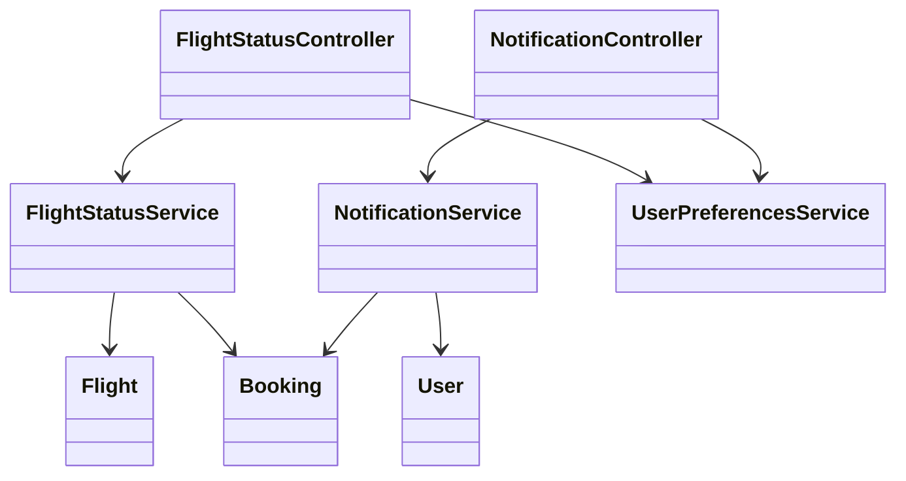
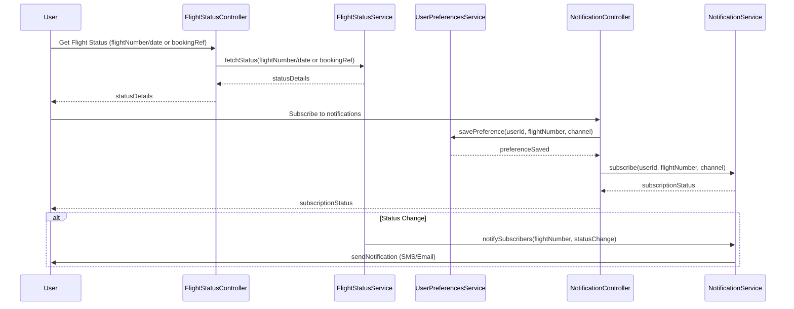
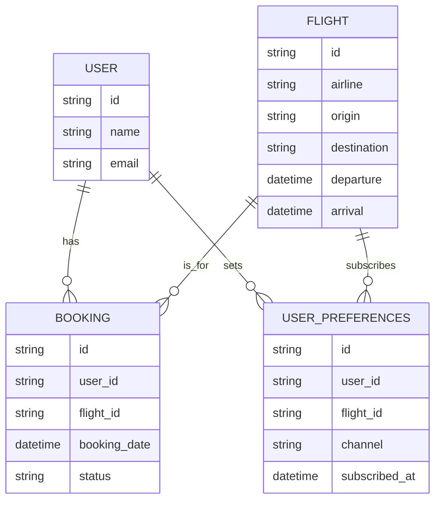

# For User Story Number [3]

1. Objective
This requirement enables travelers to check the real-time status of their flights, including delays, gate changes, and cancellations. The system will provide timely updates and allow users to subscribe to alerts via SMS or email. The objective is to keep travelers informed and reduce uncertainty during their journey.

2. API Model
  2.1 Common Components/Services
  - Flight Status Service
  - Notification Service (SMS/Email)
  - User Preferences Service
  - Authentication Service

  2.2 API Details
| Operation | REST Method | Type    | URL                                 | Request (JSON) | Response (JSON) |
|-----------|-------------|---------|-------------------------------------|----------------|-----------------|
| Status    | GET         | Success | /api/flights/status                 | {"flightNumber": "DL123", "date": "2025-12-01"} | {"status": "ON TIME", "gate": "A12", "terminal": "T1", "departure": "10:00", "arrival": "13:00"} |
| Status    | GET         | Success | /api/flights/status/byBooking       | {"bookingRef": "BR12345"} | {"status": "DELAYED", "gate": "B5", "terminal": "T2", "departure": "11:30", "arrival": "14:30"} |
| Subscribe | POST        | Success | /api/notifications/subscribe        | {"userId": "U123", "flightNumber": "DL123", "channel": "SMS"} | {"subscriptionStatus": "SUBSCRIBED"} |

  2.3 Exceptions
| API                | Exception Type           | Description |
|--------------------|-------------------------|-------------|
| /api/flights/status| InvalidInputException   | Invalid flight number or date |
| /api/flights/status/byBooking | BookingNotFoundException | Booking reference invalid |
| /api/notifications/subscribe | SubscriptionException | User not eligible or already subscribed |

3 Functional Design
  3.1 Class Diagram

  3.2 UML Sequence Diagram

  3.3 Components
| Component Name         | Description                                      | Existing/New |
|-----------------------|--------------------------------------------------|--------------|
| FlightStatusController | Handles flight status requests                   | New          |
| NotificationController | Handles notification subscriptions               | New          |
| FlightStatusService    | Business logic for real-time flight status       | New          |
| NotificationService    | Sends SMS/email notifications                    | New          |
| UserPreferencesService | Manages user notification preferences            | New          |
| User                   | Represents the user entity                       | Existing     |
| Flight                 | Represents flight details                        | Existing     |
| Booking                | Represents booking details                       | Existing     |

  3.4 Service Layer Logic and Validations
| FieldName        | Validation                                 | Error Message                  | ClassUsed             |
|------------------|--------------------------------------------|-------------------------------|-----------------------|
| flightNumber     | Valid flight number                        | Invalid flight number          | FlightStatusService   |
| bookingRef       | Must exist and belong to user              | Booking not found              | FlightStatusService   |
| userId           | Must exist and be authenticated            | Unauthorized access            | UserPreferencesService|
| channel          | Must be SMS or Email                       | Invalid notification channel   | NotificationService   |

4 Integrations
| SystemToBeIntegrated | IntegratedFor             | IntegrationType |
|---------------------|---------------------------|-----------------|
| Airline/Airport API | Real-time flight status   | API/Webhook     |
| Notification Provider| SMS/Email delivery       | API             |

5 DB Details
  5.1 ER Model

  5.2 DB Validations
- User preferences must be unique per user and flight.
- Only opted-in users receive notifications.

6 Non-Functional Requirements
  6.1 Performance
  - Status updates must reflect within 2 minutes of change.
  - Notification delivery success rate must be 99% or higher.
  - System must scale to handle peak travel periods.

  6.2 Security
    6.2.1 Authentication
    - All APIs require user authentication.
    6.2.2 Authorization
    - Only users with valid bookings or subscriptions can access status and notifications.

  6.3 Logging
    6.3.1 Application Logging
    - DEBUG: API request/response payloads (masked for sensitive data)
    - INFO: Status queries, notification subscriptions, notifications sent
    - ERROR: Invalid inputs, failed notifications
    - WARN: Delayed status updates
    6.3.2 Audit Log
    - Log all status queries and notification events with user ID, timestamp, and action details.

7 Dependencies
- Airline/airport APIs for real-time status
- Notification provider (SMS/Email)

8 Assumptions
- Real-time data feeds are reliable and up-to-date.
- Users provide valid contact information for notifications.