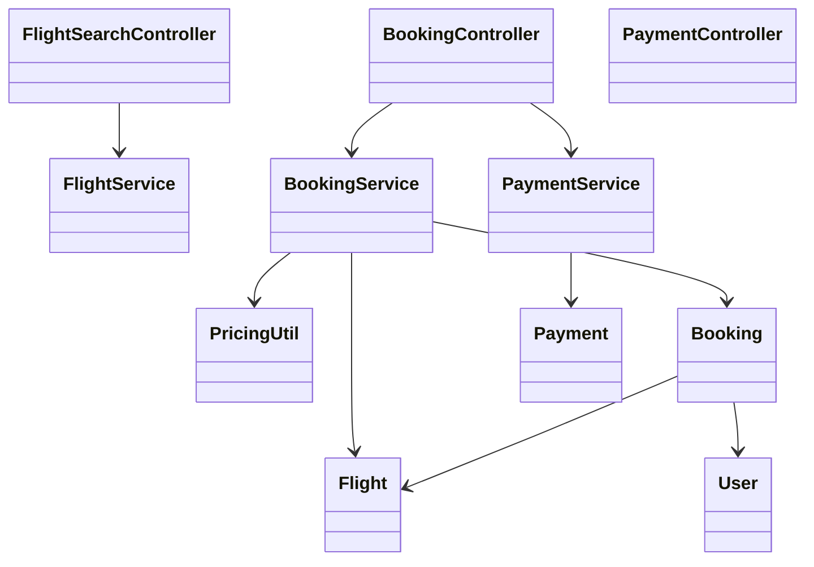
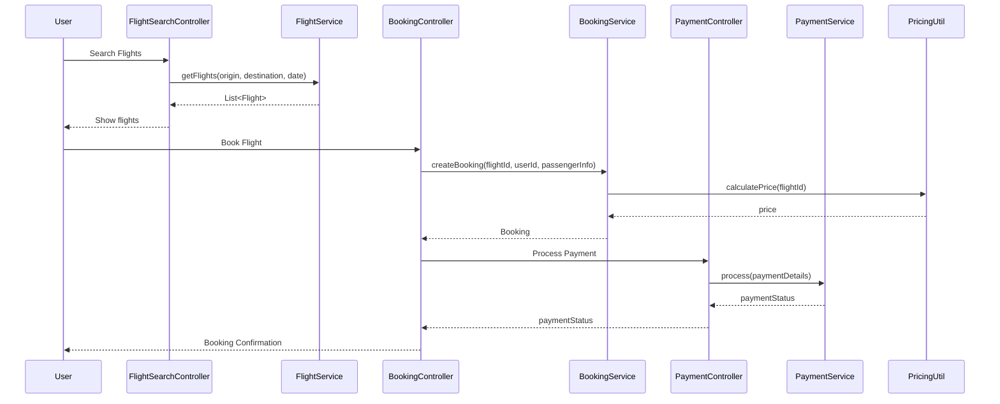
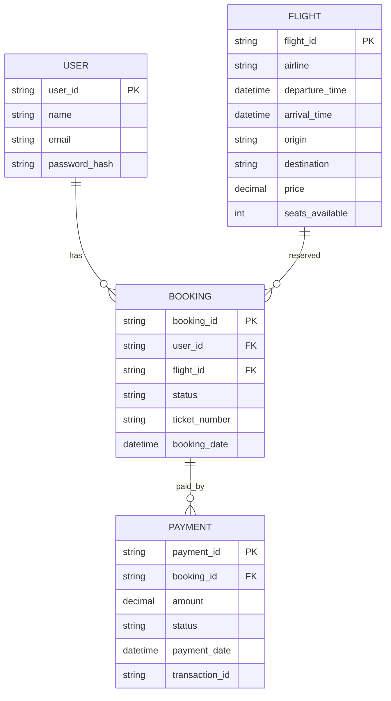

# For User Story Number [1]
1. Objective
The objective is to enable travelers to search for flights, select preferred options, and book air transport tickets online. The system must provide a seamless interface for booking, including payment and confirmation. This will allow users to conveniently plan and purchase their travel.

2. API Model
  2.1 Common Components/Services
  - Authentication Service (OAuth2)
  - Payment Integration Service
  - Flight Search Service
  - Booking Management Service
  - Pricing Calculation Utility

  2.2 API Details
| Operation   | REST Method | Type     | URL                                | Request (Sample JSON)                                                                 | Response (Sample JSON)                                                               |
|-------------|-------------|----------|-------------------------------------|--------------------------------------------------------------------------------------|--------------------------------------------------------------------------------------|
| Search      | GET         | Success  | /api/flights/search                 | {"origin": "JFK", "destination": "LAX", "date": "2025-12-01"}                | {"flights": [{"flightId": "F123", "airline": "Delta", "time": "10:00", "duration": "6h", "price": 350.00}]} |
| Book        | POST        | Success  | /api/flights/book                   | {"flightId": "F123", "userId": "U456", "passengerInfo": {...}, "paymentDetails": {...}} | {"bookingId": "B789", "status": "CONFIRMED", "ticketNumber": "T0001"}         |
| Payment     | POST        | Success  | /api/payments/process               | {"bookingId": "B789", "paymentDetails": {...}}                                   | {"paymentStatus": "SUCCESS", "transactionId": "TX1234"}                        |
| Book        | POST        | Failure  | /api/flights/book                   | {"flightId": "", "userId": "U456"}                                             | {"error": "Invalid flight selection."}                                             |

  2.3 Exceptions
| API Endpoint           | Exception Type         | Description                                    |
|------------------------|-----------------------|------------------------------------------------|
| /api/flights/search    | InvalidInputException | Origin or destination invalid                  |
| /api/flights/book      | ValidationException   | Missing or invalid booking details             |
| /api/payments/process  | PaymentFailedException| Payment declined or failed                     |
| /api/flights/book      | SeatUnavailableException | Selected seat no longer available           |

3 Functional Design
  3.1 Class Diagram

  3.2 UML Sequence Diagram

  3.3 Components
| Component Name           | Description                                              | Existing/New |
|-------------------------|----------------------------------------------------------|--------------|
| FlightSearchController  | Handles flight search requests                           | New          |
| BookingController       | Handles booking and payment requests                     | New          |
| PaymentController       | Handles payment processing                               | New          |
| FlightService           | Business logic for flight search                         | New          |
| BookingService          | Business logic for booking and seat reservation          | New          |
| PaymentService          | Integrates with payment gateway                          | New          |
| PricingUtil             | Calculates final price including taxes and fees          | New          |
| User                    | Represents application user                              | Existing     |
| Flight                  | Represents flight details                                | Existing     |
| Booking                 | Represents booking details                               | New          |
| Payment                 | Represents payment details                               | New          |

  3.4 Service Layer Logic and Validations
| FieldName      | Validation                                    | Error Message                        | ClassUsed      |
|---------------|-----------------------------------------------|--------------------------------------|---------------|
| origin        | Not empty, valid airport code                  | Invalid origin airport code           | FlightService |
| destination   | Not empty, valid airport code                  | Invalid destination airport code      | FlightService |
| date          | Not in the past, valid date                    | Invalid travel date                   | FlightService |
| paymentDetails| Valid card, PCI DSS compliance                 | Invalid payment details               | PaymentService|

4 Integrations
| SystemToBeIntegrated | IntegratedFor         | IntegrationType |
|----------------------|----------------------|-----------------|
| Payment Gateway      | Payment processing   | API             |
| Airline Inventory    | Flight availability  | API             |
| User Management      | Authentication       | API             |

5 DB Details
  5.1 ER Model

  5.2 DB Validations
- Unique constraint on ticket_number in BOOKING
- Foreign key constraints between BOOKING and USER, FLIGHT
- Foreign key constraint between PAYMENT and BOOKING

6 Non-Functional Requirements
  6.1 Performance
  - System should handle at least 1000 concurrent users.
  - API response time for search and booking <2 seconds.
  - Caching of frequent flight search queries at API layer.

  6.2 Security
    6.2.1 Authentication
    - OAuth2-based authentication for all endpoints.
    - HTTPS enforced for all API communication.
    6.2.2 Authorization
    - Role-based access to booking endpoints (only authenticated users).
    - PCI DSS compliance for payment data.

  6.3 Logging
    6.3.1 Application Logging
    - DEBUG: API request/response payloads (masked for sensitive fields)
    - INFO: Successful bookings, payments
    - ERROR: Failed bookings, payment errors
    - WARN: Suspicious activity, repeated failed logins
    6.3.2 Audit Log
    - Audit log for all booking and payment actions (user, timestamp, action, status)

7 Dependencies
- Payment gateway (PCI DSS compliant)
- Airline inventory system
- User authentication provider (OAuth2)
- Azure SQL Database

8 Assumptions
- All users have valid email addresses for confirmation.
- Airline inventory APIs provide real-time seat availability.
- Payment gateway supports instant confirmation.
