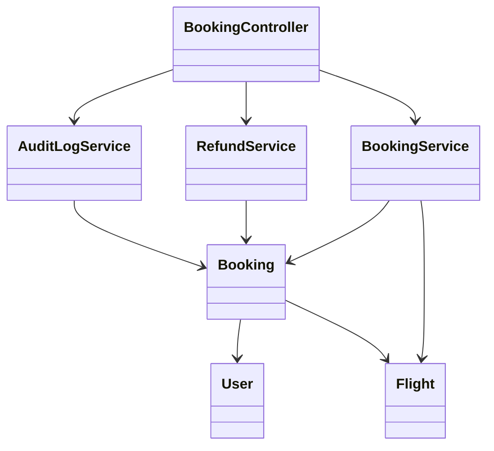
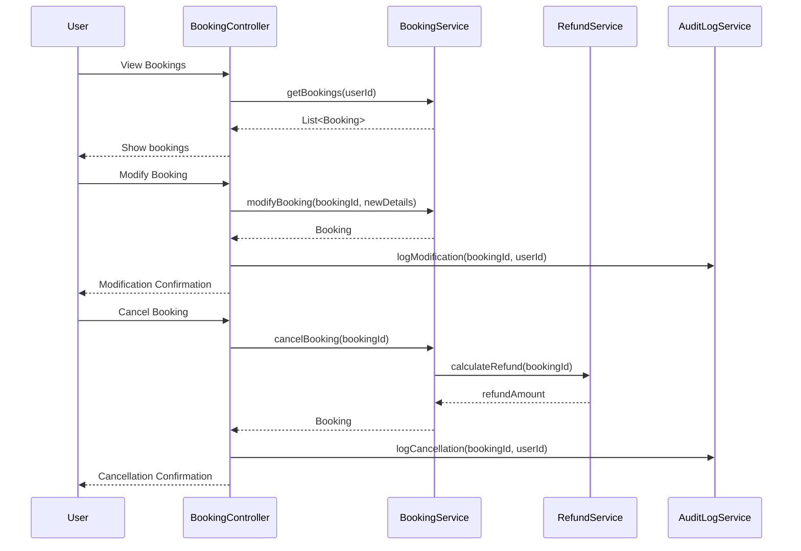
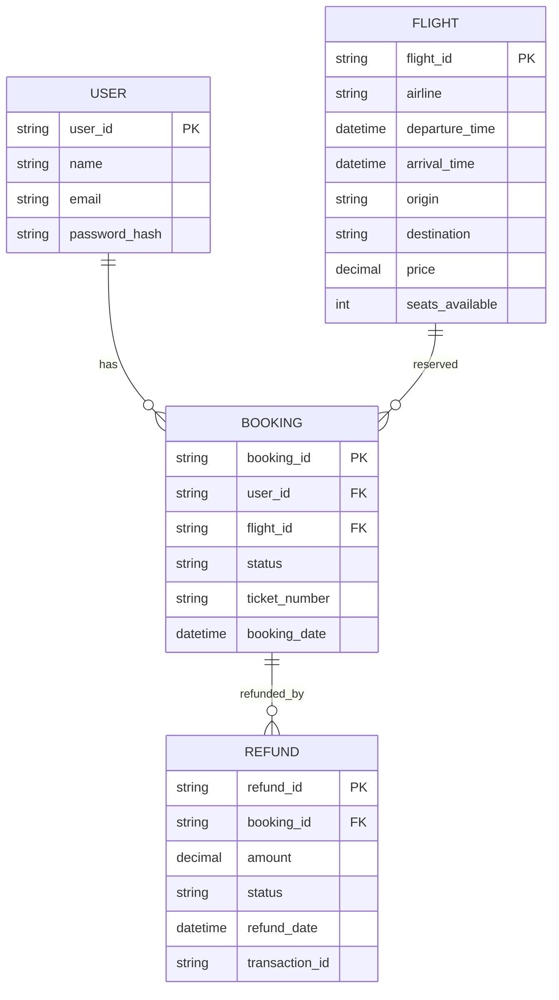

# For User Story Number [2]
1. Objective
The objective is to allow travelers to view and manage their air transport bookings, including checking itineraries, making changes, or canceling bookings. The system must provide real-time updates and clear options for modification and cancellation. This ensures users have control and flexibility over their travel plans.

2. API Model
  2.1 Common Components/Services
  - Authentication Service (OAuth2)
  - Booking Management Service
  - Refund Calculation Utility
  - Audit Logging Service

  2.2 API Details
| Operation   | REST Method | Type     | URL                                   | Request (Sample JSON)                                     | Response (Sample JSON)                                         |
|-------------|-------------|----------|----------------------------------------|----------------------------------------------------------|----------------------------------------------------------------|
| View        | GET         | Success  | /api/bookings                         | {"userId": "U456"}                                      | {"bookings": [{"bookingId": "B789", "flightId": "F123", "status": "CONFIRMED"}]} |
| Details     | GET         | Success  | /api/bookings/{bookingId}              | N/A                                                     | {"bookingId": "B789", "flight": {...}, "passengerInfo": {...}}                      |
| Modify      | PUT         | Success  | /api/bookings/{bookingId}/modify       | {"newDate": "2025-12-05", "passengerInfo": {...}}      | {"bookingId": "B789", "status": "MODIFIED"}                                   |
| Cancel      | POST        | Success  | /api/bookings/{bookingId}/cancel       | {"reason": "Change of plans"}                          | {"bookingId": "B789", "status": "CANCELLED", "refund": 200.00}                  |
| Modify      | PUT         | Failure  | /api/bookings/{bookingId}/modify       | {"newDate": "2020-01-01"}                              | {"error": "Modification not allowed as per fare rules."}                            |

  2.3 Exceptions
| API Endpoint                  | Exception Type           | Description                                            |
|-------------------------------|-------------------------|--------------------------------------------------------|
| /api/bookings                 | UnauthorizedException   | User not authenticated                                 |
| /api/bookings/{bookingId}     | NotFoundException       | Booking not found                                      |
| /api/bookings/{bookingId}/modify | ModificationNotAllowedException | Modification not permitted by fare rules      |
| /api/bookings/{bookingId}/cancel | CancellationNotAllowedException | Cancellation not permitted by fare rules      |
| /api/bookings/{bookingId}/cancel | RefundCalculationException      | Refund calculation failed                     |

3 Functional Design
  3.1 Class Diagram

  3.2 UML Sequence Diagram

  3.3 Components
| Component Name        | Description                                              | Existing/New |
|----------------------|----------------------------------------------------------|--------------|
| BookingController    | Handles booking view, modification, and cancellation     | New          |
| BookingService       | Business logic for booking management                    | New          |
| RefundService        | Calculates refund as per airline policy                  | New          |
| AuditLogService      | Logs all modifications and cancellations                 | New          |
| User                 | Represents application user                              | Existing     |
| Booking              | Represents booking details                               | Existing     |
| Flight               | Represents flight details                                | Existing     |

  3.4 Service Layer Logic and Validations
| FieldName      | Validation                                    | Error Message                        | ClassUsed         |
|---------------|-----------------------------------------------|--------------------------------------|-------------------|
| userId        | Must be authenticated                         | Unauthorized access                  | BookingService    |
| bookingId     | Must exist and belong to user                 | Booking not found                    | BookingService    |
| newDate       | Must be permitted by fare rules, seat available| Modification not allowed             | BookingService    |
| cancellation  | Must be permitted by fare rules               | Cancellation not allowed             | BookingService    |
| refund        | Accurate as per airline policy                | Refund calculation error             | RefundService     |

4 Integrations
| SystemToBeIntegrated | IntegratedFor         | IntegrationType |
|----------------------|----------------------|-----------------|
| Airline Inventory    | Seat availability, fare rules | API      |
| Payment Gateway      | Refund processing     | API             |
| User Management      | Authentication       | API             |

5 DB Details
  5.1 ER Model

  5.2 DB Validations
- Foreign key constraints between BOOKING and USER, FLIGHT
- Foreign key constraint between REFUND and BOOKING
- Booking status must be updated in real-time

6 Non-Functional Requirements
  6.1 Performance
  - Real-time update of booking status
  - API response time for booking management <2 seconds

  6.2 Security
    6.2.1 Authentication
    - OAuth2-based authentication for all endpoints
    - HTTPS enforced for all API communication
    6.2.2 Authorization
    - Only authenticated users can access their bookings
    - Fare rule-based authorization for modification/cancellation

  6.3 Logging
    6.3.1 Application Logging
    - DEBUG: API request/response payloads (masked for sensitive fields)
    - INFO: Booking modifications and cancellations
    - ERROR: Failed modifications, cancellations, refund errors
    - WARN: Unauthorized access attempts
    6.3.2 Audit Log
    - Audit log for all booking modifications and cancellations (user, timestamp, action, status)

7 Dependencies
- Airline inventory system for fare rules and seat availability
- Payment gateway for refund processing
- User authentication provider (OAuth2)
- Azure SQL Database

8 Assumptions
- Airline fare rules are accessible via API
- Refunds are processed instantly by payment gateway
- Users have valid email addresses for notifications
