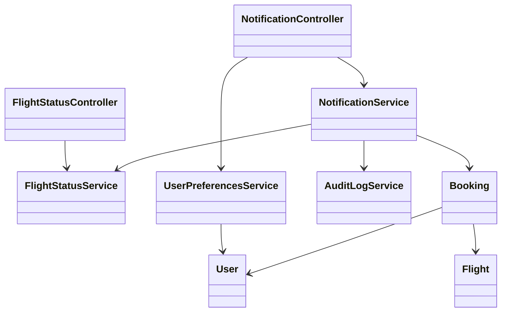
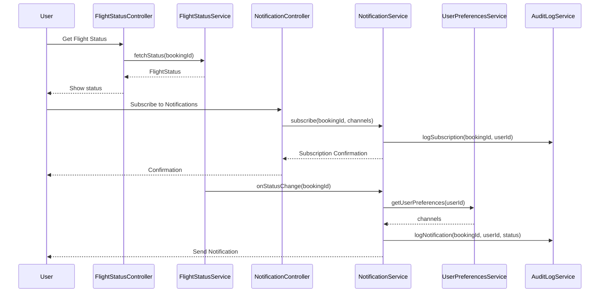
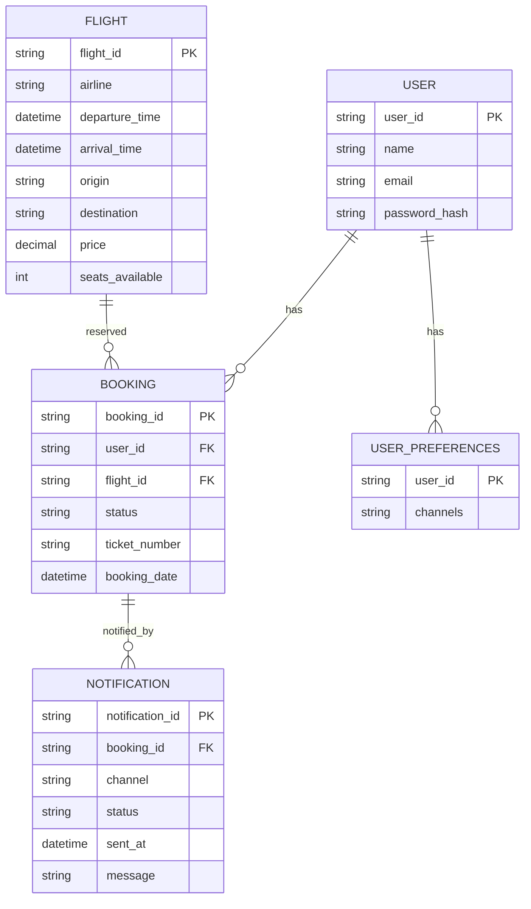

# For User Story Number [3]
1. Objective
The objective is to enable travelers to track the real-time status of their flights and receive timely notifications about delays, cancellations, or gate changes. The system should allow users to configure their notification preferences and ensure reliable, prompt delivery of alerts. This keeps users informed and able to adjust their plans accordingly.

2. API Model
  2.1 Common Components/Services
  - Authentication Service (OAuth2)
  - Flight Status Integration Service
  - Notification Engine (Email, SMS, In-app)
  - User Preferences Service
  - Audit Logging Service

  2.2 API Details
| Operation   | REST Method | Type     | URL                                       | Request (Sample JSON)                                     | Response (Sample JSON)                                         |
|-------------|-------------|----------|--------------------------------------------|----------------------------------------------------------|----------------------------------------------------------------|
| Status      | GET         | Success  | /api/flights/{bookingId}/status            | N/A                                                     | {"flightId": "F123", "status": "DELAYED", "gate": "A12", "eta": "12:30"}        |
| Subscribe   | POST        | Success  | /api/notifications/subscribe               | {"bookingId": "B789", "channels": ["email", "sms"]} | {"status": "SUBSCRIBED"}                                   |
| Preferences | PUT         | Success  | /api/notifications/preferences             | {"userId": "U456", "channels": ["in-app"]}           | {"status": "UPDATED"}                                      |
| Status      | GET         | Failure  | /api/flights/{bookingId}/status            | N/A                                                     | {"error": "No valid booking found."}                        |

  2.3 Exceptions
| API Endpoint                        | Exception Type           | Description                                            |
|-------------------------------------|-------------------------|--------------------------------------------------------|
| /api/flights/{bookingId}/status     | UnauthorizedException   | User not authenticated                                 |
| /api/flights/{bookingId}/status     | NotFoundException       | Booking not found or not valid                         |
| /api/notifications/subscribe        | SubscriptionException   | Invalid or duplicate subscription                      |
| /api/notifications/preferences      | PreferencesException    | Invalid notification channel                           |
| Notification Engine                 | NotificationFailedException | Notification delivery failed                      |

3 Functional Design
  3.1 Class Diagram

  3.2 UML Sequence Diagram

  3.3 Components
| Component Name           | Description                                              | Existing/New |
|-------------------------|----------------------------------------------------------|--------------|
| FlightStatusController  | Handles flight status requests                           | New          |
| NotificationController  | Handles notification subscription and preferences        | New          |
| FlightStatusService     | Integrates with airline/airport APIs for real-time status| New          |
| NotificationService     | Sends notifications via email, SMS, in-app               | New          |
| UserPreferencesService  | Stores and manages user notification preferences         | New          |
| AuditLogService         | Logs all notification and subscription events            | New          |
| User                    | Represents application user                              | Existing     |
| Booking                 | Represents booking details                               | Existing     |
| Flight                  | Represents flight details                                | Existing     |

  3.4 Service Layer Logic and Validations
| FieldName      | Validation                                    | Error Message                        | ClassUsed            |
|---------------|-----------------------------------------------|--------------------------------------|----------------------|
| bookingId     | Must belong to authenticated user, valid       | No valid booking found               | FlightStatusService  |
| channels      | Must be valid (email, SMS, in-app)             | Invalid notification channel         | NotificationService  |
| notification  | Delivery must be confirmed and logged          | Notification delivery failed         | NotificationService  |
| status data   | Updated at least every 5 minutes               | Flight status outdated               | FlightStatusService  |

4 Integrations
| SystemToBeIntegrated | IntegratedFor         | IntegrationType |
|----------------------|----------------------|-----------------|
| Airline/Airport APIs | Real-time flight status | API           |
| Twilio               | SMS notifications     | API             |
| SendGrid             | Email notifications   | API             |
| User Management      | Authentication       | API             |

5 DB Details
  5.1 ER Model

  5.2 DB Validations
- Foreign key constraints between BOOKING and USER, FLIGHT
- Foreign key constraint between NOTIFICATION and BOOKING
- User preferences must be valid (channels in allowed set)
- Notification delivery status must be logged

6 Non-Functional Requirements
  6.1 Performance
  - Notification delivery within 1 minute of status change
  - System should scale to handle spikes in notifications

  6.2 Security
    6.2.1 Authentication
    - OAuth2-based authentication for all endpoints
    - HTTPS enforced for all API communication
    6.2.2 Authorization
    - Only users with valid bookings can subscribe to notifications

  6.3 Logging
    6.3.1 Application Logging
    - DEBUG: API request/response payloads (masked for sensitive fields)
    - INFO: Notification delivery events
    - ERROR: Failed notification deliveries
    - WARN: Repeated notification failures
    6.3.2 Audit Log
    - Audit log for all notification and subscription events (user, timestamp, action, status)

7 Dependencies
- Airline/airport APIs for real-time flight status
- Twilio for SMS, SendGrid for email
- User authentication provider (OAuth2)
- Azure SQL Database

8 Assumptions
- Airline/airport APIs provide real-time, reliable status updates
- Notification providers (Twilio, SendGrid) are highly available
- Users have access to at least one notification channel
