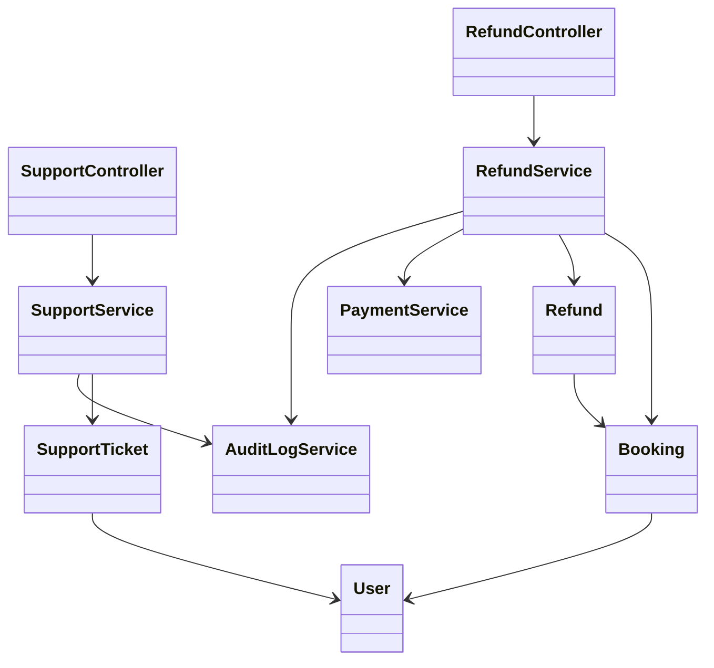
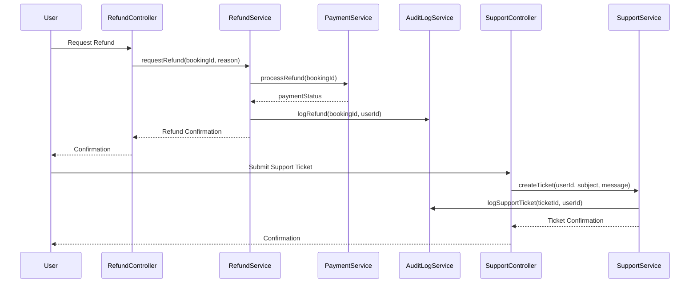
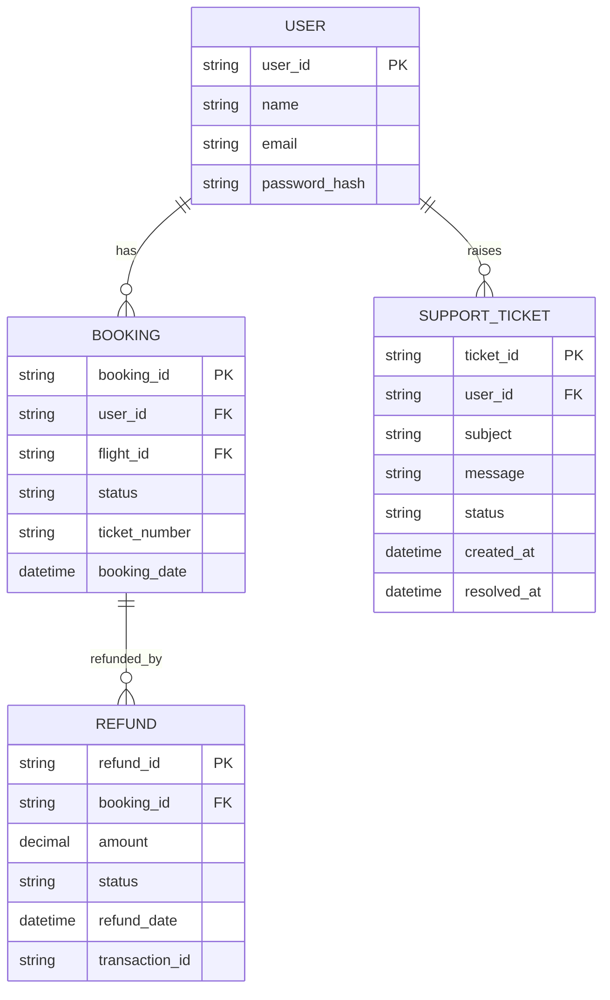

# For User Story Number [4]
1. Objective
The objective is to enable travelers to request refunds for eligible air transport bookings and access customer support for booking issues, special requests, or complaints. The system should provide clear refund policies, process requests efficiently, and offer accessible support channels. This ensures user issues are resolved promptly and transparently.

2. API Model
  2.1 Common Components/Services
  - Authentication Service (OAuth2)
  - Refund Management Service
  - Support Ticketing Service
  - Payment Integration Service
  - Audit Logging Service

  2.2 API Details
| Operation   | REST Method | Type     | URL                                 | Request (Sample JSON)                                     | Response (Sample JSON)                                         |
|-------------|-------------|----------|--------------------------------------|----------------------------------------------------------|----------------------------------------------------------------|
| Refund      | POST        | Success  | /api/refunds/request                | {"bookingId": "B789", "reason": "Flight cancelled"}   | {"refundId": "R123", "status": "PENDING"}                        |
| Refund      | GET         | Success  | /api/refunds/{refundId}/status      | N/A                                                     | {"refundId": "R123", "status": "APPROVED", "amount": 200.00}     |
| Support     | POST        | Success  | /api/support/ticket                 | {"userId": "U456", "subject": "Lost baggage", "message": "..."} | {"ticketId": "T567", "status": "OPEN"}                            |
| Support     | GET         | Success  | /api/support/ticket/{ticketId}/status | N/A                                                  | {"ticketId": "T567", "status": "RESOLVED"}                        |
| Refund      | POST        | Failure  | /api/refunds/request                | {"bookingId": "", "reason": "..."}                     | {"error": "Refund not eligible as per fare rules."}                  |

  2.3 Exceptions
| API Endpoint                  | Exception Type           | Description                                            |
|-------------------------------|-------------------------|--------------------------------------------------------|
| /api/refunds/request          | RefundNotEligibleException | Refund not allowed by fare rules                   |
| /api/refunds/{refundId}/status| NotFoundException       | Refund request not found                                |
| /api/support/ticket           | ValidationException     | Required fields missing or invalid                      |
| /api/support/ticket/{ticketId}/status | NotFoundException | Support ticket not found                          |
| Payment Integration           | PaymentFailedException  | Refund payment failed                                   |

3 Functional Design
  3.1 Class Diagram

  3.2 UML Sequence Diagram

  3.3 Components
| Component Name        | Description                                              | Existing/New |
|----------------------|----------------------------------------------------------|--------------|
| RefundController     | Handles refund requests and status queries               | New          |
| SupportController    | Handles support ticket creation and status queries       | New          |
| RefundService        | Business logic for refund eligibility and calculation    | New          |
| SupportService       | Business logic for support ticket management             | New          |
| PaymentService       | Integrates with payment gateway for refunds              | Existing     |
| AuditLogService      | Logs all refund and support actions                      | New          |
| User                 | Represents application user                              | Existing     |
| Booking              | Represents booking details                               | Existing     |
| Refund               | Represents refund request and status                     | New          |
| SupportTicket        | Represents support request and status                    | New          |

  3.4 Service Layer Logic and Validations
| FieldName      | Validation                                    | Error Message                        | ClassUsed         |
|---------------|-----------------------------------------------|--------------------------------------|-------------------|
| bookingId     | Must be eligible for refund as per fare rules  | Refund not eligible                  | RefundService     |
| refund        | Calculation as per fare rules and payment type | Refund calculation error             | RefundService     |
| userId        | Must be authenticated                         | Unauthorized access                  | SupportService    |
| subject       | Required, non-empty                           | Subject required                     | SupportService    |
| message       | Required, non-empty                           | Message required                     | SupportService    |

4 Integrations
| SystemToBeIntegrated | IntegratedFor         | IntegrationType |
|----------------------|----------------------|-----------------|
| Payment Gateway      | Refund processing     | API             |
| Support Ticketing    | Ticket management     | API             |
| User Management      | Authentication       | API             |

5 DB Details
  5.1 ER Model

  5.2 DB Validations
- Foreign key constraints between BOOKING and USER
- Foreign key constraint between REFUND and BOOKING
- Foreign key constraint between SUPPORT_TICKET and USER
- All refund and support requests must be logged and tracked

6 Non-Functional Requirements
  6.1 Performance
  - Refund requests processed within 5 business days
  - Support response time within 24 hours
  - System should handle at least 100 concurrent support requests

  6.2 Security
    6.2.1 Authentication
    - OAuth2-based authentication for all endpoints
    - HTTPS enforced for all API communication
    6.2.2 Authorization
    - Only authenticated users can request refunds or support

  6.3 Logging
    6.3.1 Application Logging
    - DEBUG: API request/response payloads (masked for sensitive fields)
    - INFO: Refund and support ticket creation
    - ERROR: Failed refund or support actions
    - WARN: Repeated failed refund/support attempts
    6.3.2 Audit Log
    - Audit log for all refund and support actions (user, timestamp, action, status)

7 Dependencies
- Payment gateway for refund processing
- Support ticketing system
- User authentication provider (OAuth2)
- Azure SQL Database

8 Assumptions
- Fare rules and refund eligibility are accessible via API
- Payment gateway supports refund processing
- Support ticketing system is integrated and available
- Users provide valid contact information for support
