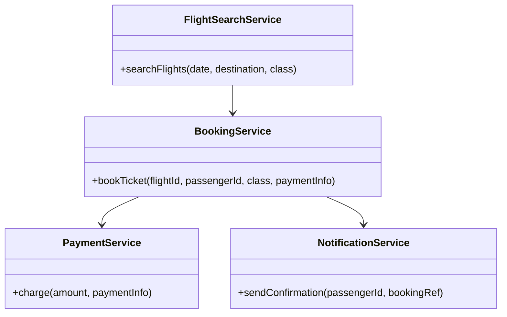
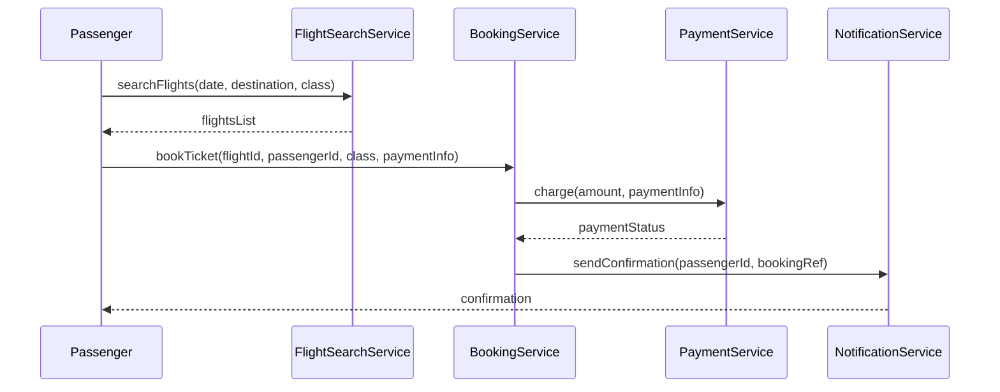
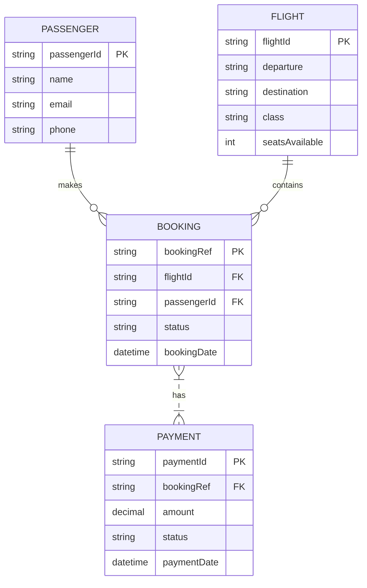

# For User Story Number [1]

1. Objective
This requirement enables passengers to search, select, and book air transport tickets online, offering convenience and flexibility in travel planning. It provides options for date, time, destination, and class, and integrates payment processing. The goal is to ensure a seamless booking experience with secure payment and instant confirmation.

2. API Model
  2.1 Common Components/Services
  - FlightSearchService (existing)
  - BookingService (new)
  - PaymentService (existing Stripe integration)
  - NotificationService (existing)

  2.2 API Details
| Operation      | REST Method | Type           | URL                               | Request (JSON)                                                                                     | Response (JSON)                                                                                  |
|---------------|-------------|----------------|------------------------------------|----------------------------------------------------------------------------------------------------|--------------------------------------------------------------------------------------------------|
| Search Flights| GET         | Success/Failure| /api/flights/search                | {"date": "2025-10-10", "destination": "NYC", "class": "Economy"}                             | {"flights": [{"flightId": "F123", "departure": "10:00", "seats": 20, ...}]}               |
| Book Ticket   | POST        | Success/Failure| /api/bookings                      | {"flightId": "F123", "passengerId": "P456", "class": "Economy", "paymentInfo": {...}}        | {"bookingRef": "BR789", "status": "CONFIRMED"}                                               |
| Payment       | POST        | Success/Failure| /api/payments/charge               | {"amount": 250.00, "currency": "USD", "cardDetails": {...}}                                    | {"paymentId": "PAY001", "status": "SUCCESS"}                                                |
| Confirmation  | GET         | Success/Failure| /api/bookings/{bookingRef}/confirm | {}                                                                                                | {"bookingRef": "BR789", "status": "CONFIRMED", "details": {...}}                           |

  2.3 Exceptions
| API                | Exception Type         | Description                                 |
|--------------------|-----------------------|---------------------------------------------|
| Search Flights     | InvalidInputException | Invalid date/destination/class              |
| Book Ticket        | SeatUnavailableException | No seats available for selected flight      |
| Payment            | PaymentFailedException | Payment gateway failure                     |
| Confirmation       | BookingNotFoundException | Invalid booking reference                   |

3 Functional Design
  3.1 Class Diagram

  3.2 UML Sequence Diagram

  3.3 Components
| Component Name        | Description                                              | Existing/New |
|----------------------|----------------------------------------------------------|--------------|
| FlightSearchService  | Handles flight search logic                              | Existing     |
| BookingService       | Manages booking creation and seat allocation             | New          |
| PaymentService       | Integrates with Stripe for payment processing            | Existing     |
| NotificationService  | Sends booking confirmation via email/SMS                 | Existing     |

  3.4 Service Layer Logic and Validations
| FieldName      | Validation                            | Error Message                    | ClassUsed            |
|---------------|---------------------------------------|----------------------------------|----------------------|
| date          | Must be a valid future date            | "Invalid travel date"            | FlightSearchService  |
| destination   | Must be a valid airport code/location  | "Invalid destination"            | FlightSearchService  |
| paymentInfo   | Must pass Stripe validation            | "Payment failed"                 | PaymentService       |
| flightId      | Must have available seats              | "No seats available"             | BookingService       |

4 Integrations
| SystemToBeIntegrated | IntegratedFor         | IntegrationType |
|----------------------|----------------------|-----------------|
| Stripe API           | Payment processing   | API             |
| Email/SMS Gateway    | Confirmation         | API             |

5 DB Details
  5.1 ER Model

  5.2 DB Validations
- Ensure bookingRef is unique per booking.
- SeatsAvailable must be >= 0 after booking.
- Payment status must be SUCCESS for confirmed bookings.

6 Non-Functional Requirements
  6.1 Performance
  - API response time for search and booking < 2 seconds.
  - Use caching for frequent flight searches.

  6.2 Security
    6.2.1 Authentication
    - OAuth2/JWT authentication for all booking APIs.
    - PCI DSS compliance for payment info.
    6.2.2 Authorization
    - Only authenticated users can book tickets.

  6.3 Logging
    6.3.1 Application Logging
    - DEBUG: API request/response payloads.
    - INFO: Successful bookings, payments.
    - ERROR: Failed payments, booking errors.
    - WARN: Suspicious activity (multiple failed payments).
    6.3.2 Audit Log
    - Log booking creation, payment processing, and confirmation events.

7 Dependencies
- Stripe payment gateway
- Email/SMS notification service

8 Assumptions
- All flights and seat inventory are up-to-date in the system.
- Stripe API is available and configured.
- Passenger contact details are valid for notifications.