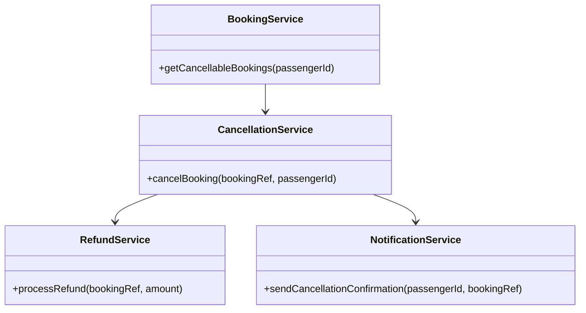
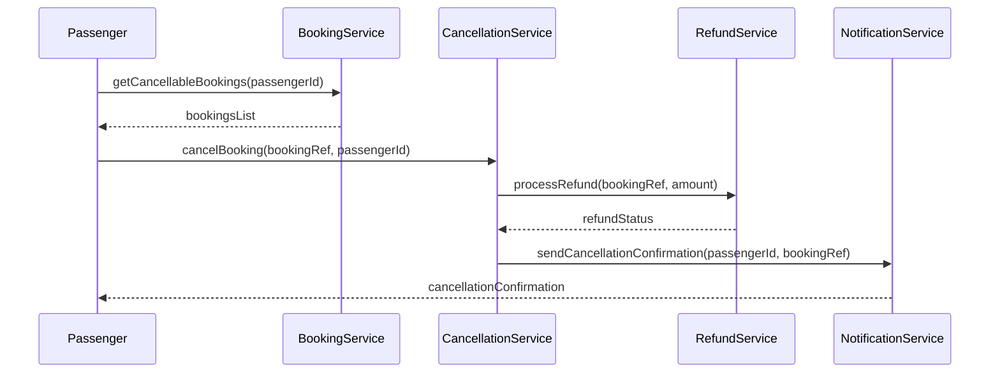
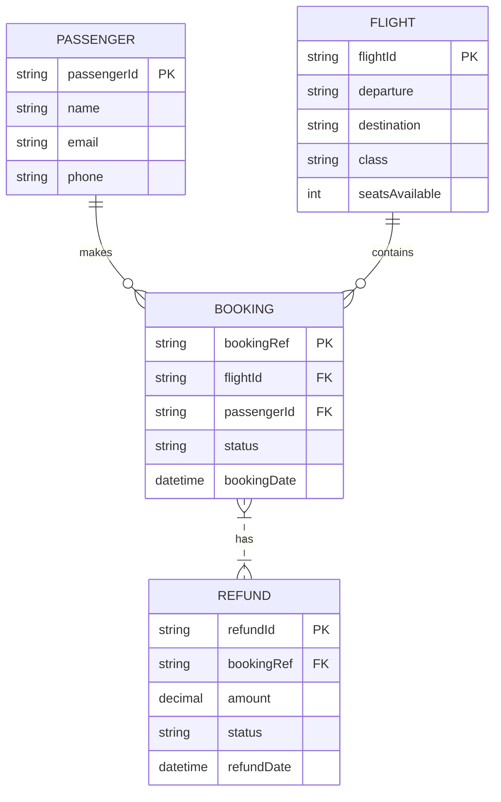

# For User Story Number [2]

1. Objective
This requirement allows passengers to cancel their booked air transport tickets online, supporting travel plan changes. It ensures cancellation policies are enforced, processes refunds as per fare rules, and updates seat inventory. The system provides confirmation and notifications for all cancellation actions.

2. API Model
  2.1 Common Components/Services
  - BookingService (existing)
  - CancellationService (new)
  - RefundService (existing, payment gateway integration)
  - NotificationService (existing)

  2.2 API Details
| Operation        | REST Method | Type           | URL                                    | Request (JSON)                                                      | Response (JSON)                                                     |
|------------------|-------------|----------------|-----------------------------------------|---------------------------------------------------------------------|---------------------------------------------------------------------|
| View Cancellable | GET         | Success/Failure| /api/bookings/cancellable               | {"passengerId": "P456"}                                           | {"bookings": [{"bookingRef": "BR789", "flightId": "F123", ...}]} |
| Cancel Ticket    | POST        | Success/Failure| /api/bookings/cancel                    | {"bookingRef": "BR789", "passengerId": "P456"}                  | {"status": "CANCELLED", "refund": 200.00}                        |
| Refund           | POST        | Success/Failure| /api/refunds/process                    | {"bookingRef": "BR789", "amount": 200.00}                        | {"refundId": "RF123", "status": "SUCCESS"}                      |
| Cancellation Conf| GET         | Success/Failure| /api/bookings/{bookingRef}/cancel/confirm| {}                                                                | {"bookingRef": "BR789", "status": "CANCELLED", "details": {...}} |

  2.3 Exceptions
| API                | Exception Type           | Description                                 |
|--------------------|-------------------------|---------------------------------------------|
| View Cancellable   | BookingNotFoundException| No cancellable bookings found               |
| Cancel Ticket      | CancellationWindowException | Cancellation window expired                 |
| Refund             | RefundFailedException   | Payment gateway refund failure              |
| Cancellation Conf  | BookingNotFoundException| Invalid booking reference                   |

3 Functional Design
  3.1 Class Diagram

  3.2 UML Sequence Diagram

  3.3 Components
| Component Name        | Description                                              | Existing/New |
|----------------------|----------------------------------------------------------|--------------|
| BookingService       | Retrieves bookings eligible for cancellation              | Existing     |
| CancellationService  | Manages cancellation logic and policy enforcement        | New          |
| RefundService        | Processes refunds via payment gateway                    | Existing     |
| NotificationService  | Sends cancellation confirmation via email/SMS            | Existing     |

  3.4 Service Layer Logic and Validations
| FieldName      | Validation                            | Error Message                    | ClassUsed            |
|---------------|---------------------------------------|----------------------------------|----------------------|
| bookingRef    | Must exist and be eligible for cancel  | "Booking not found or not eligible" | BookingService       |
| passengerId   | Must match booking                     | "Passenger mismatch"             | BookingService       |
| cancellationWindow | Must be within allowed period      | "Cancellation window expired"    | CancellationService  |
| refundAmount  | Must comply with fare rules            | "Invalid refund amount"          | RefundService        |

4 Integrations
| SystemToBeIntegrated | IntegratedFor         | IntegrationType |
|----------------------|----------------------|-----------------|
| Payment Gateway      | Refund processing    | API             |
| Email/SMS Gateway    | Cancellation confirmation | API         |

5 DB Details
  5.1 ER Model

  5.2 DB Validations
- Booking status must be CANCELLED for refund.
- Refund amount must not exceed paid amount.
- SeatsAvailable must be incremented after cancellation.

6 Non-Functional Requirements
  6.1 Performance
  - Refund processing time < 24 hours.
  - High availability for cancellation APIs.

  6.2 Security
    6.2.1 Authentication
    - OAuth2/JWT authentication for cancellation APIs.
    6.2.2 Authorization
    - Only booking owner can cancel ticket.

  6.3 Logging
    6.3.1 Application Logging
    - DEBUG: API request/response payloads.
    - INFO: Successful cancellations, refunds.
    - ERROR: Failed refunds, cancellation errors.
    - WARN: Suspicious cancellation attempts.
    6.3.2 Audit Log
    - Log cancellation, refund, and notification events.

7 Dependencies
- Payment gateway for refunds
- Email/SMS notification service

8 Assumptions
- Cancellation policies and fare rules are up-to-date.
- Payment gateway supports refund API.
- Passenger contact details are valid for notifications.