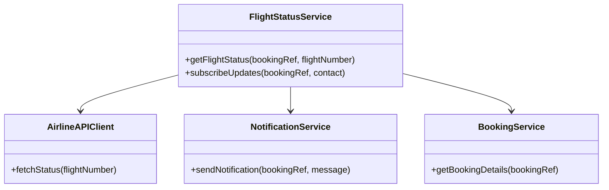
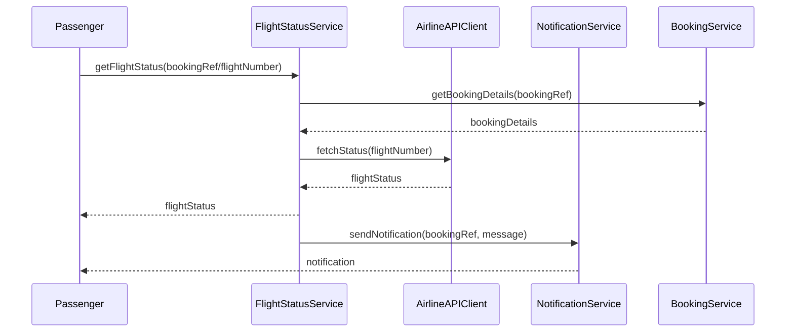
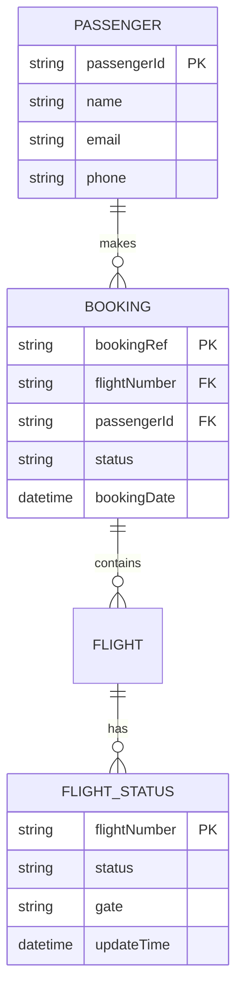

# For User Story Number [3]

1. Objective
This requirement enables passengers to track the real-time status of their flights, including updates on delays, cancellations, and gate changes. It integrates with airline APIs to provide live status information and sends notifications for any changes. The goal is to keep passengers informed and minimize travel disruptions.

2. API Model
  2.1 Common Components/Services
  - FlightStatusService (new)
  - BookingService (existing)
  - NotificationService (existing)
  - AirlineAPIClient (new)

  2.2 API Details
| Operation         | REST Method | Type           | URL                                   | Request (JSON)                                                        | Response (JSON)                                                      |
|-------------------|-------------|----------------|----------------------------------------|-----------------------------------------------------------------------|-----------------------------------------------------------------------|
| Get Flight Status | GET         | Success/Failure| /api/flights/status                    | {"bookingRef": "BR789"} or {"flightNumber": "F123"}              | {"flightStatus": "DELAYED", "gate": "A2", "updateTime": "12:01"} |
| Subscribe Updates | POST        | Success/Failure| /api/flights/status/subscribe          | {"bookingRef": "BR789", "contact": "email/phone"}                 | {"status": "SUBSCRIBED"}                                             |
| Notification      | POST        | Success/Failure| /api/notifications/send                | {"bookingRef": "BR789", "message": "Flight delayed"}               | {"status": "SENT"}                                                   |

  2.3 Exceptions
| API                | Exception Type           | Description                                 |
|--------------------|-------------------------|---------------------------------------------|
| Get Flight Status  | InvalidInputException   | Invalid booking reference/flight number      |
| Subscribe Updates  | SubscriptionException   | Unable to subscribe for updates              |
| Notification       | NotificationFailedException | Notification delivery failed               |

3 Functional Design
  3.1 Class Diagram

  3.2 UML Sequence Diagram

  3.3 Components
| Component Name        | Description                                              | Existing/New |
|----------------------|----------------------------------------------------------|--------------|
| FlightStatusService  | Handles flight status retrieval and subscription         | New          |
| BookingService       | Manages passenger bookings                               | Existing     |
| NotificationService  | Sends notifications for status changes                   | Existing     |
| AirlineAPIClient     | Integrates with airline APIs for real-time status        | New          |

  3.4 Service Layer Logic and Validations
| FieldName      | Validation                            | Error Message                    | ClassUsed            |
|---------------|---------------------------------------|----------------------------------|----------------------|
| bookingRef    | Must be valid and exist                | "Invalid booking reference"      | BookingService       |
| flightNumber  | Must be valid and exist                | "Invalid flight number"          | AirlineAPIClient     |
| contact       | Must be valid email/phone              | "Invalid contact details"        | NotificationService  |
| updateTime    | Must be within 1 minute of change      | "Status update delayed"          | FlightStatusService  |

4 Integrations
| SystemToBeIntegrated | IntegratedFor         | IntegrationType |
|----------------------|----------------------|-----------------|
| Airline APIs         | Real-time flight status| API            |
| Email/SMS Gateway    | Status notifications | API             |

5 DB Details
  5.1 ER Model

  5.2 DB Validations
- FlightStatus updateTime must be within 1 minute of real change.
- BookingRef must map to valid passenger and flight.
- Notification delivery status must be tracked.

6 Non-Functional Requirements
  6.1 Performance
  - Real-time update latency < 1 minute.
  - Scalable notification delivery system.

  6.2 Security
    6.2.1 Authentication
    - OAuth2/JWT authentication for status APIs.
    6.2.2 Authorization
    - Only booking owner can view flight status.

  6.3 Logging
    6.3.1 Application Logging
    - DEBUG: API request/response payloads.
    - INFO: Status updates, notifications sent.
    - ERROR: API failures, notification errors.
    - WARN: Delayed status updates.
    6.3.2 Audit Log
    - Log flight status changes and notification events.

7 Dependencies
- Airline APIs for real-time status
- Email/SMS notification service

8 Assumptions
- Airline APIs provide reliable and timely status updates.
- Passenger contact details are valid for notifications.