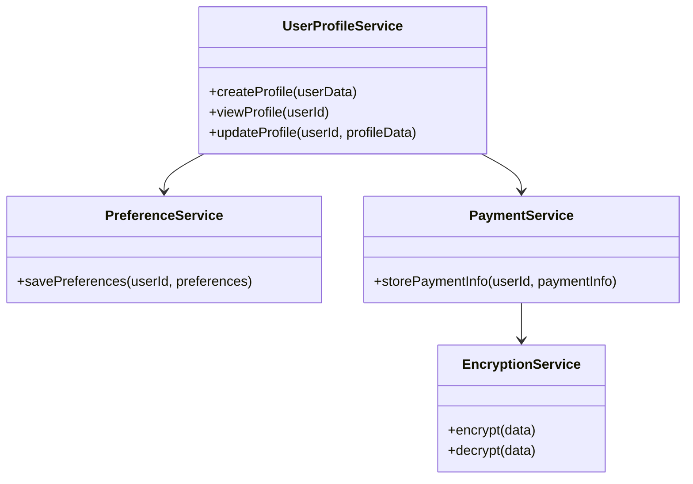
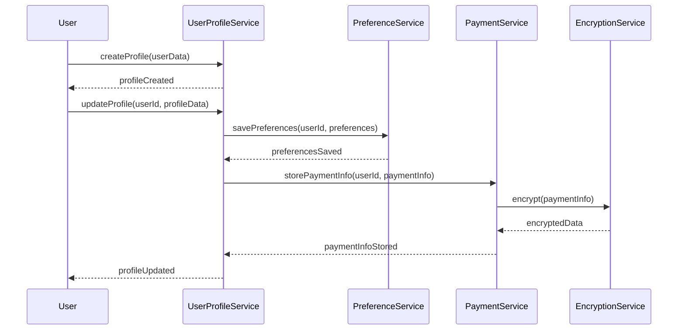
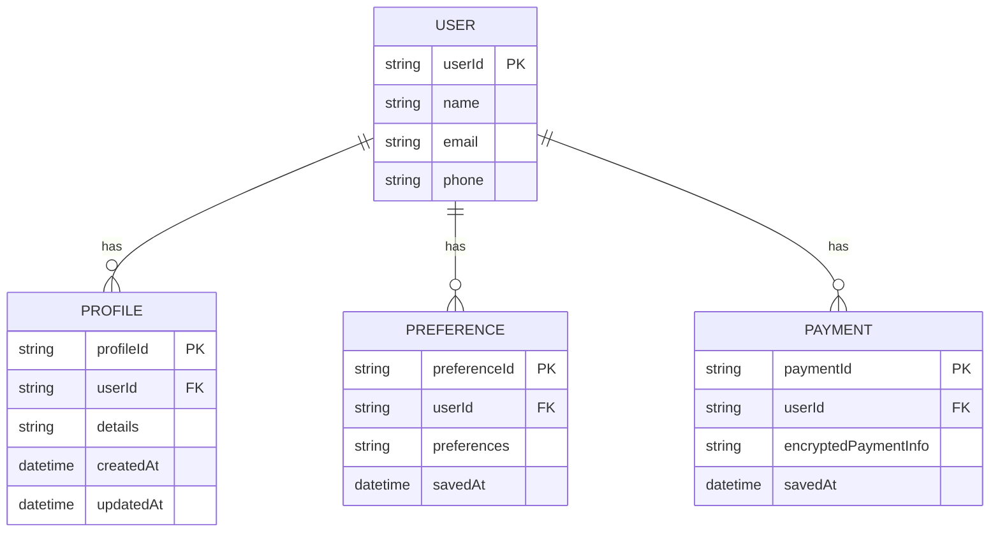

# For User Story Number [4]

1. Objective
This requirement enables registered users to manage their profiles and travel preferences, including personal details and saved payment methods. It supports secure storage and immediate updates, allowing personalized booking experiences. The system ensures data validation, encryption, and seamless integration with booking forms.

2. API Model
  2.1 Common Components/Services
  - UserProfileService (new)
  - PreferenceService (new)
  - PaymentService (existing)
  - EncryptionService (existing)

  2.2 API Details
| Operation         | REST Method | Type           | URL                                   | Request (JSON)                                                        | Response (JSON)                                                      |
|-------------------|-------------|----------------|----------------------------------------|-----------------------------------------------------------------------|-----------------------------------------------------------------------|
| Create Profile    | POST        | Success/Failure| /api/users/profile/create              | {"userId": "U123", "name": "John", "email": "john@doe.com", ...} | {"userId": "U123", "status": "CREATED"}                              |
| View Profile      | GET         | Success/Failure| /api/users/profile/{userId}            | {}                                                                    | {"userId": "U123", "profile": {...}}                                  |
| Update Profile    | PUT         | Success/Failure| /api/users/profile/{userId}/update     | {"name": "John Doe", "preferences": {...}, "paymentInfo": {...}}      | {"userId": "U123", "status": "UPDATED"}                              |
| Save Preferences  | POST        | Success/Failure| /api/users/preferences/save            | {"userId": "U123", "preferences": {...}}                             | {"userId": "U123", "status": "SAVED"}                                |

  2.3 Exceptions
| API                | Exception Type           | Description                                 |
|--------------------|-------------------------|---------------------------------------------|
| Create Profile     | InvalidInputException   | Invalid profile data format                  |
| Update Profile     | UpdateFailedException   | Profile update failed                        |
| Save Preferences   | PreferenceSaveException | Unable to save preferences                   |
| PaymentInfo        | EncryptionException     | Payment info encryption failed               |

3 Functional Design
  3.1 Class Diagram

  3.2 UML Sequence Diagram

  3.3 Components
| Component Name        | Description                                              | Existing/New |
|----------------------|----------------------------------------------------------|--------------|
| UserProfileService   | Manages user profile creation, viewing, and updates      | New          |
| PreferenceService    | Handles travel preferences storage and retrieval         | New          |
| PaymentService       | Stores and manages payment information                   | Existing     |
| EncryptionService    | Encrypts/decrypts sensitive data                         | Existing     |

  3.4 Service Layer Logic and Validations
| FieldName      | Validation                            | Error Message                    | ClassUsed            |
|---------------|---------------------------------------|----------------------------------|----------------------|
| name/email    | Must be valid format                   | "Invalid name/email format"      | UserProfileService   |
| paymentInfo   | Must be encrypted before storing       | "Payment info encryption failed" | PaymentService       |
| preferences   | Must be valid JSON object              | "Invalid preferences format"     | PreferenceService    |
| profileUpdate | Must reflect immediately               | "Profile update failed"          | UserProfileService   |

4 Integrations
| SystemToBeIntegrated | IntegratedFor         | IntegrationType |
|----------------------|----------------------|-----------------|
| Encryption Service   | Secure payment info  | API             |
| Email/SMS Gateway    | Profile notifications| API             |

5 DB Details
  5.1 ER Model

  5.2 DB Validations
- Email must be unique per user.
- Payment info must be encrypted before storage.
- Preferences must be valid JSON.

6 Non-Functional Requirements
  6.1 Performance
  - Profile update latency < 2 seconds.
  - High availability for profile APIs.

  6.2 Security
    6.2.1 Authentication
    - OAuth2/JWT authentication for profile APIs.
    6.2.2 Authorization
    - Only profile owner can update/view profile.
    - Encryption for payment information.

  6.3 Logging
    6.3.1 Application Logging
    - DEBUG: API request/response payloads.
    - INFO: Profile creation, updates.
    - ERROR: Failed updates, encryption errors.
    - WARN: Unauthorized access attempts.
    6.3.2 Audit Log
    - Log profile changes and payment info updates.

7 Dependencies
- Encryption service for payment info
- Email/SMS notification service

8 Assumptions
- Payment gateway supports secure storage.
- User contact details are valid for notifications.