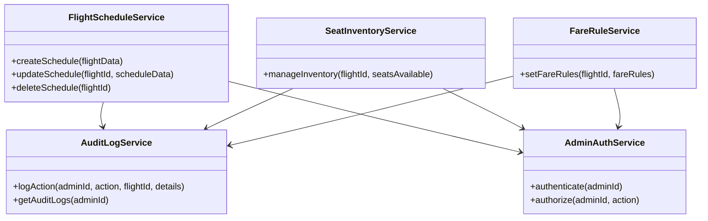
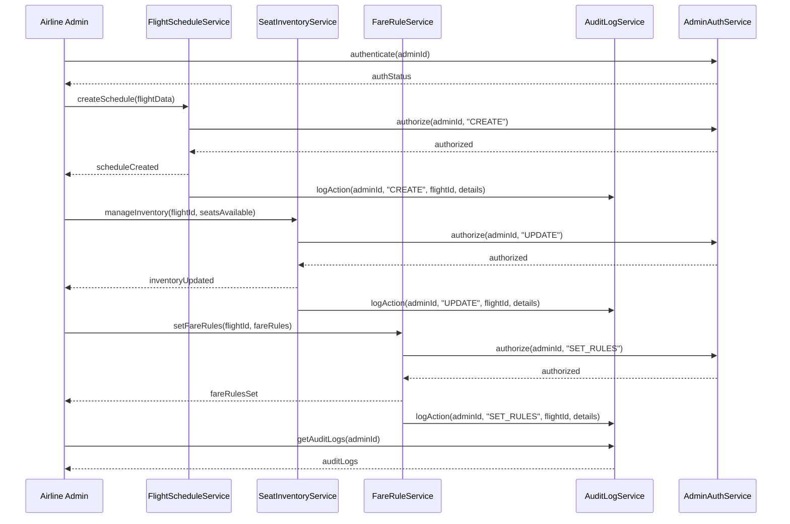
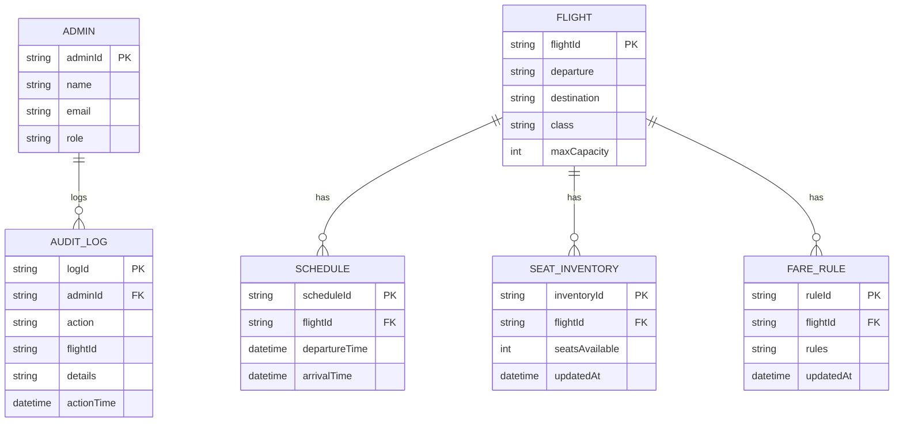

# For User Story Number [5]

1. Objective
This requirement allows airline administrators to manage flight schedules, seat inventory, and fare rules, ensuring accurate and up-to-date information for booking and operations. It supports bulk updates and generates audit logs for all administrative actions. The goal is to maintain operational integrity and compliance with business policies.

2. API Model
  2.1 Common Components/Services
  - FlightScheduleService (new)
  - SeatInventoryService (new)
  - FareRuleService (new)
  - AuditLogService (new)
  - AdminAuthService (existing)

  2.2 API Details
| Operation         | REST Method | Type           | URL                                   | Request (JSON)                                                        | Response (JSON)                                                      |
|-------------------|-------------|----------------|----------------------------------------|-----------------------------------------------------------------------|-----------------------------------------------------------------------|
| Create Schedule   | POST        | Success/Failure| /api/admin/schedules/create            | {"flightId": "F123", "departure": "10:00", "destination": "NYC", ...} | {"flightId": "F123", "status": "CREATED"}                              |
| Update Schedule   | PUT         | Success/Failure| /api/admin/schedules/{flightId}/update | {"departure": "11:00", "destination": "NYC", ...}                       | {"flightId": "F123", "status": "UPDATED"}                              |
| Delete Schedule   | DELETE      | Success/Failure| /api/admin/schedules/{flightId}/delete | {}                                                                    | {"flightId": "F123", "status": "DELETED"}                              |
| Manage Inventory  | POST        | Success/Failure| /api/admin/inventory/manage            | {"flightId": "F123", "seatsAvailable": 100}                             | {"flightId": "F123", "seatsAvailable": 100, "status": "UPDATED"}       |
| Set Fare Rules    | POST        | Success/Failure| /api/admin/fare-rules/set              | {"flightId": "F123", "fareRules": {...}}                                 | {"flightId": "F123", "status": "FARE_RULES_SET"}                       |
| Get Audit Logs    | GET         | Success/Failure| /api/admin/audit-logs                  | {"adminId": "A001"}                                                      | {"logs": [{"action": "UPDATE", "flightId": "F123", ...}]}             |

  2.3 Exceptions
| API                | Exception Type           | Description                                 |
|--------------------|-------------------------|---------------------------------------------|
| Create/Update/Delete Schedule | InvalidScheduleException | Invalid schedule data                       |
| Manage Inventory   | InventoryUpdateException| Invalid seat count or update failed          |
| Set Fare Rules     | FareRuleException       | Fare rules do not comply with policies       |
| Get Audit Logs     | AuditLogException       | Unable to retrieve audit logs                |

3 Functional Design
  3.1 Class Diagram

  3.2 UML Sequence Diagram

  3.3 Components
| Component Name        | Description                                              | Existing/New |
|----------------------|----------------------------------------------------------|--------------|
| FlightScheduleService| Manages flight schedule CRUD operations                  | New          |
| SeatInventoryService | Handles seat inventory management                        | New          |
| FareRuleService      | Manages fare rules for flights                           | New          |
| AuditLogService      | Logs and retrieves all admin actions                     | New          |
| AdminAuthService     | Authenticates and authorizes admin actions               | Existing     |

  3.4 Service Layer Logic and Validations
| FieldName      | Validation                            | Error Message                    | ClassUsed            |
|---------------|---------------------------------------|----------------------------------|----------------------|
| flightData    | Must be valid schedule format          | "Invalid schedule data"          | FlightScheduleService|
| seatsAvailable| Must be >= 0 and <= max capacity       | "Invalid seat count"             | SeatInventoryService |
| fareRules     | Must comply with business policies     | "Invalid fare rules"             | FareRuleService      |
| adminId       | Must be authenticated and authorized   | "Unauthorized admin action"      | AdminAuthService     |

4 Integrations
| SystemToBeIntegrated | IntegratedFor         | IntegrationType |
|----------------------|----------------------|-----------------|
| Audit Log Service    | Track admin actions  | API             |
| Role-based Auth      | Admin authentication | API             |

5 DB Details
  5.1 ER Model

  5.2 DB Validations
- seatsAvailable must be >= 0 and <= maxCapacity.
- Fare rules must be valid JSON and comply with policies.
- Audit log must be generated for every admin action.

6 Non-Functional Requirements
  6.1 Performance
  - Bulk update latency < 5 seconds.
  - High availability for schedule APIs.

  6.2 Security
    6.2.1 Authentication
    - OAuth2/JWT authentication for admin APIs.
    6.2.2 Authorization
    - Role-based access control for admin actions.

  6.3 Logging
    6.3.1 Application Logging
    - DEBUG: API request/response payloads.
    - INFO: Schedule, inventory, fare rule changes.
    - ERROR: Failed updates, unauthorized actions.
    - WARN: Suspicious or erroneous changes.
    6.3.2 Audit Log
    - Log all admin actions (create, update, delete, set rules).

7 Dependencies
- Audit log service
- Role-based authentication/authorization

8 Assumptions
- Flight and seat inventory data are up-to-date.
- Fare rules are defined and maintained by business policies.
- Admin users are properly provisioned and authenticated.