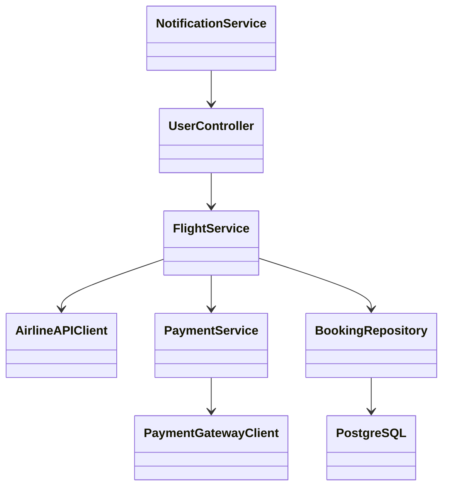
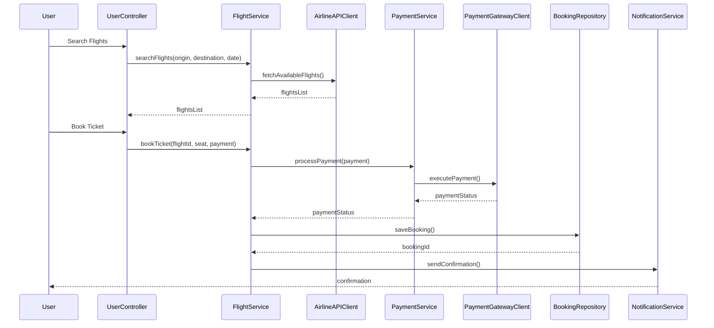

# For User Story Number [1]

1. Objective
This requirement enables travelers to search, compare, select, and book air transport tickets online, ensuring convenience and real-time information. It provides seamless integration with payment gateways and sends booking confirmations. The goal is to deliver a fast, secure, and scalable ticket booking experience.

2. API Model
2.1 Common Components/Services
- User Authentication Service (OAuth2)
- Payment Gateway Service
- Airline Integration Service
- Notification Service

2.2 API Details
| Operation        | REST Method | Type      | URL                           | Request (JSON)                                                                 | Response (JSON)                                                               |
|------------------|-------------|-----------|-------------------------------|--------------------------------------------------------------------------------|-------------------------------------------------------------------------------|
| Search Flights   | GET         | Success   | /api/flights/search           | {"origin": "DEL", "destination": "BLR", "date": "2025-10-15"}           | [{"flightId": "AI123", "fare": 5000, "seats": ["A1", "A2"]}]           |
| View Flight      | GET         | Success   | /api/flights/{flightId}       | N/A                                                                            | {"flightId": "AI123", "details": {...}}                                    |
| Book Ticket      | POST        | Success   | /api/bookings                 | {"flightId": "AI123", "userId": "U001", "seat": "A1", "payment": {...}} | {"bookingId": "B123", "status": "CONFIRMED", "confirmation": {...}}      |
| Payment Process  | POST        | Success   | /api/payments                 | {"bookingId": "B123", "paymentDetails": {...}}                             | {"paymentId": "P123", "status": "SUCCESS"}                                |
| Confirmation     | GET         | Success   | /api/bookings/{bookingId}/confirmation | N/A                                                                    | {"bookingId": "B123", "confirmation": {...}}                               |

2.3 Exceptions
| API                | Exception Type      | Message                                 |
|--------------------|--------------------|-----------------------------------------|
| Search Flights     | ValidationError    | "Origin/Destination cannot be empty"   |
| Book Ticket        | ValidationError    | "Invalid seat selection"               |
| Payment Process    | PaymentError       | "Payment failed/invalid details"       |
| Confirmation       | NotFoundError      | "Booking not found"                    |

3 Functional Design
3.1 Class Diagram


3.2 UML Sequence Diagram


3.3 Components
| Component Name         | Description                                         | Existing/New |
|-----------------------|-----------------------------------------------------|--------------|
| UserController        | Handles user requests and responses                  | New          |
| FlightService         | Business logic for flight operations                 | New          |
| AirlineAPIClient      | Integrates with external airline APIs                | New          |
| PaymentService        | Handles payment logic and integration                | New          |
| PaymentGatewayClient  | Connects to payment gateway                         | Existing     |
| BookingRepository     | Persists booking data                               | New          |
| NotificationService   | Sends notifications to users                        | Existing     |

3.4 Service Layer Logic and Validations
| FieldName      | Validation                       | Error Message                        | ClassUsed         |
|---------------|----------------------------------|--------------------------------------|-------------------|
| origin        | Not empty                        | "Origin cannot be empty"             | FlightService     |
| destination   | Not empty                        | "Destination cannot be empty"        | FlightService     |
| date          | Future date                      | "Date must be in the future"         | FlightService     |
| payment       | Valid payment details            | "Invalid payment details"            | PaymentService    |
| seat          | Valid/available seat             | "Seat not available"                 | FlightService     |

4 Integrations
| SystemToBeIntegrated | IntegratedFor         | IntegrationType |
|---------------------|-----------------------|-----------------|
| Airline APIs        | Flight search/details | API             |
| Payment Gateway     | Payment processing    | API             |
| Azure Monitor       | Monitoring/alerts     | API             |

5 DB Details
5.1 ER Model
```mermaid
erDiagram
    USER ||--o{ BOOKING : has
    BOOKING ||--|{ PAYMENT : includes
    BOOKING ||--|{ SEAT : includes
    FLIGHT ||--o{ BOOKING : has
    USER {
      userId PK
      name
      email
      password
    }
    FLIGHT {
      flightId PK
      airline
      origin
      destination
      date
      fare
    }
    BOOKING {
      bookingId PK
      userId FK
      flightId FK
      seatId FK
      status
      createdAt
    }
    PAYMENT {
      paymentId PK
      bookingId FK
      amount
      status
      paymentDate
    }
    SEAT {
      seatId PK
      flightId FK
      seatNumber
      isAvailable
    }
```

5.2 DB Validations
- Unique constraint on bookingId, paymentId, seatId
- Foreign key constraints for userId, flightId, seatId
- Check constraint for payment status (SUCCESS/FAILED)

6 Non-Functional Requirements
6.1 Performance
- Search results to be cached at API layer for 2 seconds
- Asynchronous notification sending

6.2 Security
  6.2.1 Authentication
  - OAuth2 authentication for all user actions
  - PCI DSS compliance for payment data
  6.2.2 Authorization
  - Role-based access for booking management (user/admin)

6.3 Logging
  6.3.1 Application Logging
  - DEBUG: API request/response payloads
  - INFO: Successful bookings, payments
  - ERROR: Failed payments, booking errors
  - WARN: Slow API responses
  6.3.2 Audit Log
  - Audit all booking creation, payment transactions, and confirmation notifications

7 Dependencies
- Airline APIs for flight data
- Payment Gateway for transactions
- Azure Monitor for analytics

8 Assumptions
- All airlines support real-time API integration
- Payment gateway is PCI DSS compliant
- Users have valid authentication before booking
