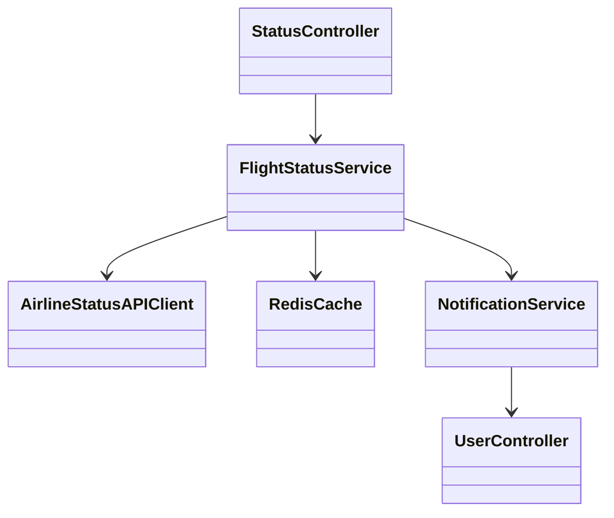
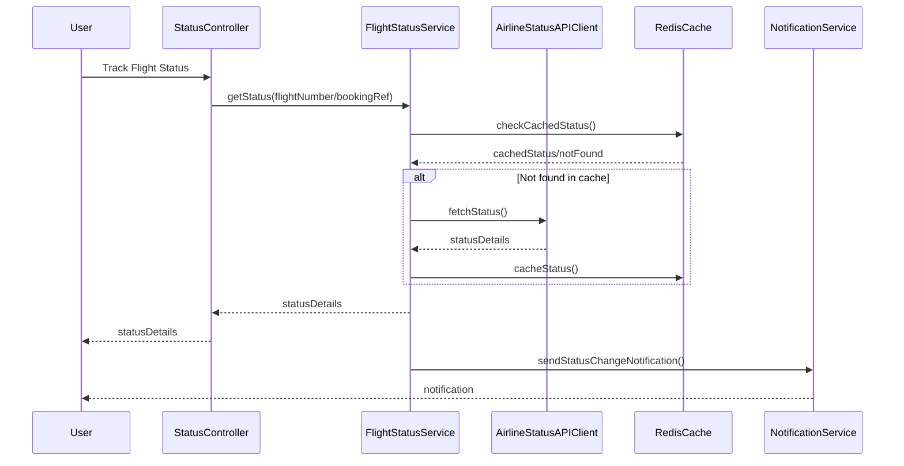

# For User Story Number [2]

1. Objective
This requirement enables travelers to track the real-time status of their flights, ensuring they are promptly informed of delays, cancellations, or gate changes. It provides a seamless experience for users to input flight details and receive notifications. The goal is to deliver accurate, fast, and reliable flight status updates.

2. API Model
2.1 Common Components/Services
- User Authentication Service
- Airline Status Integration Service
- Notification Service
- Real-time Update Service (Redis)

2.2 API Details
| Operation         | REST Method | Type      | URL                               | Request (JSON)                                                           | Response (JSON)                                                     |
|-------------------|-------------|-----------|-----------------------------------|--------------------------------------------------------------------------|---------------------------------------------------------------------|
| Track Flight      | GET         | Success   | /api/flights/status               | {"flightNumber": "AI123"}                                              | {"flightNumber": "AI123", "status": "DELAYED", "gate": "A5"}          |
| Track by Booking  | GET         | Success   | /api/bookings/{bookingRef}/status | N/A                                                                      | {"bookingRef": "BR123", "status": "ON TIME", "gate": "B2"}             |
| Notification      | POST        | Success   | /api/notifications                | {"userId": "U001", "message": "Flight delayed"}                      | {"notificationId": "N123", "status": "SENT"}                          |

2.3 Exceptions
| API                | Exception Type      | Message                                  |
|--------------------|--------------------|------------------------------------------|
| Track Flight       | ValidationError    | "Invalid flight number/booking reference"|
| Track Flight       | NotFoundError      | "Flight not found"                      |
| Notification       | NotificationError  | "Notification failed"                   |

3 Functional Design
3.1 Class Diagram


3.2 UML Sequence Diagram


3.3 Components
| Component Name          | Description                                         | Existing/New |
|------------------------|-----------------------------------------------------|--------------|
| StatusController       | Handles flight status requests                       | New          |
| FlightStatusService    | Business logic for status tracking                   | New          |
| AirlineStatusAPIClient | Integrates with airline status APIs                  | New          |
| RedisCache             | Stores real-time flight status for quick access      | Existing     |
| NotificationService    | Sends notifications to users                         | Existing     |

3.4 Service Layer Logic and Validations
| FieldName         | Validation                        | Error Message                           | ClassUsed            |
|-------------------|-----------------------------------|-----------------------------------------|----------------------|
| flightNumber      | Valid and exists                  | "Invalid flight number"                 | FlightStatusService  |
| bookingReference  | Valid and exists                  | "Invalid booking reference"             | FlightStatusService  |
| statusSource      | Reliable airline API              | "Status source not reliable"            | AirlineStatusAPIClient|
| notification      | Sent promptly                     | "Notification failed"                   | NotificationService  |

4 Integrations
| SystemToBeIntegrated | IntegratedFor           | IntegrationType |
|---------------------|-------------------------|-----------------|
| Airline Status APIs | Flight status tracking  | API             |
| Redis               | Real-time status cache  | API             |
| Notification Service| Status change alerts    | API             |

5 DB Details
5.1 ER Model
```mermaid
erDiagram
    USER ||--o{ BOOKING : has
    BOOKING ||--o{ FLIGHT_STATUS : tracks
    FLIGHT_STATUS {
      statusId PK
      flightNumber
      bookingRef
      status
      gate
      lastUpdated
    }
    USER {
      userId PK
      name
      email
      password
    }
    BOOKING {
      bookingRef PK
      userId FK
      flightNumber FK
      createdAt
    }
```

5.2 DB Validations
- Unique constraint on statusId
- Foreign key constraints for userId, flightNumber
- Check constraint for status values (ON TIME, DELAYED, CANCELLED)

6 Non-Functional Requirements
6.1 Performance
- Status updates delivered within 5 seconds
- Redis caching for real-time status

6.2 Security
  6.2.1 Authentication
  - User authentication required for personalized notifications
  6.2.2 Authorization
  - Only users with valid bookings can track flight status

6.3 Logging
  6.3.1 Application Logging
  - DEBUG: API request/response payloads
  - INFO: Status changes, notifications sent
  - ERROR: Failed API calls, notification errors
  - WARN: Delayed status updates
  6.3.2 Audit Log
  - Audit all status change notifications and tracking requests

7 Dependencies
- Airline status APIs for real-time data
- Redis for caching
- Notification service for alerts

8 Assumptions
- Airline APIs provide reliable real-time status
- Redis cache is available and performant
- Users are authenticated before tracking status
