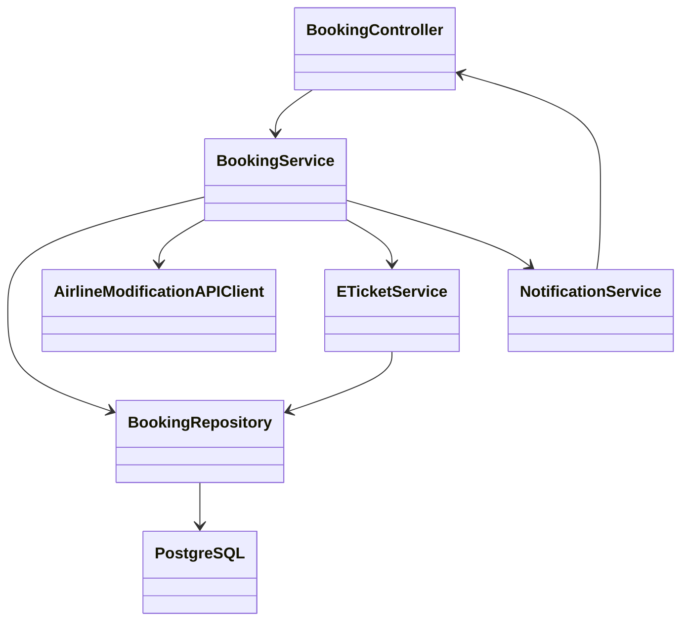
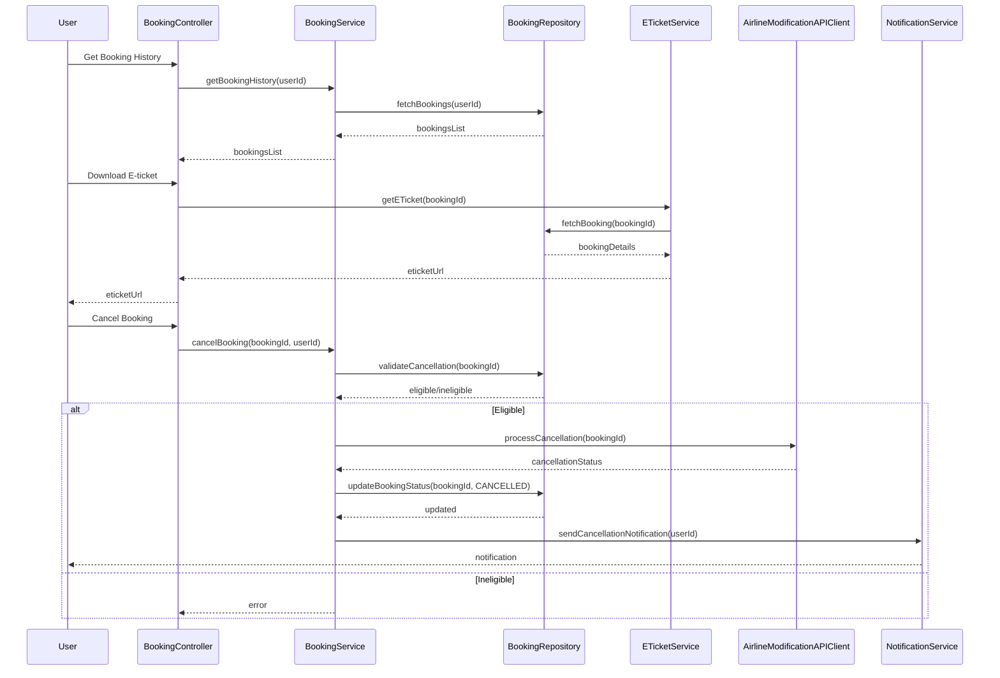

# For User Story Number [3]

1. Objective
This requirement enables travelers to view and manage their air transport booking history, including downloading e-tickets and modifying or canceling eligible bookings. It ensures secure access to booking data and provides a user-friendly dashboard for managing trips. The goal is to provide fast, secure, and comprehensive booking management for users.

2. API Model
2.1 Common Components/Services
- User Authentication Service
- Booking Management Service
- Airline Modification Integration Service
- E-ticket Generation Service
- Notification Service

2.2 API Details
| Operation         | REST Method | Type      | URL                                   | Request (JSON)                                                       | Response (JSON)                                                      |
|-------------------|-------------|-----------|---------------------------------------|----------------------------------------------------------------------|----------------------------------------------------------------------|
| Get Bookings      | GET         | Success   | /api/bookings/history                 | {"userId": "U001"}                                                 | [{"bookingId": "B123", "flightId": "AI123", "status": "UPCOMING"}]   |
| Download E-ticket | GET         | Success   | /api/bookings/{bookingId}/eticket     | N/A                                                                  | {"bookingId": "B123", "eticketUrl": "https://..."}                  |
| Cancel Booking    | POST        | Success   | /api/bookings/{bookingId}/cancel      | {"userId": "U001"}                                                 | {"bookingId": "B123", "status": "CANCELLED"}                        |
| Modify Booking    | POST        | Success   | /api/bookings/{bookingId}/modify      | {"userId": "U001", "changes": {...}}                              | {"bookingId": "B123", "status": "MODIFIED", "details": {...}}        |

2.3 Exceptions
| API                | Exception Type      | Message                                 |
|--------------------|--------------------|-----------------------------------------|
| Get Bookings       | AuthError          | "User not authenticated"                |
| Download E-ticket  | NotFoundError      | "E-ticket link invalid or expired"      |
| Cancel Booking     | ValidationError    | "Booking not eligible for cancellation" |
| Modify Booking     | ValidationError    | "Modification not allowed"              |

3 Functional Design
3.1 Class Diagram


3.2 UML Sequence Diagram


3.3 Components
| Component Name              | Description                                         | Existing/New |
|----------------------------|-----------------------------------------------------|--------------|
| BookingController          | Handles booking management requests                  | New          |
| BookingService             | Business logic for booking history and management    | New          |
| BookingRepository          | Persists and retrieves booking data                  | New          |
| AirlineModificationAPIClient| Integrates with airline APIs for modifications      | New          |
| ETicketService             | Generates and manages e-ticket downloads             | New          |
| NotificationService        | Sends notifications to users                        | Existing     |

3.4 Service Layer Logic and Validations
| FieldName      | Validation                                | Error Message                              | ClassUsed                |
|---------------|-------------------------------------------|--------------------------------------------|--------------------------|
| userId        | Authenticated user                        | "User not authenticated"                   | BookingService           |
| bookingId     | Exists and belongs to user                | "Booking not found or unauthorized"        | BookingService           |
| cancellation  | Eligible as per airline policy            | "Booking not eligible for cancellation"    | BookingService           |
| modification  | Allowed as per airline rules              | "Modification not allowed"                 | BookingService           |
| eticketUrl    | Valid and secure download link            | "E-ticket link invalid or expired"         | ETicketService           |

4 Integrations
| SystemToBeIntegrated | IntegratedFor           | IntegrationType |
|---------------------|-------------------------|-----------------|
| Airline APIs        | Booking modifications   | API             |
| Notification Service| Booking change alerts   | API             |
| ETicket Service     | E-ticket generation     | API             |

5 DB Details
5.1 ER Model
```mermaid
erDiagram
    USER ||--o{ BOOKING : has
    BOOKING ||--|{ ETICKET : generates
    BOOKING {
      bookingId PK
      userId FK
      flightId FK
      status
      createdAt
      updatedAt
    }
    ETICKET {
      eticketId PK
      bookingId FK
      eticketUrl
      generatedAt
    }
    USER {
      userId PK
      name
      email
      password
    }
    FLIGHT {
      flightId PK
      airline
      origin
      destination
      date
      fare
    }
```

5.2 DB Validations
- Unique constraint on bookingId, eticketId
- Foreign key constraints for userId, flightId, bookingId
- Check constraint for booking status (UPCOMING, CANCELLED, MODIFIED, COMPLETED)

6 Non-Functional Requirements
6.1 Performance
- Booking history loads within 3 seconds
- Asynchronous e-ticket generation and notification sending

6.2 Security
  6.2.1 Authentication
  - User authentication required for access
  6.2.2 Authorization
  - RBAC for booking actions (view, modify, cancel)
  - Secure download links for e-tickets

6.3 Logging
  6.3.1 Application Logging
  - DEBUG: API request/response payloads
  - INFO: Booking modifications, cancellations
  - ERROR: Failed booking changes, download errors
  - WARN: Unauthorized access attempts
  6.3.2 Audit Log
  - Audit all booking changes, cancellations, and e-ticket downloads

7 Dependencies
- Airline APIs for booking modifications
- Notification service for alerts
- ETicket service for e-ticket generation

8 Assumptions
- Airline APIs support modification/cancellation
- E-ticket links are securely generated and expire after use
- Users are authenticated before accessing booking history
