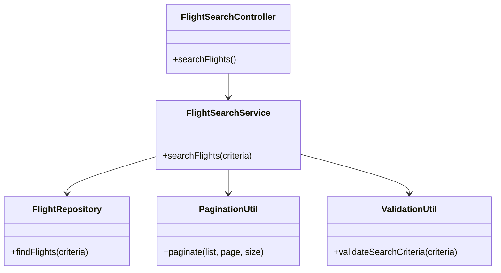
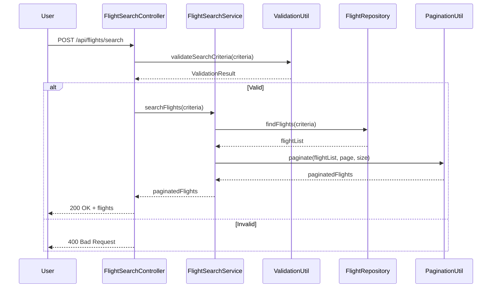
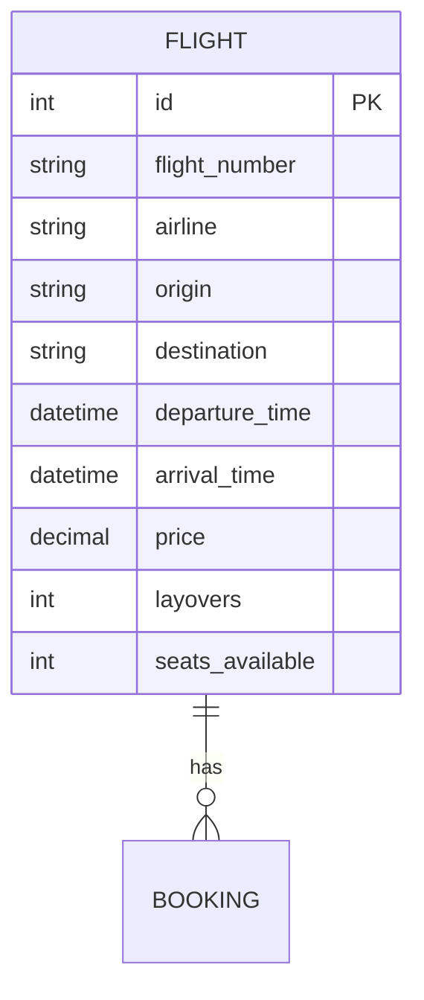

# For User Story Number [1]
1. Objective
This requirement enables travelers to search for available flights by specifying origin, destination, travel dates, and preferred airlines. The system should return a list of flights with relevant details such as timings, prices, and layovers. The objective is to provide fast, accurate, and filterable flight search results.

2. API Model
	2.1 Common Components/Services
	- FlightSearchService (new): Handles flight search logic and filtering.
	- FlightRepository (existing): Interface to the flight inventory database.
	- PaginationUtil (existing): Utility for paginating results.
	- ValidationUtil (existing): Utility for input validation.

	2.2 API Details
| Operation | REST Method | Type     | URL                           | Request (JSON)                                                                                   | Response (JSON)                                                                                                  |
|-----------|-------------|----------|-------------------------------|--------------------------------------------------------------------------------------------------|-------------------------------------------------------------------------------------------------------------------|
| Search    | POST        | Success  | /api/flights/search           | {"origin": "JFK", "destination": "LAX", "departureDate": "2025-12-01", "returnDate": "2025-12-10", "airlines": ["Delta"], "priceRange": {"min": 100, "max": 500}, "stops": 1, "page": 1, "size": 20 } | {"flights": [{"flightNumber": "DL123", "airline": "Delta", "departureTime": "2025-12-01T09:00:00", "arrivalTime": "2025-12-01T12:00:00", "price": 350, "layovers": 0}], "total": 1, "page": 1, "size": 20 } |
| Search    | POST        | Failure  | /api/flights/search           | {"origin": "JFK", "destination": "JFK", "departureDate": "2020-01-01"}                      | {"error": "Origin and destination cannot be the same or date is invalid."}                                       |

	2.3 Exceptions
| Exception Type              | When Triggered                                               | Response Code | Response Message                                   |
|----------------------------|-------------------------------------------------------------|---------------|----------------------------------------------------|
| InvalidInputException      | Origin = destination, invalid dates, missing fields         | 400           | Invalid input parameters.                          |
| NoFlightsFoundException    | No flights match criteria                                   | 404           | No flights found for the given criteria.           |
| InternalServerError        | Database/API failure                                        | 500           | Internal server error.                             |

3 Functional Design
	3.1 Class Diagram

	3.2 UML Sequence Diagram

	3.3 Components
| Component Name         | Description                                             | Existing/New |
|-----------------------|---------------------------------------------------------|--------------|
| FlightSearchController| REST controller for handling search requests            | New          |
| FlightSearchService   | Service for business logic of searching flights         | New          |
| FlightRepository      | Data access for flight inventory                        | Existing     |
| PaginationUtil        | Utility for paginating results                          | Existing     |
| ValidationUtil        | Utility for validating input criteria                   | Existing     |

	3.4 Service Layer Logic and Validations
| FieldName           | Validation                                   | Error Message                                | ClassUsed         |
|---------------------|----------------------------------------------|----------------------------------------------|-------------------|
| origin, destination | Must not be the same                         | Origin and destination cannot be the same     | ValidationUtil    |
| departureDate       | Must be valid and not in the past            | Departure date is invalid                    | ValidationUtil    |
| returnDate          | Must be valid and not in the past            | Return date is invalid                       | ValidationUtil    |
| all fields          | Required fields must be present              | All required fields must be filled           | ValidationUtil    |

4 Integrations
| SystemToBeIntegrated | IntegratedFor           | IntegrationType |
|----------------------|------------------------|-----------------|
| Flight Inventory DB  | Flight search queries  | DB              |

5 DB Details
	5.1 ER Model

	5.2 DB Validations
- Unique constraint on flight_number
- departure_time < arrival_time
- Non-negative seats_available

6 Non-Functional Requirements
	6.1 Performance
	- Search results returned within 2 seconds.
	- Pagination to reduce data transfer.
	- Indexes on search columns (origin, destination, dates).
	6.2 Security
		6.2.1 Authentication
		- Not required for search, but rate limiting to prevent abuse.
		6.2.2 Authorization
		- Not required for search.
	6.3 Logging
		6.3.1 Application Logging
		- Log all search queries at INFO level.
		- Log errors at ERROR level.
		6.3.2 Audit Log
		- Not applicable for search.

7 Dependencies
- Flight inventory database must be up and synchronized.
- Network connectivity between backend and database.

8 Assumptions
- All flight data is current and synchronized.
- Search is available to all users without authentication.
- Pagination is required for large result sets.
