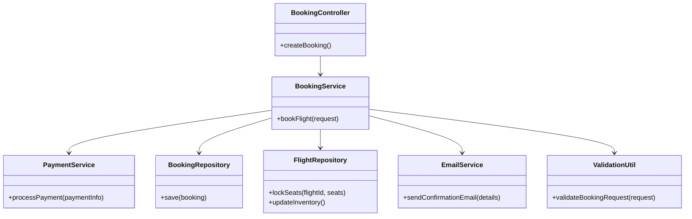
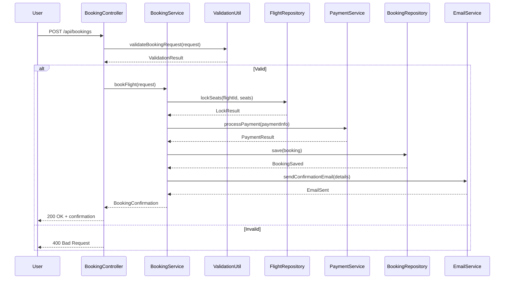
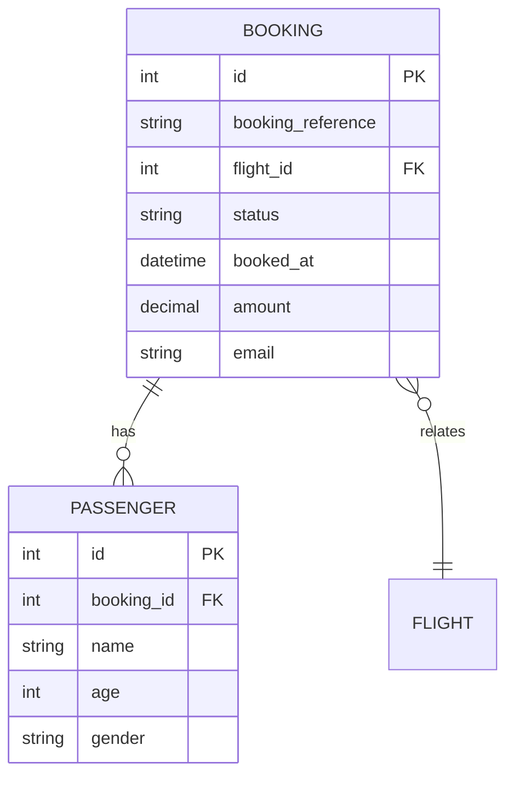

# For User Story Number [2]
1. Objective
This requirement allows travelers to book a selected flight by entering passenger details, selecting seats, and making payment. The system must confirm the booking, update inventory, and send a confirmation email. The objective is to ensure a secure, fast, and reliable booking process.

2. API Model
	2.1 Common Components/Services
	- BookingService (new): Handles booking, seat locking, and confirmation logic.
	- PaymentService (new): Integrates with Payment Gateway API.
	- BookingRepository (existing): Interface to booking database.
	- FlightRepository (existing): Interface to flight inventory.
	- EmailService (existing): Sends confirmation emails.
	- ValidationUtil (existing): Utility for input validation.

	2.2 API Details
| Operation | REST Method | Type     | URL                           | Request (JSON)                                                                                   | Response (JSON)                                                                                                  |
|-----------|-------------|----------|-------------------------------|--------------------------------------------------------------------------------------------------|-------------------------------------------------------------------------------------------------------------------|
| Book      | POST        | Success  | /api/bookings                 | {"flightId": 123, "passengers": [{"name": "John Doe", "age": 30, "gender": "M"}], "seats": ["12A"], "paymentInfo": {"cardNumber": "****", "expiry": "12/27", "cvv": "***"}} | {"bookingReference": "BK20250101", "status": "CONFIRMED", "details": {"flightId": 123, "seats": ["12A"]}} |
| Book      | POST        | Failure  | /api/bookings                 | {"flightId": 123, "passengers": [], "seats": ["12A"], "paymentInfo": {}}                      | {"error": "Passenger details are incomplete or payment failed."}                                                |

	2.3 Exceptions
| Exception Type              | When Triggered                                               | Response Code | Response Message                                   |
|----------------------------|-------------------------------------------------------------|---------------|----------------------------------------------------|
| InvalidPassengerException  | Passenger details invalid/incomplete                        | 400           | Invalid passenger details.                         |
| PaymentFailedException     | Payment authorization fails                                 | 402           | Payment could not be processed.                    |
| SeatUnavailableException   | Selected seats not available                                | 409           | Selected seats are no longer available.            |
| InternalServerError        | Database/API failure                                        | 500           | Internal server error.                             |

3 Functional Design
	3.1 Class Diagram

	3.2 UML Sequence Diagram

	3.3 Components
| Component Name         | Description                                             | Existing/New |
|-----------------------|---------------------------------------------------------|--------------|
| BookingController     | REST controller for handling booking requests           | New          |
| BookingService        | Service for booking logic and seat locking              | New          |
| PaymentService        | Service for payment processing                          | New          |
| BookingRepository     | Data access for bookings                                | Existing     |
| FlightRepository      | Data access for flight inventory                        | Existing     |
| EmailService          | Service for sending confirmation emails                 | Existing     |
| ValidationUtil        | Utility for validating booking requests                 | Existing     |

	3.4 Service Layer Logic and Validations
| FieldName           | Validation                                   | Error Message                                | ClassUsed         |
|---------------------|----------------------------------------------|----------------------------------------------|-------------------|
| passengers          | Must be valid and complete                   | Invalid passenger details                    | ValidationUtil    |
| paymentInfo         | Must be authorized                           | Payment could not be processed               | PaymentService    |
| seats               | Must be available                            | Selected seats are no longer available       | FlightRepository  |

4 Integrations
| SystemToBeIntegrated | IntegratedFor           | IntegrationType |
|----------------------|------------------------|-----------------|
| Payment Gateway API  | Payment processing     | API             |
| Email Service        | Confirmation emails    | API             |
| Flight Inventory DB  | Seat locking/inventory | DB              |
| Booking DB           | Booking records        | DB              |

5 DB Details
	5.1 ER Model

	5.2 DB Validations
- Unique constraint on booking_reference
- Foreign key constraints for flight_id and booking_id
- Non-negative amount

6 Non-Functional Requirements
	6.1 Performance
	- Booking process completes within 5 seconds after payment.
	- Indexes on booking_reference, flight_id.
	6.2 Security
		6.2.1 Authentication
		- Required for booking (user must be logged in).
		6.2.2 Authorization
		- Only authenticated users can book.
		- PCI DSS compliance for payment data.
	6.3 Logging
		6.3.1 Application Logging
		- Log all booking attempts at INFO level.
		- Log payment failures at ERROR level.
		6.3.2 Audit Log
		- Log all payment transactions and booking confirmations.

7 Dependencies
- Payment Gateway must be available and integrated.
- Email service must be operational.
- Flight inventory and booking databases must be up.

8 Assumptions
- Payment gateway is PCI DSS compliant.
- Email delivery is reliable and fast.
- Seat locking is atomic and prevents double booking.
