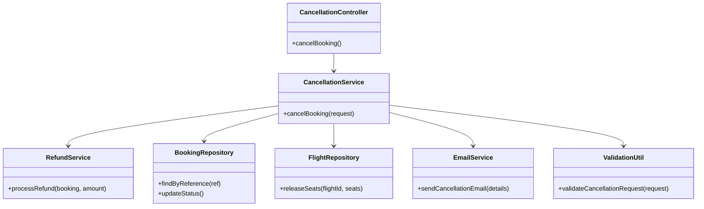

# For User Story Number [3]
1. Objective
This requirement enables travelers to cancel previously booked flights and request refunds in accordance with airline policies. The system must update booking status, release seats, and process refunds to the original payment method. The objective is to provide a secure, policy-driven, and auditable cancellation and refund process.

2. API Model
	2.1 Common Components/Services
	- CancellationService (new): Handles cancellation and refund logic.
	- RefundService (new): Integrates with Payment Gateway API for refunds.
	- BookingRepository (existing): Interface to booking database.
	- FlightRepository (existing): Interface to flight inventory.
	- EmailService (existing): Sends cancellation/refund confirmations.
	- ValidationUtil (existing): Utility for input validation.

	2.2 API Details
| Operation   | REST Method | Type     | URL                                | Request (JSON)                                                                                   | Response (JSON)                                                                                                  |
|-------------|-------------|----------|------------------------------------|--------------------------------------------------------------------------------------------------|-------------------------------------------------------------------------------------------------------------------|
| Cancel      | POST        | Success  | /api/bookings/cancel               | {"bookingReference": "BK20250101", "reason": "Change of plans"}                                | {"status": "CANCELLED", "refundAmount": 120.00, "policy": "Standard", "confirmation": "sent"}           |
| Cancel      | POST        | Failure  | /api/bookings/cancel               | {"bookingReference": "INVALID"}                                                                  | {"error": "Booking not eligible for cancellation or not found."}                                               |

	2.3 Exceptions
| Exception Type              | When Triggered                                               | Response Code | Response Message                                   |
|----------------------------|-------------------------------------------------------------|---------------|----------------------------------------------------|
| IneligibleBookingException | Booking not eligible for cancellation                       | 400           | Booking not eligible for cancellation.             |
| RefundCalculationException | Refund calculation fails                                    | 500           | Could not calculate refund.                        |
| RefundFailedException      | Refund transaction fails                                    | 502           | Refund could not be processed.                     |
| InternalServerError        | Database/API failure                                        | 500           | Internal server error.                             |

3 Functional Design
	3.1 Class Diagram

	3.2 UML Sequence Diagram

	3.3 Components
| Component Name         | Description                                             | Existing/New |
|-----------------------|---------------------------------------------------------|--------------|
| CancellationController| REST controller for handling cancellation requests      | New          |
| CancellationService   | Service for cancellation and refund logic               | New          |
| RefundService         | Service for refund transaction                          | New          |
| BookingRepository     | Data access for bookings                                | Existing     |
| FlightRepository      | Data access for flight inventory                        | Existing     |
| EmailService          | Service for sending cancellation/refund emails          | Existing     |
| ValidationUtil        | Utility for validating cancellation requests            | Existing     |

	3.4 Service Layer Logic and Validations
| FieldName           | Validation                                   | Error Message                                | ClassUsed         |
|---------------------|----------------------------------------------|----------------------------------------------|-------------------|
| bookingReference    | Must be eligible for cancellation            | Booking not eligible for cancellation        | ValidationUtil    |
| refundAmount        | Must be calculated as per policy             | Could not calculate refund                   | CancellationService|
| paymentMethod       | Refund to original payment method only        | Refund could not be processed                | RefundService     |

4 Integrations
| SystemToBeIntegrated | IntegratedFor           | IntegrationType |
|----------------------|------------------------|-----------------|
| Payment Gateway API  | Refund processing      | API             |
| Email Service        | Cancellation emails    | API             |
| Flight Inventory DB  | Seat release           | DB              |
| Booking DB           | Booking records        | DB              |

5 DB Details
	5.1 ER Model

	5.2 DB Validations
- Only eligible bookings can be cancelled (status, time window).
- Refund amount must not exceed original amount.
- Foreign key constraints for booking_id.

6 Non-Functional Requirements
	6.1 Performance
	- Refund initiation occurs within 2 minutes of cancellation.
	- Indexes on booking_reference, status.
	6.2 Security
		6.2.1 Authentication
		- Required for cancellation (user must be logged in).
		6.2.2 Authorization
		- Only booking owner can cancel.
		- PCI DSS compliance for refund data.
	6.3 Logging
		6.3.1 Application Logging
		- Log all cancellation attempts at INFO level.
		- Log refund failures at ERROR level.
		6.3.2 Audit Log
		- Log all cancellations and refunds for audit.

7 Dependencies
- Payment Gateway must be available and integrated.
- Email service must be operational.
- Flight inventory and booking databases must be up.

8 Assumptions
- Refund policy logic is up-to-date and accurate.
- Refunds are processed only to the original payment method.
- Cancellation eligibility is enforced by business rules.
