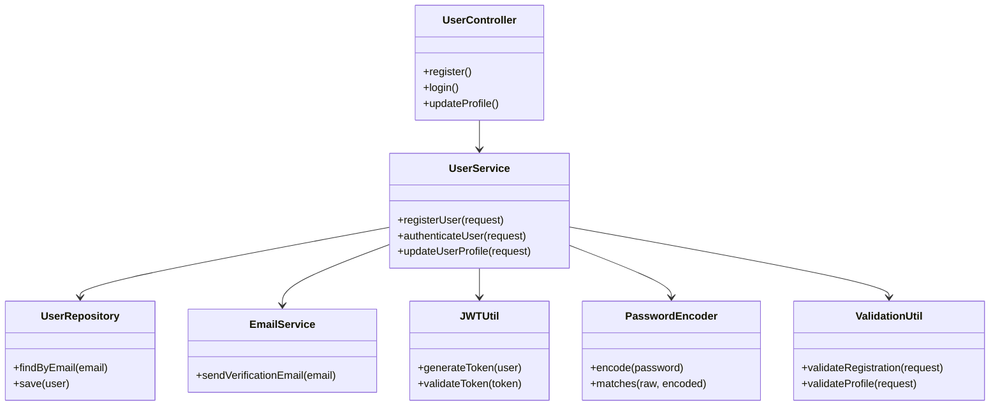
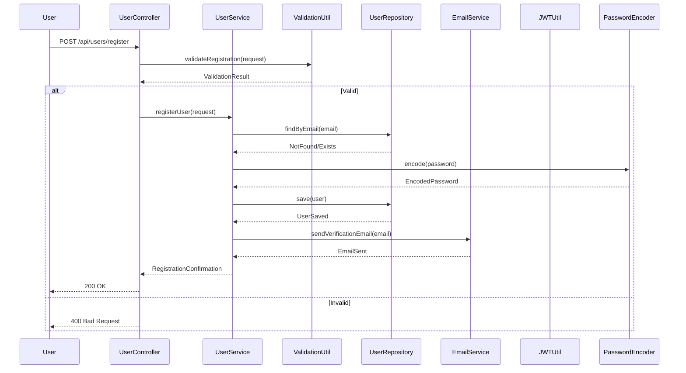

# For User Story Number [4]
1. Objective
This requirement enables travelers to register, log in, and manage their accounts securely. Users can update their profile, change their password, and view their bookings. The objective is to provide secure authentication, authorization, and account management functionality.

2. API Model
	2.1 Common Components/Services
	- UserService (new): Handles registration, login, and profile management logic.
	- EmailService (existing): Sends verification and notification emails.
	- UserRepository (existing): Interface to user database.
	- JWTUtil (new): Handles JWT token creation and validation.
	- PasswordEncoder (existing): Handles password hashing.
	- ValidationUtil (existing): Utility for input validation.

	2.2 API Details
| Operation      | REST Method | Type     | URL                         | Request (JSON)                                                                                   | Response (JSON)                                                                                                  |
|---------------|-------------|----------|-----------------------------|--------------------------------------------------------------------------------------------------|-------------------------------------------------------------------------------------------------------------------|
| Register      | POST        | Success  | /api/users/register         | {"email": "user@email.com", "password": "StrongPass!1"}                                         | {"status": "VERIFICATION_SENT"}                                                                                |
| Register      | POST        | Failure  | /api/users/register         | {"email": "user@email.com", "password": "weak"}                                               | {"error": "Password does not meet requirements."}                                                              |
| Login         | POST        | Success  | /api/users/login            | {"email": "user@email.com", "password": "StrongPass!1"}                                       | {"token": "jwt-token", "user": {"email": "user@email.com"}}                                               |
| Login         | POST        | Failure  | /api/users/login            | {"email": "user@email.com", "password": "wrongpass"}                                         | {"error": "Invalid credentials."}                                                                              |
| Profile Update| PUT         | Success  | /api/users/profile          | {"email": "user@email.com", "contact": "1234567890"}                                         | {"status": "UPDATED", "user": {"email": "user@email.com", "contact": "1234567890"}}                   |
| Profile Update| PUT         | Failure  | /api/users/profile          | {"email": "user@email.com", "contact": ""}                                                  | {"error": "Contact cannot be empty."}                                                                          |

	2.3 Exceptions
| Exception Type              | When Triggered                                               | Response Code | Response Message                                   |
|----------------------------|-------------------------------------------------------------|---------------|----------------------------------------------------|
| DuplicateEmailException    | Email already exists                                        | 409           | Email already registered.                          |
| InvalidPasswordException   | Password does not meet complexity                           | 400           | Password does not meet requirements.               |
| AuthenticationException    | Invalid credentials                                         | 401           | Invalid credentials.                               |
| InvalidProfileException    | Profile update validation fails                             | 400           | Invalid profile data.                              |
| InternalServerError        | Database/API failure                                        | 500           | Internal server error.                             |

3 Functional Design
	3.1 Class Diagram


	3.2 UML Sequence Diagram


	3.3 Components
| Component Name         | Description                                             | Existing/New |
|-----------------------|---------------------------------------------------------|--------------|
| UserController        | REST controller for user registration/login/profile      | New          |
| UserService           | Service for user management logic                       | New          |
| UserRepository        | Data access for user records                            | Existing     |
| EmailService          | Service for sending verification emails                 | Existing     |
| JWTUtil               | Utility for JWT token handling                          | New          |
| PasswordEncoder       | Utility for password hashing                            | Existing     |
| ValidationUtil        | Utility for validating registration/profile requests    | Existing     |

	3.4 Service Layer Logic and Validations
| FieldName           | Validation                                   | Error Message                                | ClassUsed         |
|---------------------|----------------------------------------------|----------------------------------------------|-------------------|
| email               | Must be unique and valid                     | Email already registered                     | ValidationUtil    |
| password            | Must meet complexity requirements            | Password does not meet requirements          | ValidationUtil    |
| profile fields      | Must be valid before saving                  | Invalid profile data                         | ValidationUtil    |

4 Integrations
| SystemToBeIntegrated | IntegratedFor           | IntegrationType |
|----------------------|------------------------|-----------------|
| Email Service        | Verification emails    | API             |
| User DB              | User records           | DB              |

5 DB Details
	5.1 ER Model
```mermaid
erDiagram
    USER {
        int id PK
        string email
        string password_hash
        string contact
        string preferences
        string status
        datetime created_at
        datetime updated_at
    }
    BOOKING {
        int id PK
        int user_id FK
        string booking_reference
        ...
    }
    USER ||--o{ BOOKING : has
```
	5.2 DB Validations
- Unique constraint on email
- Password hash must not be empty
- Foreign key constraint for user_id in BOOKING

6 Non-Functional Requirements
	6.1 Performance
	- Registration and login complete within 3 seconds.
	- Indexes on email.
	6.2 Security
		6.2.1 Authentication
		- JWT-based authentication for all endpoints.
		- Passwords stored as hashes only.
		6.2.2 Authorization
		- Only logged-in users can access/update their profile.
	6.3 Logging
		6.3.1 Application Logging
		- Log all authentication events at INFO level.
		- Log failed login attempts at WARN level.
		6.3.2 Audit Log
		- Log registration, login, and profile changes.

7 Dependencies
- Email service must be operational.
- User database must be up.

8 Assumptions
- Email delivery is reliable and fast.
- JWT tokens are securely signed and validated.
- Password complexity policy is enforced.
