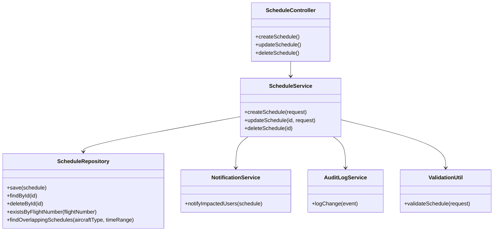
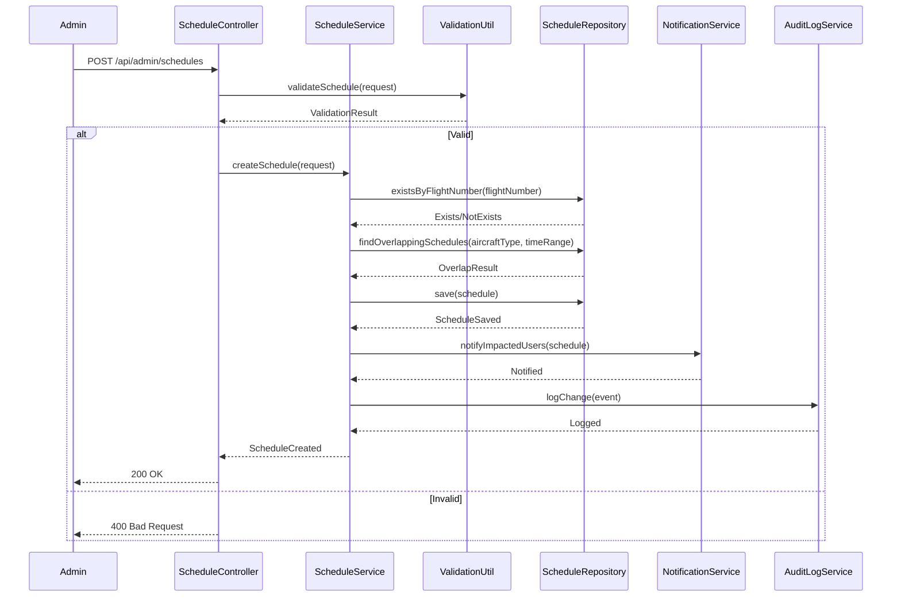
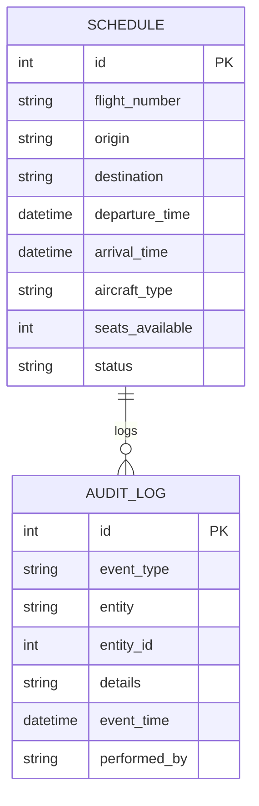

# For User Story Number [5]
1. Objective
This requirement enables airline administrators to create, update, and delete flight schedules, ensuring accurate and up-to-date flight information for travelers. All changes must be reflected in real-time and logged for audit purposes. The objective is to maintain data integrity, prevent scheduling conflicts, and support compliance.

2. API Model
	2.1 Common Components/Services
	- ScheduleService (new): Handles schedule creation, update, and deletion logic.
	- ScheduleRepository (new): Interface to schedule/flight database.
	- NotificationService (existing): Notifies users of impacted bookings.
	- AuditLogService (new): Logs all schedule changes.
	- ValidationUtil (existing): Utility for input validation.

	2.2 API Details
| Operation   | REST Method | Type     | URL                                | Request (JSON)                                                                                   | Response (JSON)                                                                                                  |
|-------------|-------------|----------|------------------------------------|--------------------------------------------------------------------------------------------------|-------------------------------------------------------------------------------------------------------------------|
| Create      | POST        | Success  | /api/admin/schedules               | {"flightNumber": "DL123", "origin": "JFK", "destination": "LAX", "departureTime": "2025-12-01T09:00:00", "arrivalTime": "2025-12-01T12:00:00", "aircraftType": "B737", "seatsAvailable": 180} | {"status": "CREATED", "scheduleId": 1}                                                                         |
| Update      | PUT         | Success  | /api/admin/schedules/{id}          | {"departureTime": "2025-12-01T10:00:00", "arrivalTime": "2025-12-01T13:00:00"}             | {"status": "UPDATED", "scheduleId": 1}                                                                         |
| Delete      | DELETE      | Success  | /api/admin/schedules/{id}          |                                                                                                  | {"status": "DELETED", "scheduleId": 1}                                                                         |
| Create/Update| POST/PUT   | Failure  | /api/admin/schedules               | {"flightNumber": "DL123", "departureTime": "2025-12-01T09:00:00", "arrivalTime": "2025-12-01T08:00:00"} | {"error": "Arrival time must be after departure time."}                                                          |

	2.3 Exceptions
| Exception Type              | When Triggered                                               | Response Code | Response Message                                   |
|----------------------------|-------------------------------------------------------------|---------------|----------------------------------------------------|
| DuplicateFlightNumberException | Flight number already exists                            | 409           | Flight number must be unique.                      |
| ScheduleConflictException  | Overlapping schedule for same aircraft                      | 409           | Schedule times overlap for this aircraft.          |
| InvalidScheduleException   | Missing or invalid fields                                   | 400           | Invalid schedule data.                             |
| NotFoundException          | Schedule not found for update/delete                        | 404           | Schedule not found.                                |
| InternalServerError        | Database/API failure                                        | 500           | Internal server error.                             |

3 Functional Design
	3.1 Class Diagram

	3.2 UML Sequence Diagram

	3.3 Components
| Component Name         | Description                                             | Existing/New |
|-----------------------|---------------------------------------------------------|--------------|
| ScheduleController    | REST controller for schedule management                 | New          |
| ScheduleService       | Service for schedule CRUD logic                         | New          |
| ScheduleRepository    | Data access for schedule/flight records                 | New          |
| NotificationService   | Service for notifying impacted users                    | Existing     |
| AuditLogService       | Service for logging schedule changes                    | New          |
| ValidationUtil        | Utility for validating schedule requests                | Existing     |

	3.4 Service Layer Logic and Validations
| FieldName           | Validation                                   | Error Message                                | ClassUsed         |
|---------------------|----------------------------------------------|----------------------------------------------|-------------------|
| flightNumber        | Must be unique                               | Flight number must be unique                 | ScheduleRepository|
| schedule times      | No overlap for same aircraft                 | Schedule times overlap for this aircraft      | ScheduleRepository|
| all fields          | Required fields must be present              | Invalid schedule data                        | ValidationUtil    |
| departure/arrival   | Arrival after departure                      | Arrival time must be after departure time     | ValidationUtil    |

4 Integrations
| SystemToBeIntegrated | IntegratedFor           | IntegrationType |
|----------------------|------------------------|-----------------|
| Notification Service | Notify impacted users  | API             |
| Audit Log DB         | Compliance logging     | DB              |
| Flight Inventory DB  | Schedule records       | DB              |

5 DB Details
	5.1 ER Model

	5.2 DB Validations
- Unique constraint on flight_number
- No overlapping schedules for same aircraft
- Non-negative seats_available
- Foreign key constraints for audit logs

6 Non-Functional Requirements
	6.1 Performance
	- Schedule updates propagate to search within 1 minute.
	- Indexes on flight_number, aircraft_type, departure_time.
	6.2 Security
		6.2.1 Authentication
		- Admin authentication required for all endpoints.
		6.2.2 Authorization
		- Role-based access control for schedule management.
	6.3 Logging
		6.3.1 Application Logging
		- Log all schedule changes at INFO level.
		- Log errors at ERROR level.
		6.3.2 Audit Log
		- Log all schedule CRUD operations for compliance.

7 Dependencies
- Notification service must be operational.
- Audit log and flight inventory databases must be up.

8 Assumptions
- All schedule changes are reflected in real-time for search.
- Only authorized admins can manage schedules.
- Notification to users is reliable and timely.
