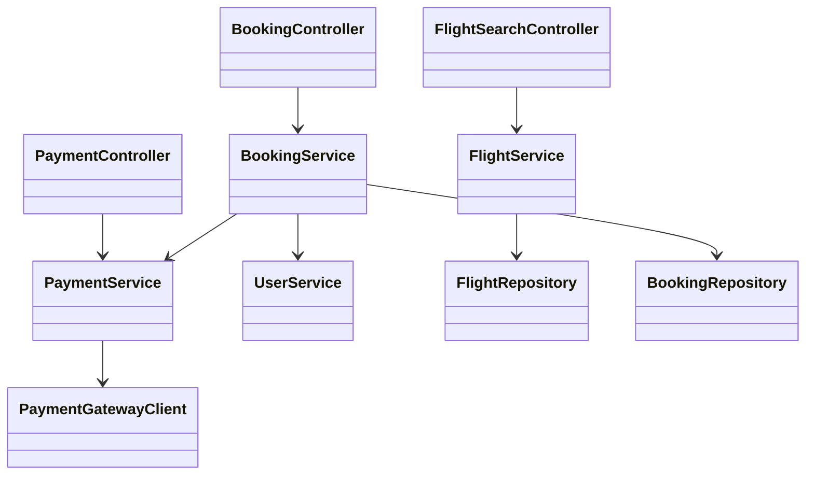
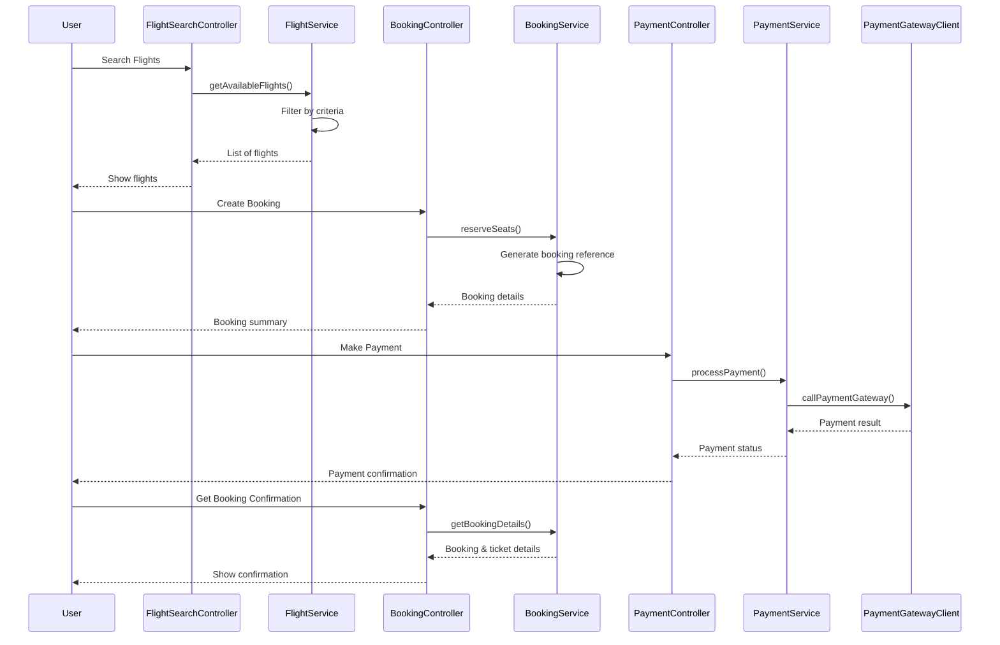
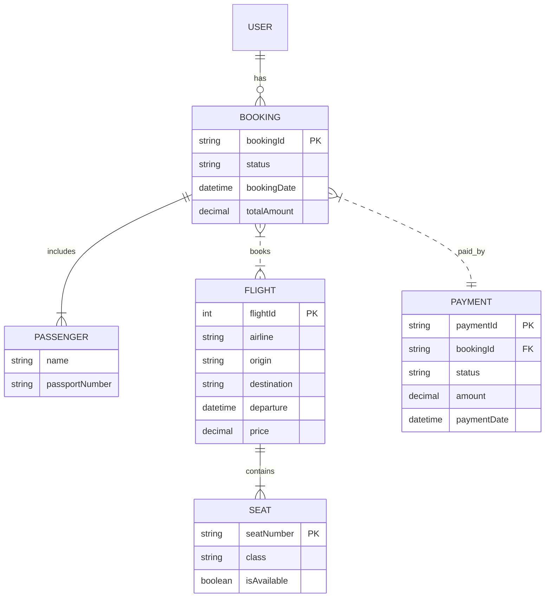

# For User Story Number [1]
1. Objective
This requirement enables travelers to search, compare, and book air transport tickets online. The process must be seamless, supporting multiple payment methods and providing booking confirmation. The goal is to enhance user convenience and streamline the booking experience.

2. API Model
	2.1 Common Components/Services
	- User Authentication Service
	- Payment Gateway Integration Service
	- Flight Search Service
	- Booking Management Service

	2.2 API Details
| Operation | REST Method | Type | URL | Request | Response |
|-----------|-------------|------|-----|---------|----------|
| Search Flights | GET | Success/Failure | /api/flights/search | {"date":"2025-11-01","destination":"LAX","passengers":2} | {"flights":[{"id":1,"airline":"AirX","price":350}] } |
| Create Booking | POST | Success/Failure | /api/bookings | {"flightId":1,"passengerDetails":[{"name":"John Doe"}],"seats":["A1"],"paymentMethod":"CARD"} | {"bookingId":"BK123","status":"CONFIRMED","ticketDetails":{...}} |
| Process Payment | POST | Success/Failure | /api/payments | {"bookingId":"BK123","paymentDetails":{"cardNumber":"****","expiry":"12/26"}} | {"paymentStatus":"SUCCESS","transactionId":"TXN789"} |
| Booking Confirmation | GET | Success/Failure | /api/bookings/{bookingId}/confirmation | - | {"bookingId":"BK123","status":"CONFIRMED","ticketDetails":{...}} |

	2.3 Exceptions
| API | Exception | Description |
|-----|-----------|-------------|
| Search Flights | InvalidInputException | Destination or date missing |
| Create Booking | SeatUnavailableException | Selected seat already booked |
| Process Payment | PaymentFailedException | Invalid card/payment details |
| Booking Confirmation | BookingNotFoundException | Invalid booking reference |

3 Functional Design
	3.1 Class Diagram

	3.2 UML Sequence Diagram

	3.3 Components
| Component Name | Description | Existing/New |
|----------------|-------------|--------------|
| FlightSearchController | Handles flight search requests | New |
| BookingController | Handles booking creation and confirmation | New |
| PaymentController | Handles payment processing | New |
| FlightService | Business logic for flight search | New |
| BookingService | Business logic for booking management | New |
| PaymentService | Business logic for payment processing | New |
| UserService | Manages user authentication and profile | Existing |
| FlightRepository | Data access for flights | New |
| BookingRepository | Data access for bookings | New |
| PaymentGatewayClient | Integrates with external payment gateway | New |

	3.4 Service Layer Logic and Validations
| FieldName | Validation | Error Message | ClassUsed |
|-----------|-----------|--------------|-----------|
| destination | NotEmpty | Destination is required | FlightService |
| date | NotEmpty | Date is required | FlightService |
| cardDetails | ValidCard | Invalid card details | PaymentService |
| paymentCredentials | ValidCredentials | Invalid payment credentials | PaymentService |
| bookingStatus | PaymentSuccessBeforeConfirmation | Booking cannot be confirmed before payment | BookingService |

4 Integrations
| SystemToBeIntegrated | IntegratedFor | IntegrationType |
|----------------------|--------------|-----------------|
| Payment Gateway API | Payment processing | API |
| External Airline API | Flight data | API |
| Azure Application Insights | Monitoring | API |

5 DB Details
	5.1 ER Model

	5.2 DB Validations
- BookingId must be unique.
- Payment must reference a valid booking.
- Seat must be available before booking.

6 Non-Functional Requirements
	6.1 Performance
	- API response time for search and booking < 2 seconds.
	- Use caching for frequently searched routes.
	6.2 Security
		6.2.1 Authentication
		- OAuth2/JWT for user authentication.
		6.2.2 Authorization
		- Role-based access for booking and payment APIs.
	- PCI DSS compliance for payment data.
	6.3 Logging
		6.3.1 Application Logging
		- DEBUG: API requests/responses (masked sensitive data)
		- INFO: Successful bookings, payments
		- ERROR: Failed payments, booking errors
		- WARN: Suspicious activity
		6.3.2 Audit Log
		- Log booking creation, payment, and confirmation events with user and timestamp.

7 Dependencies
- External payment gateway availability
- Airline API data reliability
- Azure Application Insights for monitoring

8 Assumptions
- All users are registered and authenticated.
- Payment gateway supports all major cards and wallets.
- Airline APIs provide real-time flight and seat availability.
