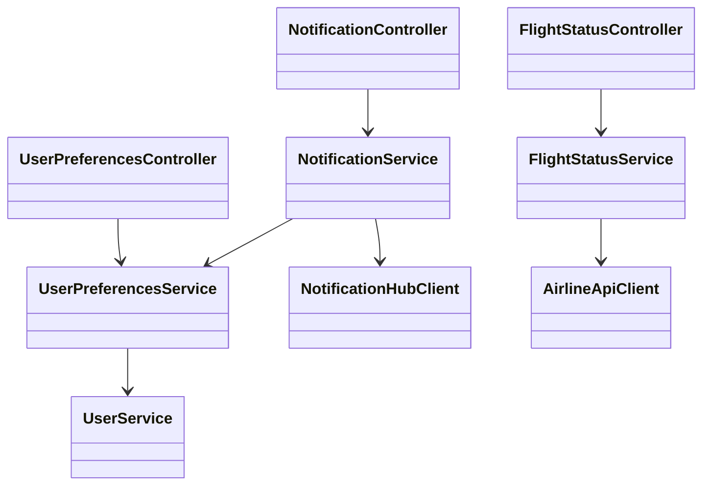
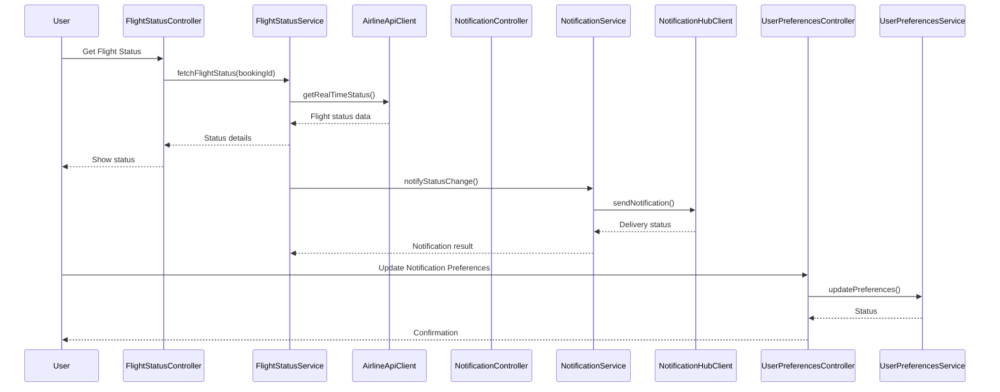
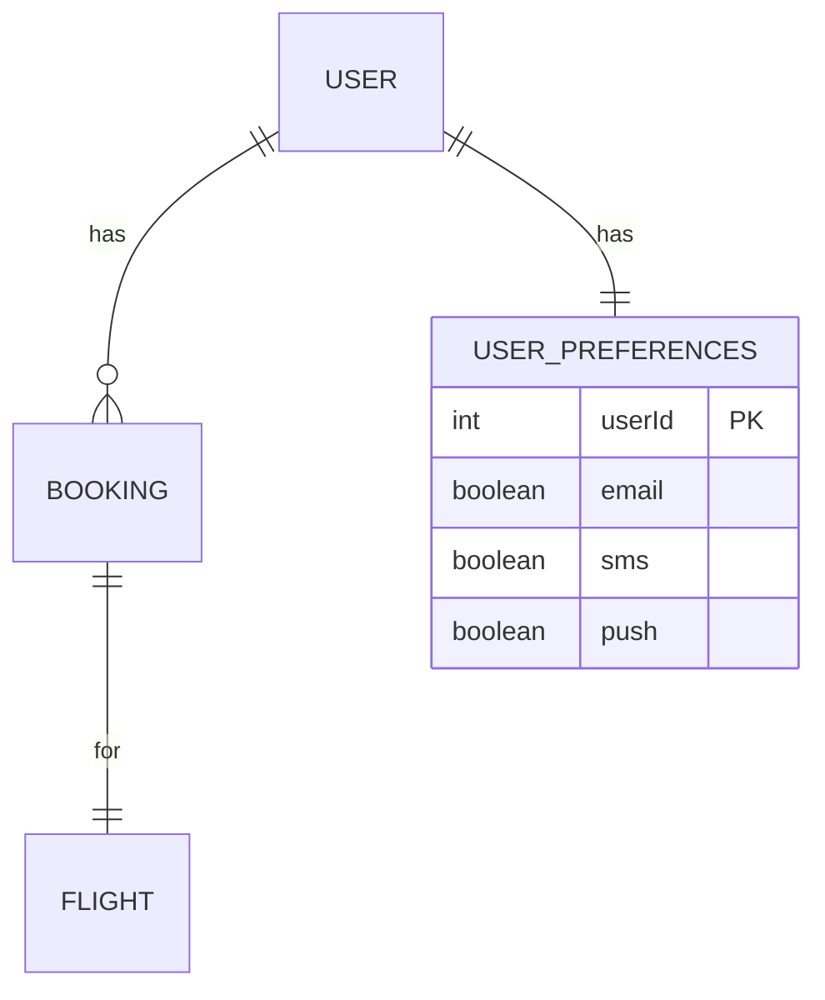

# For User Story Number [2]
1. Objective
This requirement enables travelers to track their flight status in real-time, including delays, gate changes, and cancellations. The system must provide up-to-date information and notify users through their preferred channels. The goal is to keep travelers informed and reduce uncertainty during their journey.

2. API Model
	2.1 Common Components/Services
	- User Authentication Service
	- Flight Status Integration Service
	- Notification Service
	- User Preferences Service

	2.2 API Details
| Operation | REST Method | Type | URL | Request | Response |
|-----------|-------------|------|-----|---------|----------|
| Get Flight Status | GET | Success/Failure | /api/flights/{bookingId}/status | - | {"flightId":1,"status":"DELAYED","gate":"A12","departureTime":"2025-11-01T10:30:00Z"} |
| Update Notification Preferences | PUT | Success/Failure | /api/users/{userId}/notification-preferences | {"email":true,"sms":false,"push":true} | {"status":"UPDATED"} |
| Receive Notification | POST | Success/Failure | /api/notifications | {"userId":123,"message":"Flight delayed by 30 mins","channel":"push"} | {"deliveryStatus":"SENT"} |

	2.3 Exceptions
| API | Exception | Description |
|-----|-----------|-------------|
| Get Flight Status | UnauthorizedAccessException | User does not have a valid booking |
| Get Flight Status | FlightDataUnavailableException | Unable to fetch real-time data |
| Update Notification Preferences | InvalidInputException | Invalid notification channel |
| Receive Notification | NotificationDeliveryException | Failed to deliver notification |

3 Functional Design
	3.1 Class Diagram

	3.2 UML Sequence Diagram

	3.3 Components
| Component Name | Description | Existing/New |
|----------------|-------------|--------------|
| FlightStatusController | Handles flight status requests | New |
| NotificationController | Handles notification delivery | New |
| UserPreferencesController | Manages user notification preferences | New |
| FlightStatusService | Business logic for flight status retrieval | New |
| NotificationService | Business logic for notifications | New |
| UserPreferencesService | Manages user preferences | New |
| AirlineApiClient | Integrates with airline/airport APIs | New |
| NotificationHubClient | Integrates with Azure Notification Hubs | New |
| UserService | Manages user authentication | Existing |

	3.4 Service Layer Logic and Validations
| FieldName | Validation | Error Message | ClassUsed |
|-----------|-----------|--------------|-----------|
| bookingId | ValidBooking | Invalid or expired booking | FlightStatusService |
| userId | Authenticated | User not authenticated | UserService |
| notificationChannel | ValidChannel | Invalid notification channel | NotificationService |
| flightData | ReliableSource | Flight data unavailable | AirlineApiClient |

4 Integrations
| SystemToBeIntegrated | IntegratedFor | IntegrationType |
|----------------------|--------------|-----------------|
| Airline/Airport API | Real-time flight status | API |
| Azure Notification Hubs | Push/email/SMS notifications | API |

5 DB Details
	5.1 ER Model

	5.2 DB Validations
- Only users with valid bookings can access flight status.
- Notification preferences must be valid and linked to user.

6 Non-Functional Requirements
	6.1 Performance
	- Real-time updates with latency < 30 seconds.
	- Scalable notification delivery.
	6.2 Security
		6.2.1 Authentication
		- OAuth2 for user authentication.
		6.2.2 Authorization
		- Only users with valid bookings can access status.
	- Secure storage of user contact information.
	6.3 Logging
		6.3.1 Application Logging
		- DEBUG: API requests/responses (masked sensitive data)
		- INFO: Notification sent, status updates
		- ERROR: Notification delivery failures
		- WARN: API latency or failures
		6.3.2 Audit Log
		- Log notification events, status changes, and user preference updates.

7 Dependencies
- Airline/airport API reliability
- Azure Notification Hubs availability

8 Assumptions
- All users are registered and authenticated.
- Airline APIs provide real-time and accurate status data.
- Notification channels (email, SMS, push) are available and configured.
