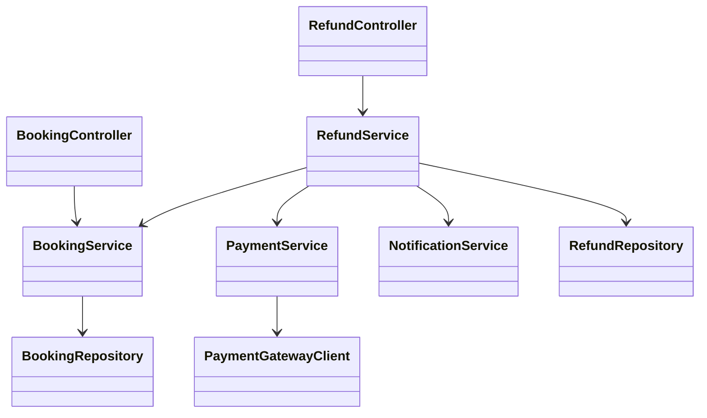
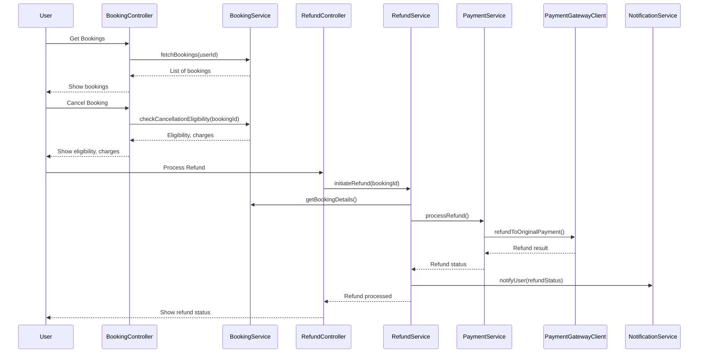
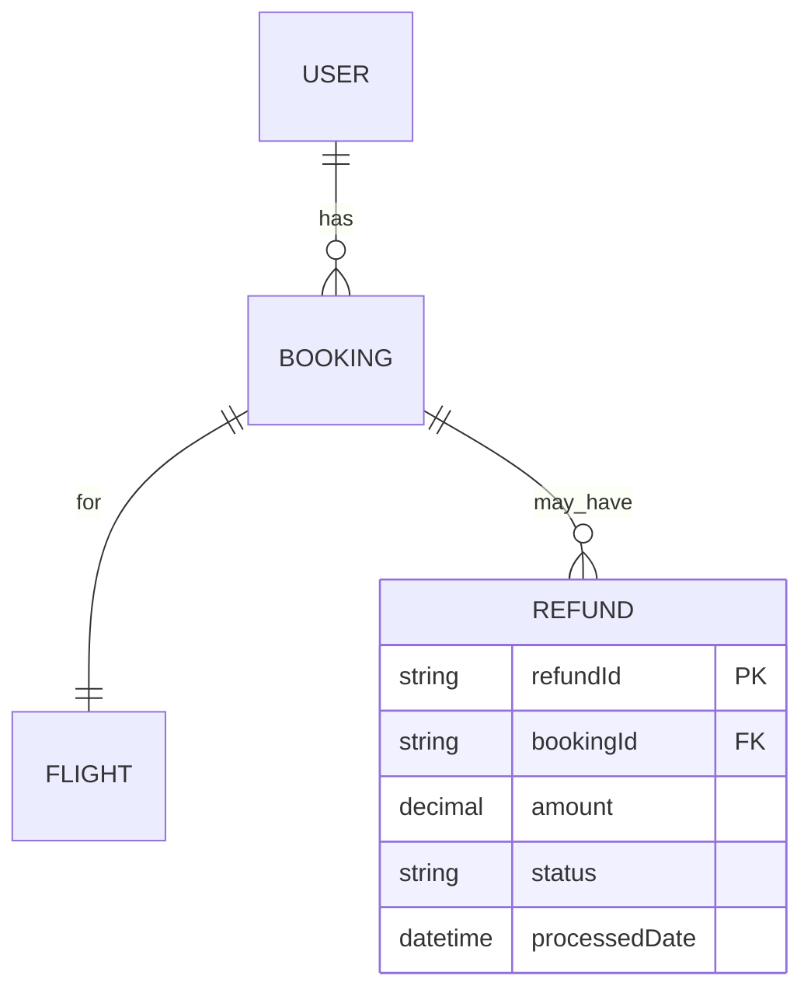

# For User Story Number [3]
1. Objective
This requirement enables travelers to cancel their air transport tickets and request refunds according to airline policies. The system must display refund eligibility, calculate applicable charges, and process refunds automatically. The goal is to provide flexibility and transparency to users when their plans change.

2. API Model
	2.1 Common Components/Services
	- User Authentication Service
	- Booking Management Service
	- Refund Calculation Service
	- Payment Gateway Integration Service
	- Notification Service

	2.2 API Details
| Operation | REST Method | Type | URL | Request | Response |
|-----------|-------------|------|-----|---------|----------|
| Get Bookings | GET | Success/Failure | /api/bookings | - | {"bookings":[{"bookingId":"BK123","status":"CONFIRMED"}]} |
| Cancel Booking | POST | Success/Failure | /api/bookings/{bookingId}/cancel | {"reason":"Personal"} | {"bookingId":"BK123","refundEligible":true,"refundAmount":100.0,"cancellationCharges":50.0} |
| Process Refund | POST | Success/Failure | /api/refunds | {"bookingId":"BK123"} | {"refundStatus":"PROCESSED","transactionId":"TXN456"} |
| Get Refund Status | GET | Success/Failure | /api/refunds/{bookingId}/status | - | {"refundStatus":"PROCESSED","amount":100.0} |

	2.3 Exceptions
| API | Exception | Description |
|-----|-----------|-------------|
| Cancel Booking | IneligibleCancellationException | Booking not eligible for cancellation |
| Cancel Booking | BookingNotFoundException | Invalid booking reference |
| Process Refund | RefundCalculationException | Error in refund calculation |
| Process Refund | PaymentGatewayException | Refund transaction failed |

3 Functional Design
	3.1 Class Diagram

	3.2 UML Sequence Diagram

	3.3 Components
| Component Name | Description | Existing/New |
|----------------|-------------|--------------|
| BookingController | Handles booking retrieval and cancellation | New |
| RefundController | Handles refund processing and status | New |
| BookingService | Business logic for bookings | New |
| RefundService | Business logic for refunds | New |
| PaymentService | Integrates with payment gateway | Existing |
| NotificationService | Sends notifications to users | Existing |
| BookingRepository | Data access for bookings | New |
| RefundRepository | Data access for refunds | New |
| PaymentGatewayClient | Integrates with payment gateway | Existing |

	3.4 Service Layer Logic and Validations
| FieldName | Validation | Error Message | ClassUsed |
|-----------|-----------|--------------|-----------|
| bookingId | EligibleForCancellation | Booking not eligible for cancellation | BookingService |
| refundAmount | AirlinePolicyCompliant | Refund calculation error | RefundService |
| paymentMethod | ValidOriginalMethod | Refund must be processed to original payment method | PaymentService |

4 Integrations
| SystemToBeIntegrated | IntegratedFor | IntegrationType |
|----------------------|--------------|-----------------|
| Payment Gateway API | Refund processing | API |
| Notification Service | User notifications | API |

5 DB Details
	5.1 ER Model

	5.2 DB Validations
- Refund must reference a valid and eligible booking.
- Refund amount must comply with airline policy.

6 Non-Functional Requirements
	6.1 Performance
	- Refund processing time < 48 hours.
	- Scalable to handle bulk cancellations.
	6.2 Security
		6.2.1 Authentication
		- User authentication required for all operations.
		6.2.2 Authorization
		- Only booking owner can request cancellation/refund.
	- Secure handling of financial data.
	6.3 Logging
		6.3.1 Application Logging
		- DEBUG: API requests/responses (masked sensitive data)
		- INFO: Cancellation and refund events
		- ERROR: Refund failures
		- WARN: Policy violations
		6.3.2 Audit Log
		- Log cancellation, refund initiation, and completion events.

7 Dependencies
- Payment gateway reliability
- Airline policy data accuracy

8 Assumptions
- All users are registered and authenticated.
- Airline policies are up-to-date and accessible.
- Refunds can be processed automatically via payment gateway.
