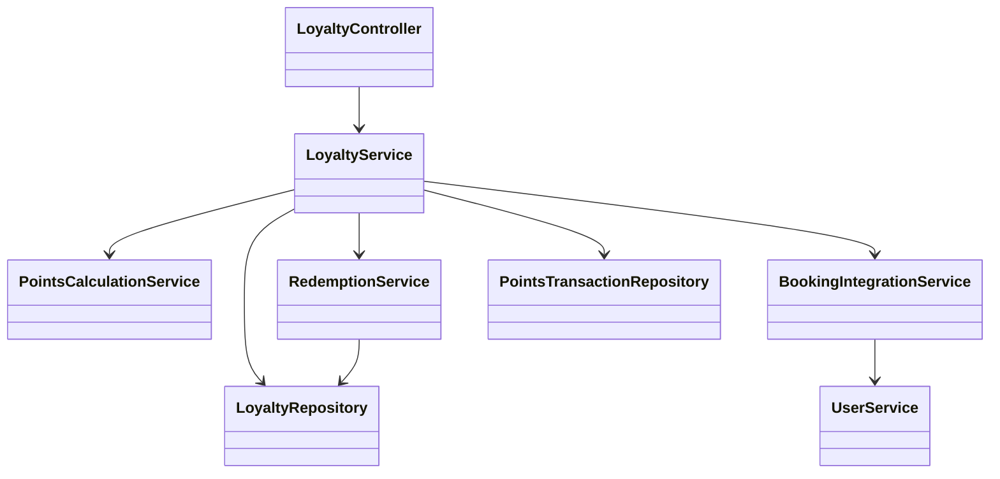
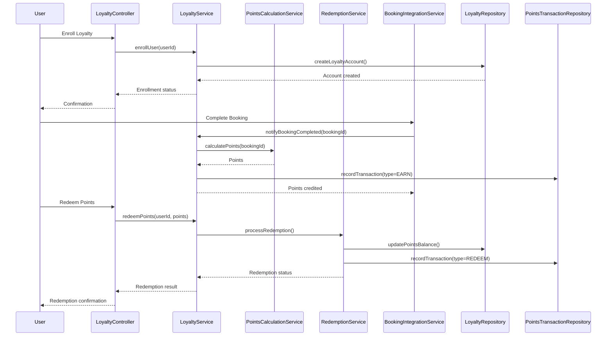
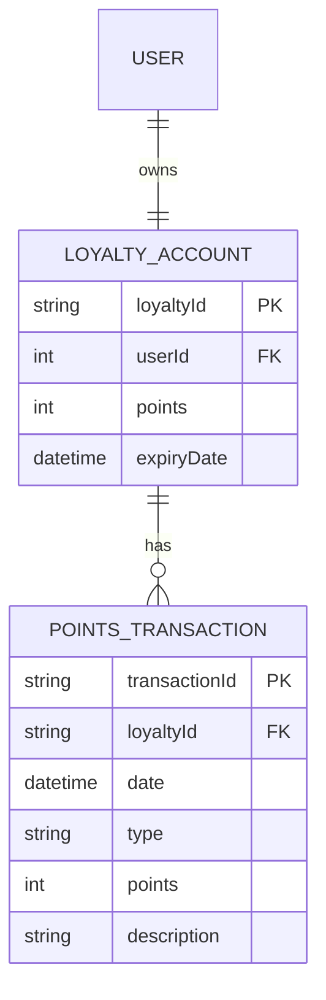

# For User Story Number [4]
1. Objective
This requirement enables frequent flyers to enroll in a loyalty program, earn points with each completed booking, and redeem those points for rewards. The system must manage points accrual, redemption, expiry, and display transaction history. The goal is to incentivize repeat bookings and reward loyal customers.

2. API Model
	2.1 Common Components/Services
	- User Authentication Service
	- Loyalty Management Service
	- Booking Integration Service
	- Points Calculation Service
	- Redemption Service

	2.2 API Details
| Operation | REST Method | Type | URL | Request | Response |
|-----------|-------------|------|-----|---------|----------|
| Enroll Loyalty | POST | Success/Failure | /api/loyalty/enroll | {"userId":123} | {"loyaltyId":"LOY123","status":"ENROLLED"} |
| Get Points Balance | GET | Success/Failure | /api/loyalty/{userId}/balance | - | {"points":2500,"expiryDate":"2026-01-01"} |
| Get Points History | GET | Success/Failure | /api/loyalty/{userId}/history | - | {"transactions":[{"date":"2025-10-01","type":"EARN","points":500}]} |
| Redeem Points | POST | Success/Failure | /api/loyalty/redeem | {"userId":123,"points":1000,"rewardType":"DISCOUNT"} | {"redemptionStatus":"SUCCESS","discountValue":100} |

	2.3 Exceptions
| API | Exception | Description |
|-----|-----------|-------------|
| Enroll Loyalty | AlreadyEnrolledException | User already enrolled |
| Get Points Balance | LoyaltyAccountNotFoundException | No loyalty account for user |
| Redeem Points | InsufficientPointsException | Not enough points to redeem |
| Redeem Points | RedemptionRuleViolationException | Redemption not allowed by rules |

3 Functional Design
	3.1 Class Diagram

	3.2 UML Sequence Diagram

	3.3 Components
| Component Name | Description | Existing/New |
|----------------|-------------|--------------|
| LoyaltyController | Handles loyalty operations | New |
| LoyaltyService | Business logic for loyalty management | New |
| PointsCalculationService | Calculates points for bookings | New |
| RedemptionService | Handles redemption logic | New |
| BookingIntegrationService | Integrates with booking system | New |
| LoyaltyRepository | Data access for loyalty accounts | New |
| PointsTransactionRepository | Data access for points transactions | New |
| UserService | Manages user authentication | Existing |

	3.4 Service Layer Logic and Validations
| FieldName | Validation | Error Message | ClassUsed |
|-----------|-----------|--------------|-----------|
| bookingStatus | CompletedAndNotCancelled | Points only for completed bookings | PointsCalculationService |
| points | SufficientForRedemption | Insufficient points for redemption | RedemptionService |
| points | ExpiryRuleEnforced | Points expired | LoyaltyService |

4 Integrations
| SystemToBeIntegrated | IntegratedFor | IntegrationType |
|----------------------|--------------|-----------------|
| Booking System | Points accrual | API |
| Booking System | Redemption during booking | API |

5 DB Details
	5.1 ER Model

	5.2 DB Validations
- Points cannot be negative.
- Points must expire as per business rules.
- Only one loyalty account per user.

6 Non-Functional Requirements
	6.1 Performance
	- Points update reflected within 1 minute of booking.
	- Scalable to millions of users.
	6.2 Security
		6.2.1 Authentication
		- User authentication required for all loyalty operations.
		6.2.2 Authorization
		- Only account owner can redeem points.
	- Secure handling of loyalty data.
	6.3 Logging
		6.3.1 Application Logging
		- DEBUG: API requests/responses (masked sensitive data)
		- INFO: Points accrual/redemption
		- ERROR: Points calculation/redemption errors
		- WARN: Suspicious redemption activity
		6.3.2 Audit Log
		- Log all points accrual, redemption, and expiry events.

7 Dependencies
- Booking system reliability
- Accurate points calculation logic

8 Assumptions
- All users are registered and authenticated.
- Points rules and expiry policies are up-to-date.
- Redemption options are managed as per business rules.
