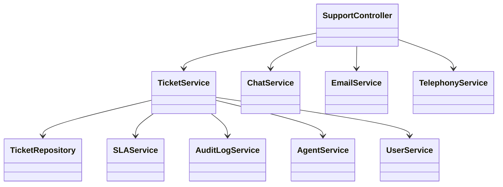
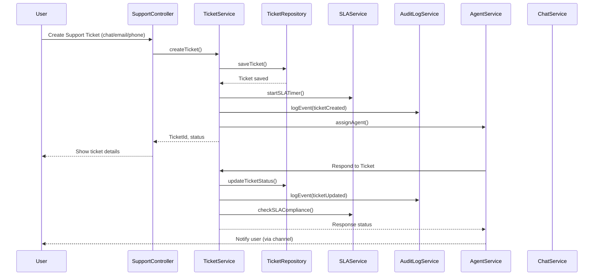
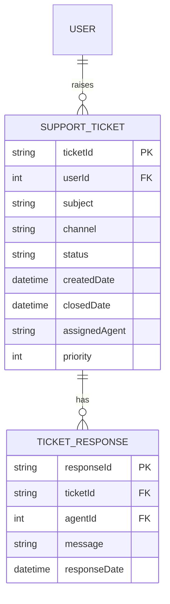

# For User Story Number [5]
1. Objective
This requirement enables travelers to contact customer support via chat, email, or phone through the application. Users can raise support tickets, track their status, and receive timely assistance for booking, payment, cancellation, or flight status issues. The goal is to ensure prompt and auditable resolution of user queries and problems.

2. API Model
	2.1 Common Components/Services
	- User Authentication Service
	- Ticketing Service
	- Chat Integration Service
	- Email Integration Service
	- Telephony Integration Service
	- SLA Tracking Service
	- Audit Logging Service

	2.2 API Details
| Operation | REST Method | Type | URL | Request | Response |
|-----------|-------------|------|-----|---------|----------|
| Create Support Ticket | POST | Success/Failure | /api/support/tickets | {"userId":123,"subject":"Payment issue","channel":"chat","details":"Payment failed"} | {"ticketId":"TCK123","status":"OPEN"} |
| Get Ticket Status | GET | Success/Failure | /api/support/tickets/{ticketId}/status | - | {"ticketId":"TCK123","status":"IN_PROGRESS","assignedAgent":"AGT001"} |
| List User Tickets | GET | Success/Failure | /api/support/tickets?userId=123 | - | {"tickets":[{"ticketId":"TCK123","status":"OPEN"}]} |
| Agent Respond to Ticket | POST | Success/Failure | /api/support/tickets/{ticketId}/response | {"agentId":"AGT001","message":"Issue resolved"} | {"status":"RESOLVED"} |

	2.3 Exceptions
| API | Exception | Description |
|-----|-----------|-------------|
| Create Support Ticket | UnauthorizedAccessException | User not authenticated |
| Create Support Ticket | InvalidInputException | Missing required fields |
| Agent Respond to Ticket | TicketNotFoundException | Invalid ticket reference |
| Agent Respond to Ticket | SLAExceededException | Response outside SLA window |

3 Functional Design
	3.1 Class Diagram

	3.2 UML Sequence Diagram

	3.3 Components
| Component Name | Description | Existing/New |
|----------------|-------------|--------------|
| SupportController | Handles support requests and routing | New |
| TicketService | Business logic for ticket management | New |
| ChatService | Integrates with Azure Bot Service | New |
| EmailService | Integrates with email provider | New |
| TelephonyService | Integrates with telephony system | New |
| SLAService | Tracks and enforces SLA compliance | New |
| AuditLogService | Logs all support interactions | New |
| TicketRepository | Data access for support tickets | New |
| UserService | Manages user authentication | Existing |
| AgentService | Manages support agents | New |

	3.4 Service Layer Logic and Validations
| FieldName | Validation | Error Message | ClassUsed |
|-----------|-----------|--------------|-----------|
| userId | Authenticated | User not authenticated | UserService |
| ticketId | Exists | Ticket not found | TicketService |
| channel | ValidChannel | Invalid support channel | SupportController |
| sla | WithinSLA | SLA breached | SLAService |

4 Integrations
| SystemToBeIntegrated | IntegratedFor | IntegrationType |
|----------------------|--------------|-----------------|
| Azure Bot Service | Chat support | API |
| Email Provider | Email support | API |
| Telephony System | Phone support | API |

5 DB Details
	5.1 ER Model

	5.2 DB Validations
- Only authenticated users can create tickets.
- All ticket interactions are logged and auditable.
- SLA compliance tracked for each ticket.

6 Non-Functional Requirements
	6.1 Performance
	- First response time < 5 minutes for chat support.
	- Scalable to high support volumes.
	6.2 Security
		6.2.1 Authentication
		- User authentication required for all support requests.
		6.2.2 Authorization
		- Only ticket owner and assigned agent can interact with ticket.
	- Data privacy for all support interactions.
	6.3 Logging
		6.3.1 Application Logging
		- DEBUG: API requests/responses (masked sensitive data)
		- INFO: Ticket creation, updates, agent responses
		- ERROR: SLA breaches, ticket assignment failures
		- WARN: Suspicious support activity
		6.3.2 Audit Log
		- Log all ticket creation, updates, agent responses, and SLA events.

7 Dependencies
- Azure Bot Service availability
- Email and telephony provider reliability

8 Assumptions
- All users are registered and authenticated.
- Support agents and channels are available and configured.
- SLAs are defined and monitored for all ticket types.
