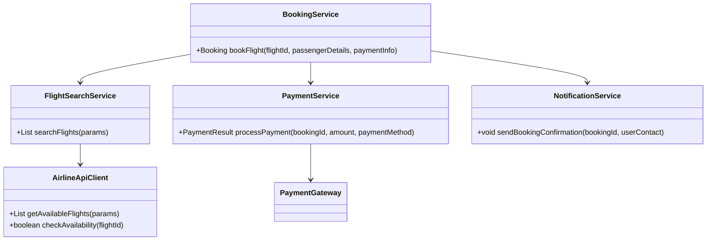
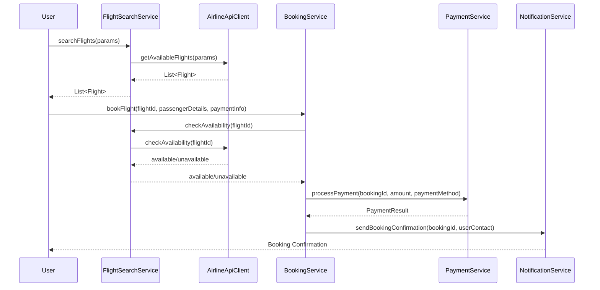
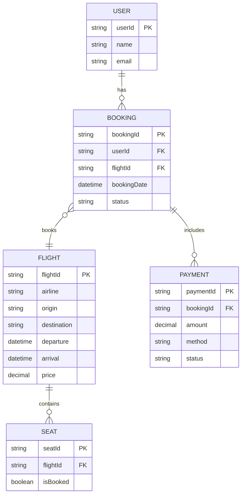

# For User Story Number [1]

1. Objective
This requirement enables travelers to search, compare, and book air transport tickets online. It provides a user-friendly interface for filtering flights by date, destination, price, and airline, and supports secure payment options. The goal is to facilitate convenient trip planning and seamless ticket booking.

2. API Model
  2.1 Common Components/Services
  - FlightSearchService (existing/new)
  - BookingService (new)
  - PaymentService (existing integration)
  - AirlineApiClient (new)
  - NotificationService (existing)

  2.2 API Details
| Operation | REST Method | Type | URL | Request | Response |
|-----------|-------------|------|-----|---------|----------|
| Search Flights | GET | Success/Failure | /api/flights/search | { "date": "2025-10-10", "destination": "LAX", "airline": "Delta" } | { "flights": [{"flightId": "DL123", "price": 350, "departure": "10:00", "arrival": "14:00"}] } |
| Book Flight | POST | Success/Failure | /api/bookings | { "flightId": "DL123", "passengerDetails": {"name": "John Doe", "age": 32}, "paymentInfo": {"method": "stripe", "cardNumber": "****"} } | { "bookingId": "BK123", "status": "CONFIRMED", "ticketDetails": { ... } } |
| Payment | POST | Success/Failure | /api/payments | { "bookingId": "BK123", "amount": 350, "paymentMethod": "stripe" } | { "paymentStatus": "SUCCESS", "transactionId": "TXN456" } |
| Get Booking Confirmation | GET | Success/Failure | /api/bookings/{bookingId}/confirmation | - | { "bookingId": "BK123", "status": "CONFIRMED", "ticketDetails": { ... } } |

  2.3 Exceptions
| API | Exception | Description |
|-----|-----------|-------------|
| Search Flights | FlightNotFoundException | No flights found for criteria |
| Book Flight | FlightUnavailableException | Flight is no longer available |
| Book Flight | InvalidPassengerException | Passenger details invalid |
| Payment | PaymentFailedException | Payment could not be processed |
| Get Booking Confirmation | BookingNotFoundException | Booking does not exist |

3. Functional Design
  3.1 Class Diagram

  3.2 UML Sequence Diagram

  3.3 Components
| Component Name | Description | Existing/New |
|----------------|-------------|--------------|
| FlightSearchService | Handles flight search and availability | New |
| BookingService | Manages booking workflow | New |
| PaymentService | Integrates with payment gateway | Existing |
| AirlineApiClient | Communicates with airline APIs | New |
| NotificationService | Sends booking confirmations | Existing |

  3.4 Service Layer Logic and Validations
| FieldName | Validation | Error Message | ClassUsed |
|-----------|-----------|--------------|-----------|
| date | Must not be null, must be a valid date | "Date is required and must be valid" | FlightSearchService |
| destination | Must not be null | "Destination is required" | FlightSearchService |
| passengerDetails | Must not be null, must include all required fields | "Passenger details incomplete" | BookingService |
| paymentInfo | Must be valid and secure | "Invalid payment details" | PaymentService |
| flightId | Must be available | "Selected flight is no longer available" | BookingService |

4. Integrations
| SystemToBeIntegrated | IntegratedFor | IntegrationType |
|----------------------|---------------|-----------------|
| Airline APIs | Real-time flight data and availability | API |
| Payment Gateway (Stripe, PayPal) | Payment processing | API |
| Notification Service | Booking confirmation | API |

5. DB Details
  5.1 ER Model

  5.2 DB Validations
- Booking must reference existing user and flight.
- Payment must be linked to a valid booking.
- Seat inventory must be updated atomically after booking.

6. Non-Functional Requirements
  6.1 Performance
  - API and DB queries optimized for <2s response.
  - Caching of frequent flight searches at API layer.
  6.2 Security
    6.2.1 Authentication
      - OAuth2/JWT for user authentication.
      - HTTPS enforced for all endpoints.
    6.2.2 Authorization
      - Role-based access for booking endpoints (user/admin).
      - PCI DSS compliance for payment data.
  6.3 Logging
    6.3.1 Application Logging
      - DEBUG: API request/response payloads (masked sensitive data)
      - INFO: Successful bookings, payments
      - ERROR: Failed payments, booking errors
      - WARN: Suspicious activity (e.g., repeated failed payments)
    6.3.2 Audit Log
      - Log all booking and payment events with user, timestamp, and action details

7. Dependencies
- Airline APIs for real-time flight data
- Payment gateway (Stripe, PayPal)
- Notification service for confirmations

8. Assumptions
- All airlines provide real-time APIs for availability
- Payment gateways are PCI DSS compliant
- User authentication is handled via OAuth2/JWT
