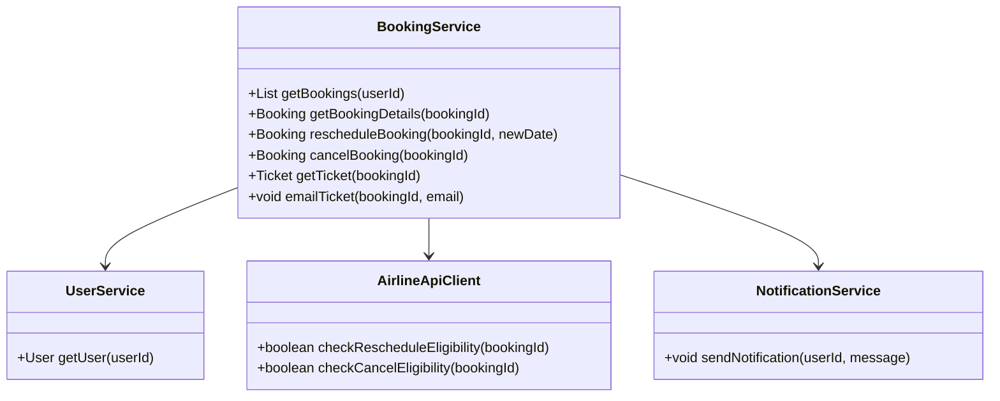
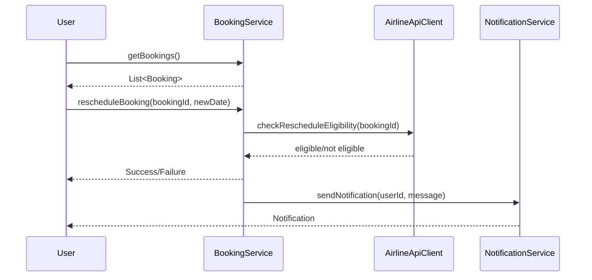
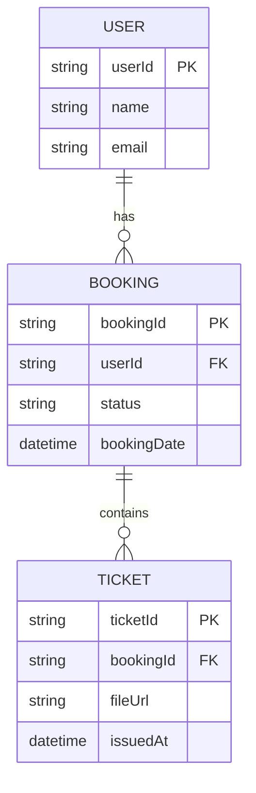

# For User Story Number [2]

1. Objective
This requirement allows travelers to view and manage their air transport bookings, including accessing ticket details and performing actions such as rescheduling, canceling, or downloading tickets. It provides a dashboard for managing all bookings with real-time updates. The goal is to give users control and transparency over their travel plans.

2. API Model
  2.1 Common Components/Services
  - BookingService (existing)
  - UserService (existing)
  - AirlineApiClient (existing)
  - NotificationService (existing)

  2.2 API Details
| Operation | REST Method | Type | URL | Request | Response |
|-----------|-------------|------|-----|---------|----------|
| Get Bookings | GET | Success/Failure | /api/bookings | - | { "bookings": [{"bookingId": "BK123", "status": "UPCOMING", ...}] } |
| Get Booking Details | GET | Success/Failure | /api/bookings/{bookingId} | - | { "bookingId": "BK123", "flightDetails": {...}, "status": "UPCOMING" } |
| Reschedule Booking | PUT | Success/Failure | /api/bookings/{bookingId}/reschedule | { "newDate": "2025-10-15" } | { "bookingId": "BK123", "status": "RESCHEDULED" } |
| Cancel Booking | DELETE | Success/Failure | /api/bookings/{bookingId} | - | { "bookingId": "BK123", "status": "CANCELED" } |
| Download Ticket | GET | Success/Failure | /api/bookings/{bookingId}/ticket | - | [PDF file download] |
| Email Ticket | POST | Success/Failure | /api/bookings/{bookingId}/email | { "email": "user@email.com" } | { "status": "SENT" } |

  2.3 Exceptions
| API | Exception | Description |
|-----|-----------|-------------|
| Get Bookings | AuthenticationException | User not authenticated |
| Get Booking Details | BookingNotFoundException | Booking does not exist |
| Reschedule Booking | NotAllowedException | Reschedule not permitted by fare rules |
| Cancel Booking | NotAllowedException | Cancellation not permitted |
| Download Ticket | TicketNotAvailableException | Ticket not available |
| Email Ticket | EmailSendFailedException | Email could not be sent |

3. Functional Design
  3.1 Class Diagram

  3.2 UML Sequence Diagram

  3.3 Components
| Component Name | Description | Existing/New |
|----------------|-------------|--------------|
| BookingService | Manages booking retrieval, update, and cancellation | Existing |
| UserService | Manages user authentication and data | Existing |
| AirlineApiClient | Checks airline policy for changes | Existing |
| NotificationService | Sends notifications for booking changes | Existing |

  3.4 Service Layer Logic and Validations
| FieldName | Validation | Error Message | ClassUsed |
|-----------|-----------|--------------|-----------|
| userId | Must be authenticated | "User not authenticated" | UserService |
| bookingId | Must exist and belong to user | "Booking not found or unauthorized" | BookingService |
| newDate | Must be valid and allowed by policy | "Rescheduling not allowed" | AirlineApiClient |
| status | Must update in real-time | "Booking status update failed" | BookingService |

4. Integrations
| SystemToBeIntegrated | IntegratedFor | IntegrationType |
|----------------------|---------------|-----------------|
| Airline APIs | Real-time status and policy checks | API |
| Notification Service | Booking change notifications | API |
| Email Service | Ticket delivery | API |

5. DB Details
  5.1 ER Model

  5.2 DB Validations
- Booking must belong to authenticated user.
- Ticket must be linked to a valid booking.
- Status updates must be atomic and consistent.

6. Non-Functional Requirements
  6.1 Performance
  - Dashboard and booking APIs must respond within 2 seconds.
  - Efficient queries for booking retrieval.
  6.2 Security
    6.2.1 Authentication
      - OAuth2/JWT for user authentication.
      - HTTPS enforced for all endpoints.
    6.2.2 Authorization
      - Users can only access their own bookings.
  6.3 Logging
    6.3.1 Application Logging
      - DEBUG: API payloads (masked sensitive data)
      - INFO: Booking changes (reschedule/cancel)
      - ERROR: Failed booking actions
      - WARN: Unauthorized access attempts
    6.3.2 Audit Log
      - Log all booking changes with user, timestamp, and action

7. Dependencies
- Airline APIs for policy and status
- Notification and email services

8. Assumptions
- All booking changes are subject to airline policy
- User authentication is managed via OAuth2/JWT
